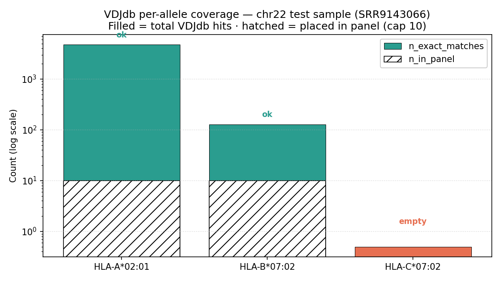

## What we built

::: {.r-fit-text}
A per-patient **reference TCR panel** from VDJdb
:::

. . .

::: {.callout-note appearance="simple"}
**Why now:** parent [Issue #86](https://github.com/Jin-HoMLee/splice-neoepitope-pipeline/issues/86) needs HLA-matched paired α/β TCRs for downstream TCRdock predictions. Sub-issues [Issue #205](https://github.com/Jin-HoMLee/splice-neoepitope-pipeline/issues/205) (selection) and [Issue #206](https://github.com/Jin-HoMLee/splice-neoepitope-pipeline/issues/206) (report wiring) build on this.
:::

---

## Where it fits {.smaller}

::: {.columns}

::: {.column width="45%"}
{width=100%}
:::

::: {.column style="width:55%; font-size: 0.72em;"}

**New from this PR ([PR #457](https://github.com/Jin-HoMLee/splice-neoepitope-pipeline/pull/457)):**

- `fetch_vdjdb_panel` — the rule itself
- `download_vdjdb_release` — SHA256-verified VDJdb release
- `download_imgt_germlines` — stitchrdl wrapper
- `workflow/envs/vdjdb.yaml` — new conda env

**Inputs** (rails feeding `fetch_vdjdb_panel`):

- `alleles.tsv` ← `aggregate_hla_alleles` (OptiType chain)
- `vdjdb_full.txt` ← `download_vdjdb_release`
- IMGT germlines (sidecar) ← `download_imgt_germlines`

**Outputs:**

- `panel.tsv` — top-N TCRs per allele
- `panel_qc.tsv` — per-allele coverage

**Not wired yet** (deferred):

- [Issue #205](https://github.com/Jin-HoMLee/splice-neoepitope-pipeline/issues/205) — TCR selection for TCRdock
- [Issue #206](https://github.com/Jin-HoMLee/splice-neoepitope-pipeline/issues/206) — report wiring (`generate_report` ← `panel.tsv`)
:::

:::

---

## Filter pipeline {.smaller}

| Step | Filter | Why |
|---|---|---|
| 1 | `species == "HomoSapiens"` | drop mouse/etc. |
| 2 | `mhc.class == "MHCI"` | scope to class-I presentation |
| 3 | `vdjdb.score >= 2` | discard low-confidence entries |
| 4 | **paired α/β required** (no NaN in any of 6 V/J/CDR3 cols) | single-chain rows would crash stitchr |
| 5 | normalize `mhc.a` to 4-digit (e.g. `HLA-A*02:01:110` → `HLA-A*02:01`) | match patient allele resolution |
| 6 | exact 4-digit match against patient alleles | strict HLA matching |
| 7 | sort by `(vdjdb.score DESC, donor_id ASC)` | deterministic top-N tiebreak |
| 8 | take top 10 per allele | bounded panel size |
| 9 | reconstruct full α + β chains via `stitchr` | input to TCRdock |

---

## chr22 integration run — per-allele coverage

{width=82%}

::: {.fragment}
**Read:** HLA-A\*02:01 (4734 hits) and HLA-B\*07:02 (128 hits) both fill the panel cleanly. HLA-C\*07:02 has zero VDJdb entries — a **real biological gap**, not a code bug. Today's pipeline still uses the legacy DMF5 fallback (HLA-A\*02:01-restricted MART-1 TCR) for *all* alleles — structurally mismatched, being replaced by [Issue #205](https://github.com/Jin-HoMLee/splice-neoepitope-pipeline/issues/205).
:::

---

## Sample output {.smaller}

First row from `panel.tsv` ([frozen chr22 data](data/panel.tsv); full α + β AA sequences truncated for slide):

```text
allele:           HLA-A*02:01
va_gene:          TRAV12-2*01
ja_gene:          TRAJ30*01
cdr3a:            CAVNRDDKIIF
vb_gene:          TRBV7-9*01
jb_gene:          TRBJ2-7*01
cdr3b:            CASSPDIEQYF
alpha_seq:        MKSLRVLLVILWLQLSWVWSQQKEVEQNSGPLSVPEGAIASLNCTYSDRGSQSFFWY...  (271 aa)
beta_seq:         MGTSLLCWMALCLLGADHADTGVSQNPRHKITKRGQNVTFRCDPISEHNRLYWYRQT...  (309 aa)
vdjdb_score:      3
vdjdb_donor_id:   #020 (CA16) Ac
```

::: {.fragment}
Per-allele QC also written to `panel_qc.tsv` — see preceding slide for the chr22 read.
:::

---

## VDJdb coverage varies per patient {.smaller}

::: {.callout-tip appearance="simple"}
**Why this slide matters:** how many of a patient's HLAs are actually represented in VDJdb is **patient-dependent** — and we won't know until we ask. This is why every run writes a `panel_status` per allele (`ok` / `low_coverage` / `empty`).
:::

Pre-implementation check on both patients (pre-step, before any code shipped — [Issue #204 comment](https://github.com/Jin-HoMLee/splice-neoepitope-pipeline/issues/204#issuecomment-4502381646)):

| Patient | HLAs in `alleles.tsv` | Empty (0 hits) | Coverage shape |
|---|---|---|---|
| **patient_001** | 6 (heterozygous A/B/C) | **3 of 6** | HLA-A\*26:01, B\*15:63, C\*03:03 all zero in VDJdb |
| **patient_002** | 5 (homozygous on HLA-A\*01:01) | **0 of 5** | All alleles hit; HLA-C entries are sparse but non-zero |

::: {.fragment}
**Takeaway:** patient_001's half-empty result is what motivates the deferred *supertype-fallback* follow-up — when an exact 4-digit allele has no VDJdb hits, fall back to a related allele in the same supertype.
:::

---

## Lessons — integration runs catch what dry-runs cannot {.smaller}

The PR shipped only after a local chr22 end-to-end run surfaced **4 substantive bugs** that bot review + unit tests + CI dry-run had all missed:

::: {.incremental}
1. `IMGTgeneDL>=0.7.0` pinned in conda env — PyPI max is `0.6.1` (env build fails)
2. `from __future__ import annotations` SyntaxErrors under Snakemake's `script:` wrapper preamble injection
3. **Paired α/β filter missing** — single-chain VDJdb rows (NaN in opposite-chain cols) crashed stitchr
4. `stitchr -species HUMAN` CLI typo — correct flag is `-s` / `--species`, and HUMAN is the default
:::

::: {.fragment}
Each of these requires actually *executing* the rule — none are visible to static review or DAG traversal. Captured as a project convention in [CLAUDE.md "What `snakemake -n` does NOT catch"](../../../CLAUDE.md) ([PR #462](https://github.com/Jin-HoMLee/splice-neoepitope-pipeline/pull/462)) — chr22 integration run is now the gate for any new Snakemake rule.
:::

---

## Next steps {.smaller}

- **[Issue #205](https://github.com/Jin-HoMLee/splice-neoepitope-pipeline/issues/205)** — select one TCR from the panel for the actual TCRdock prediction
- **[Issue #206](https://github.com/Jin-HoMLee/splice-neoepitope-pipeline/issues/206)** — surface panel preview + matched TCR in the per-patient HTML report
- **Follow-up (deferred per [Issue #86](https://github.com/Jin-HoMLee/splice-neoepitope-pipeline/issues/86)):** supertype / 2-digit matching fallback for alleles with 0 exact matches (motivated by patient_001's 3/6 empty result)
- **Latent:** [Issue #461](https://github.com/Jin-HoMLee/splice-neoepitope-pipeline/issues/461) — audit other `workflow/scripts/*.py` for the same `from __future__` Snakemake-wrapper foot-gun

---

## Reproducibility

::: {.smaller}
**To regenerate the chr22 panel locally:**

```bash
conda activate snakemake
snakemake --cores 4 --use-conda --configfile config/test_config.yaml \
  -- results/SRR9143066/tcr_panel/vdjdb/panel.tsv \
     results/SRR9143066/tcr_panel/vdjdb/panel_qc.tsv
```

**To regenerate this deck's figures from the frozen data:**

```bash
research/.venv/bin/python docs/features/issue_204_vdjdb_panel/figures/_regenerate_figures.py
```

**To render the slides:**

```bash
quarto render docs/features/issue_204_vdjdb_panel/slides.qmd
```
:::
