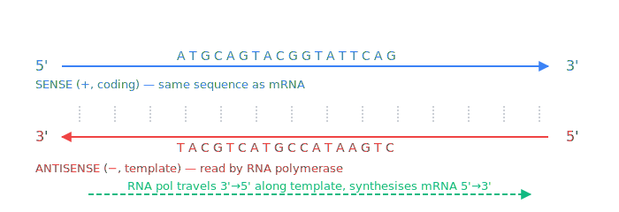
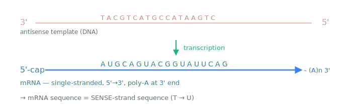
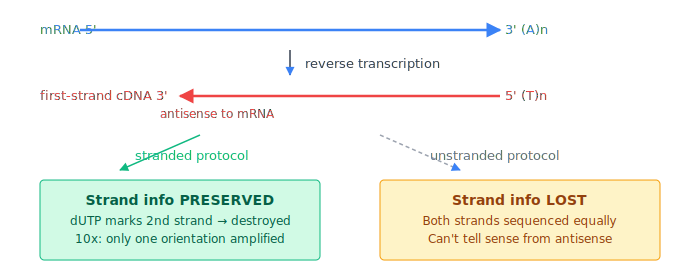
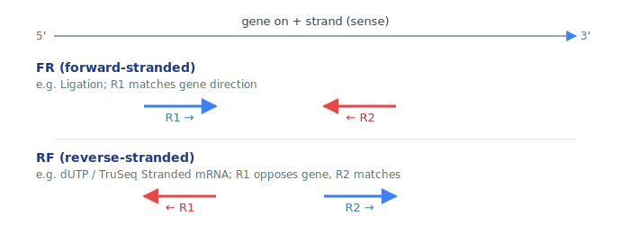
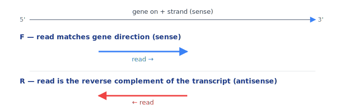
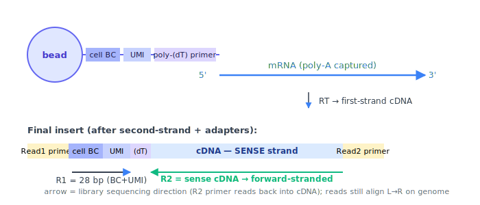
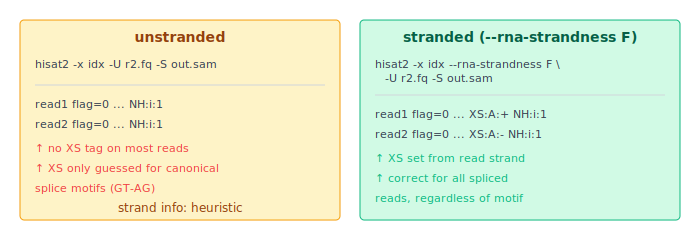
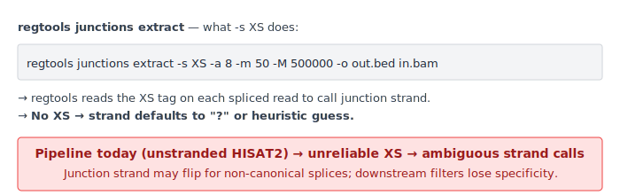

# RNA-Seq Strandedness
## A Visual Primer

**Context:** pipeline strand-aware alignment ([Issue #279](https://github.com/Jin-HoMLee/splice-neoepitope-pipeline/issues/279))

Why this deck exists: strandedness terminology drifts between tools (HISAT2 `F`/`R`/`FR`/`RF`, htseq `yes`/`reverse`, Salmon `ISF`/`ISR`, featureCounts `0`/`1`/`2`). Picking the wrong flag silently produces wrong junction strand calls — no error, no warning, just bad data downstream.

*"R2 maps to which strand?" — the question this deck answers visually.*

---

## 1 · The dsDNA setup

- DNA strands are **anti-parallel** (top 5'→3', bottom 3'→5')
- RNA polymerase reads the **antisense template**; the mRNA produced has the **same sequence as the sense strand**

---

## 2 · mRNA orientation

- mRNA matches the **sense** strand (5'→3'), with **U** in place of T
- "Forward / sense / coding strand / mRNA-strand" all refer to the same direction
- Poly-A tail at 3' end is the anchor 10x bead chemistry uses to capture mRNA

---

## 3 · Library prep — where strand info lives

- **First-strand cDNA is antisense to mRNA** — this is the universal step
- Whether strand info survives depends on **what the protocol does next** (dUTP destruction, ligation chemistry, 10x bead architecture)

---

## 4 · Paired-end: FR vs RF

- HISAT2 PE flag: `--rna-strandness FR` or `RF` (two-letter)
- **FR**: R1 → sense; **RF**: R1 → antisense (R2 → sense)
- Salmon: `ISF` ≈ FR, `ISR` ≈ RF · htseq: `yes` ≈ FR, `reverse` ≈ RF

---

## 5 · Single-end: F vs R

> ⚠️ **SE syntax pitfall:** HISAT2 SE takes a **single letter** (`F` or `R`) — not `FR`/`RF`. Passing `RF` on SE input is a frequent copy-paste error from PE docs.

---

## 6 · 10x Chromium 3' Gene Expression

- **R1** = barcode + UMI only → not aligned to genome
- **R2** = reads back into the cDNA, **matches the sense (coding) strand**
- → For HISAT2 SE: `--rna-strandness F` (forward-stranded) — see [10x Tech Note CG000376](https://assets.ctfassets.net/an68im79xiti/awNZTarmwqmwxKcvDv9wv/b05500661e36290b8ce59689ff889ea8/CG000376_TechNote_Antisense_Intronic_Reads_SingleCellGeneExpression_RevA.pdf), [scg_lib_structs 10xChromium3v3](https://scg-lib-structs.readthedocs.io/en/latest/ge/10xChromium3v3.html)

---

## 7 · HISAT2 stranded alignment → XS tag

- `XS:A:+/-` is the **splice strand** tag — required by every downstream junction tool
- Without `--rna-strandness`, HISAT2 sets XS only when it can guess from splice motifs (GT-AG); reads with non-canonical or ambiguous splices get **no XS**

---

## 8 · regtools `-s XS` + Issue #279 fix

**Fix proposed in [Issue #279](https://github.com/Jin-HoMLee/splice-neoepitope-pipeline/issues/279):** pass `--rna-strandness F` for 10x R2 SE samples.

> ⚠️ **Correction to Issue #279 body:** the issue currently proposes `--rna-strandness RF`, but (a) `RF` is PE syntax; SE takes a single letter, and (b) 10x R2 is **forward-stranded** (R2 = sense strand), so the correct flag is `F`, not `R`. Follow-up correction comment posted on the issue.

---

## Cheat sheet

|                          | HISAT2 SE | HISAT2 PE | htseq    | Salmon | featureCounts |
|--------------------------|-----------|-----------|----------|--------|---------------|
| Unstranded               | (omit)    | (omit)    | `no`     | `IU`   | `0`           |
| Forward-stranded (sense) | `F`       | `FR`      | `yes`    | `ISF`  | `1`           |
| Reverse-stranded (anti)  | `R`       | `RF`      | `reverse`| `ISR`  | `2`           |

**This pipeline's case:** 10x 3' GEX v3, R2-only SE, normal samples → **forward-stranded** (R2 = sense) → HISAT2 `--rna-strandness F` · featureCounts `1` · htseq `yes`.

**Sources:** [HISAT2 manual](http://daehwankimlab.github.io/hisat2/manual/) · [10x Tech Note CG000376](https://assets.ctfassets.net/an68im79xiti/awNZTarmwqmwxKcvDv9wv/b05500661e36290b8ce59689ff889ea8/CG000376_TechNote_Antisense_Intronic_Reads_SingleCellGeneExpression_RevA.pdf) · [scg_lib_structs 10xChromium3v3](https://scg-lib-structs.readthedocs.io/en/latest/ge/10xChromium3v3.html) · [Strandedness review (Bfunc Gen 2020)](https://academic.oup.com/bfg/article/19/5-6/339/5837822)
