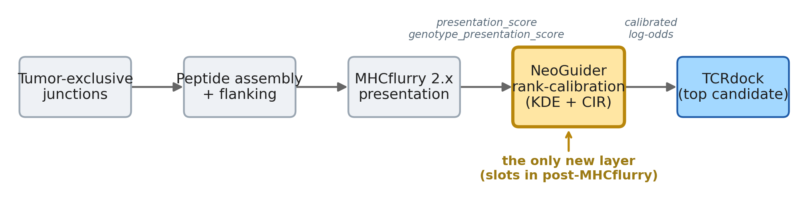
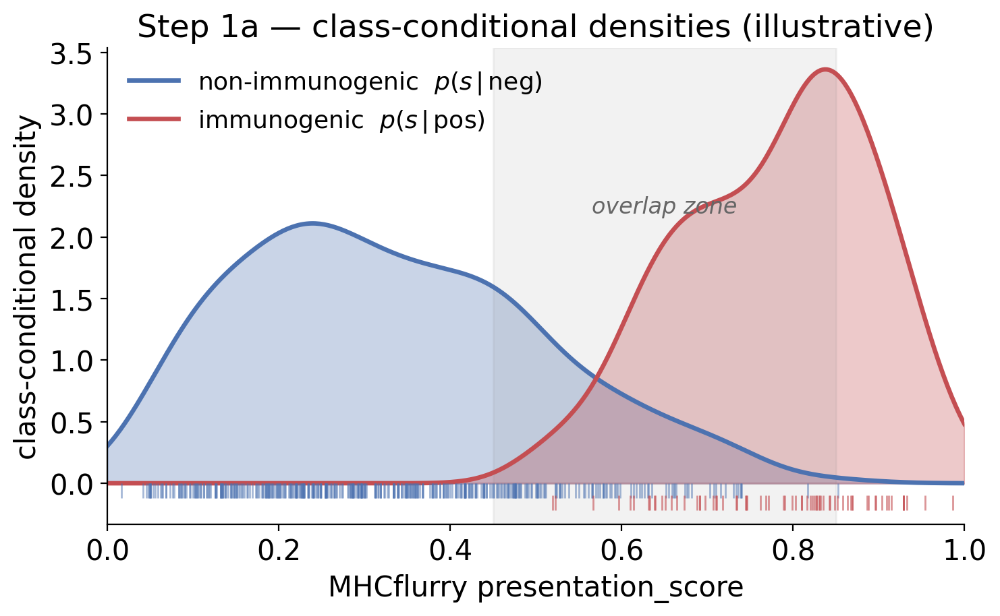
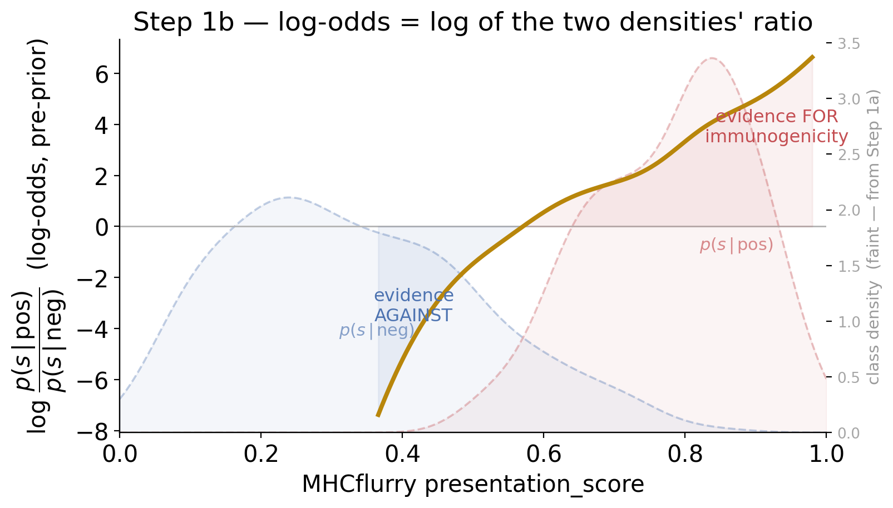
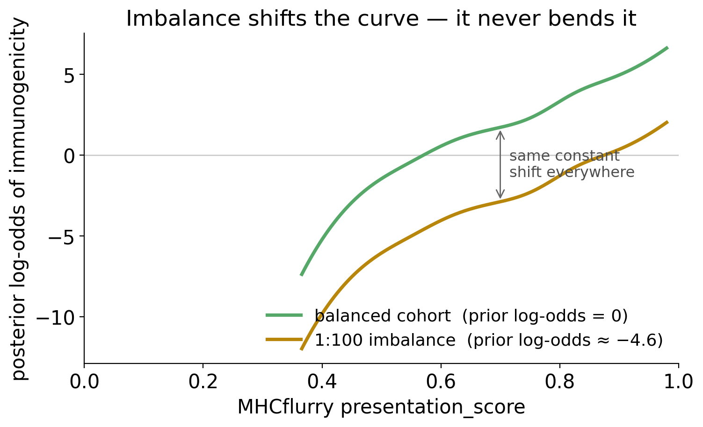
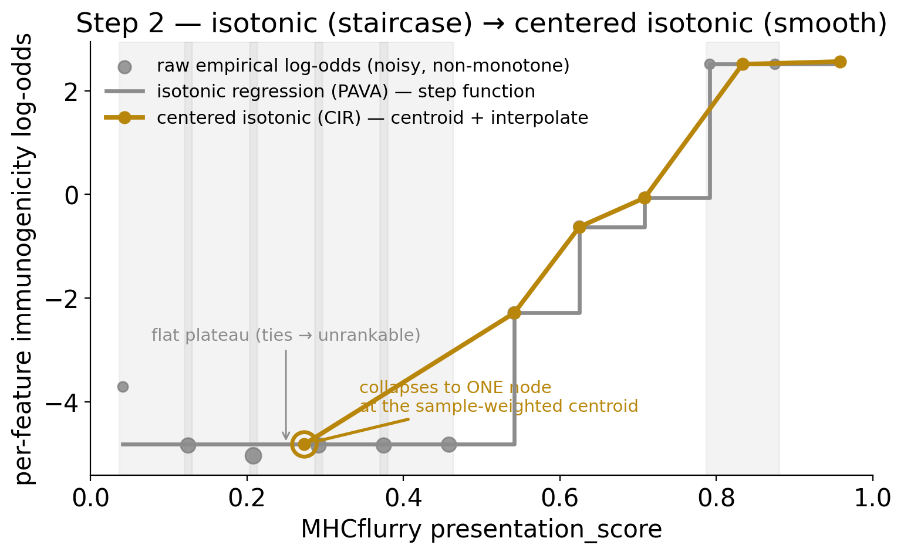
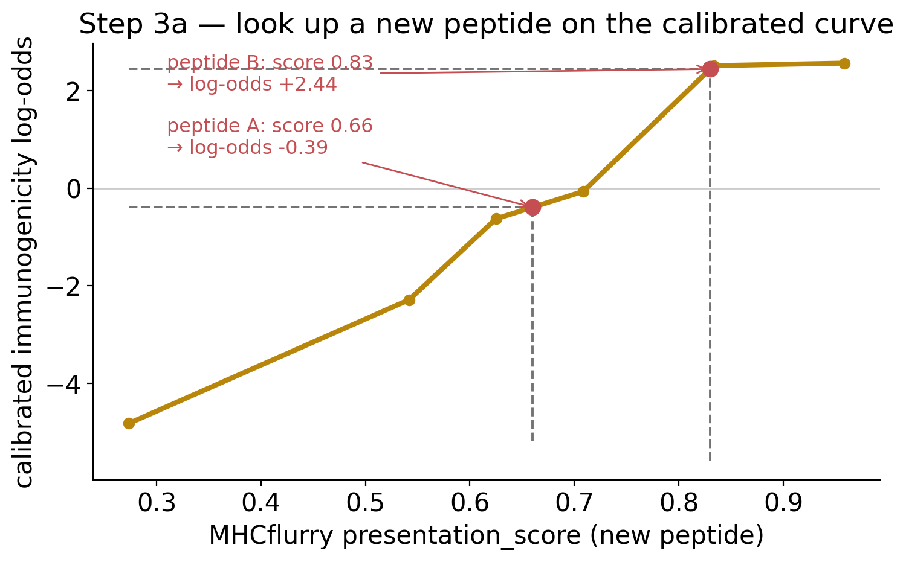
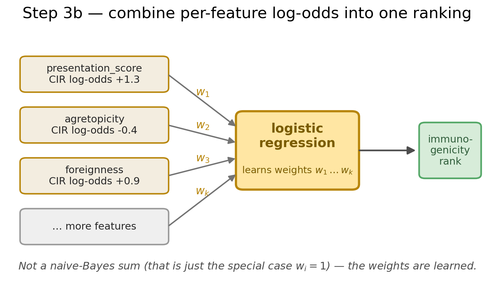

## The question

::: {style="text-align: center; font-size: 2.0em; font-weight: bold; line-height: 1.2; margin-top: 0.4em;"}
Should NeoGuider's\
rank-calibration ML\
join our scoring stack?
:::

. . .

::: {.callout-note appearance="simple"}
**Why now:** NeoGuider surfaced via [2026-05-04 morning news briefing](https://github.com/Jin-HoMLee/splice-neoepitope-pipeline/blob/main/research/news_log.md) as a peer end-to-end neoepitope pipeline with explicit splice-variant support. Pattern fits the existing Sci-eval family (parallel to [Issue #218](https://github.com/Jin-HoMLee/splice-neoepitope-pipeline/issues/218) HERMES, [Issue #201](https://github.com/Jin-HoMLee/splice-neoepitope-pipeline/issues/201) ImmSET, [Issue #188](https://github.com/Jin-HoMLee/splice-neoepitope-pipeline/issues/188) Boltz-2, [Issue #222](https://github.com/Jin-HoMLee/splice-neoepitope-pipeline/issues/222) splice2neo).
:::

---

## The tool — NeoGuider at a glance {.smaller}

**NeoGuider (NG)** — *neoepitope prediction using advanced feature engineering* — Wei et al., **Genome Medicine** 2025-12-23 [@wei2025neoguider]. Xuegong Lab, Tsinghua.

::: {.incremental}
- **Architecture:** end-to-end Snakemake pipeline; FASTQ → ranked candidates with predicted immunogenicity probability.
- **Variant classes:** SNV / indel / frameshift / fusion / **splicing** — `detection_alteration_type: 'snv,indel,fsv,fusion,splicing'` (config default).
- **Benchmark:** **7 cohorts, 113 patients, 635 immunogenic candidates** (TESLA, NCI-train/test, Bjerregaard, Wu, HiTIDE, Borch); outranked 25 TESLA teams on TFA-mean; AUROC > MuPeXI + DeepHLApan.
- **Code:** [`XuegongLab/neoguider`](https://github.com/XuegongLab/neoguider) — AGPLv3 + author commercial restriction (see Caveats); paper CC-BY-NC-ND 4.0. Pre-built Docker at `quay.io/cndfeifei0/ng:v01`.
:::

. . .

::: {.callout-important appearance="simple"}
**Splice support exists but is delegated to ASNEO** [@zhang2020asneo] — separate package, optional step in NeoGuider's Snakemake. NeoGuider has **no native splice predictor**.
:::

---

## The novel mechanism — KDE + centered isotonic regression {.smaller}

::: {.columns}

::: {.column width="55%"}

**NeoGuider's contribution is in feature engineering, not architecture:**

::: {.incremental}
- Each raw feature → **adaptive KDE (aKDE)** — one shared kernel jointly estimates the positive- vs. negative-class densities
- Density ratio (= odds) → **isotonic regression** — enforces monotonicity, no parametric shape assumed
- **Centered isotonic regression** [@oron2017isotonic] — replaces isotonic's flat plateaus with a smooth, strictly-increasing curve
- Per-feature **immunogenicity log-odds** — calibrated + comparable across features, then **combined by a logistic regression** that learns per-feature weights (*not* a naive-Bayes sum)
- **Hyperparameter-free feature transform** — aKDE bandwidth is data-derived (adapts to spacing of consecutive positives, then refined); downstream classifier left at default settings
:::

:::

::: {.column width="45%"}

::: {.callout-tip appearance="simple"}
**Why this matters for neoepitope ranking:**

Raw MHC-binding affinity (or `presentation_score`) is not linearly related to immunogenicity. KDE+isotonic learns the actual mapping per-cohort, without imposing a parametric form.

Class imbalance (1 immunogenic per ~100 candidates) is handled by the density-ratio framing — no need for resampling or weight tuning.
:::

:::

:::

---

## Where it would plug in {.smaller}

{fig-align="center" width="88%"}

**Integration shape:** a post-MHCflurry ranker calibration layer. Consumes our existing `presentation_score` / `genotype_presentation_score` columns; emits a calibrated log-odds column for downstream ranking.

| Layer in NeoGuider | Our pipeline equivalent | Adopt? |
|---|---|---|
| Variant calling (UVC / Mutect2) | HISAT2 + regtools (own stack) | ❌ |
| Splice detection (delegated to ASNEO) | HISAT2 + STAR + own junction extraction | ❌ |
| MHC presentation (netMHCpan [@jurtz2017netmhcpan] + netMHCstabpan [@rasmussen2016netmhcstabpan]) | MHCflurry 2.x `Class1PresentationPredictor` [@odonnell2020mhcflurry2] | ❌ |
| **Rank calibration (KDE + centered isotonic)** | none | **✅** |

---

## Reasons by mode {.smaller}

::: {.incremental}
1. **(a) Adopt as full pipeline replacement — ❌ decline.** Splice branch is just ASNEO (a separate tool that warrants its own eval); variant calling + MHC predictor are divergent from our stack; netMHCpan/stabpan add commercial-license friction. Full swap is high-cost, low-gain.
2. **(b) Reject outright — ❌ decline.** The KDE + centered isotonic regression rank-calibration is a genuinely novel ML contribution. Dismissing it would forfeit a free upgrade lane for our ranker.
3. **(c) Adopt the calibration module as a component — ✅ proceed.** Reimplement the algorithm from the paper (avoids AGPL implications of the repo code), evaluate on patient_001 + cohort backbone. Single new Python module slotting between MHCflurry output and TCRdock input.
:::

. . .

::: {.callout-important appearance="simple"}
**Asymmetry vs. HERMES / NetTCR-struc:** those evals were *integrate by adopting the tool's pretrained model*. This one is *integrate by reimplementing the algorithm* — license-driven, but cleaner technically.
:::

---

## Decision {.smaller}

::: {style="text-align: center; font-size: 2.4em; font-weight: bold; margin-top: 0.2em;"}
\(c\) Component reuse
:::

::: {style="text-align: center; font-size: 1.2em; margin-top: 0.2em;"}
KDE + centered isotonic regression as post-MHCflurry ranker calibration
:::

. . .

- **Modeling sub-issue** to be filed under [milestone 29](https://github.com/Jin-HoMLee/splice-neoepitope-pipeline/milestone/29) once a calibration target dataset is in scope; gated by training-cohort selection (TESLA-style validated immunogenic set).
- **Separate follow-up: ASNEO eval Issue** — peer to our HISAT2/regtools + STAR/SJ.out.tab paths. Discovered as the actual splice tool inside NeoGuider; deserves its own (a)/(b)/(c) decision.

---

## Open scientific questions for the integration sub-issue {.smaller}

When the calibration sub-issue lands on Dev's plate, Sci consult points:

::: {.incremental}
1. **Calibration training set.** TESLA + NCI-train + HiTIDE union? Or restrict to splice-specific neoepitope cohorts (none exist at scale today)? Without splice-positive training examples, the calibration may underweight splice-specific features.
2. **Feature inventory.** NeoGuider uses many features beyond MHC binding (foreignness, agretopicity, abundance, motif). Mirror the full set, or start with `genotype_presentation_score` alone and add features incrementally?
3. **Cross-cohort generalisation.** Centered isotonic regression overfits less than parametric models but still cohort-dependent. Hold-out cohort design: TESLA-train + HiTIDE-test, or k-fold within TESLA?
4. **Patient_001 calibration deferment.** Single-patient calibration is meaningless — defer the patient_001 evaluation to *after* a validated cohort-level calibrator exists. Same shape as the AlphaGenome chr22 PoC ([Issue #393](https://github.com/Jin-HoMLee/splice-neoepitope-pipeline/issues/393)).
:::

---

## Caveats — read before citing the headline {.smaller}

::: {.incremental}
1. **Benchmark cohorts are SNV-heavy.** TESLA / NCI / HiTIDE / Borch are dominated by missense neoantigens. NeoGuider's headline numbers do not certify performance on splice-specific neoepitopes.
2. **ASNEO is the actual splice tool** — separate eval Issue forthcoming. NeoGuider's headline splice support is a wrapper claim; the substantive work is in the [Zhang 2020 ASNEO paper](https://doi.org/10.18632/aging.103581) [@zhang2020asneo].
3. **License layering.** Repo is AGPLv3 (non-profit only); paper is CC-BY-NC-ND 4.0. The algorithm can be reimplemented from the paper; the *repo code* cannot be embedded in commercial use without a paid license from the corresponding author.
4. **Verdict is upstream of TCR-pMHC scoring** — NeoGuider does NOT enter the [Issue #432](https://github.com/Jin-HoMLee/splice-neoepitope-pipeline/issues/432) (TCR-pMHC landscape) verdict list. It's a neoepitope ranker, not a TCR-pMHC scorer.
:::

---

## References {.smaller}

::: {#refs}
:::

---

## Appendix {.smaller}

::: {style="text-align: center; font-size: 1.9em; font-weight: bold; margin-top: 0.4em; line-height: 1.2;"}
KDE + centered isotonic regression\
— the mechanism, visually
:::

::: {style="text-align: center; font-size: 0.92em; margin-top: 0.6em; color: #555;"}
Per-feature calibration, step by step. Figures use synthetic data. The isotonic + centered-isotonic transforms are exactly NeoGuider's (`sklearn.IsotonicRegression` + a from-scratch CIR); the KDE is drawn **fixed-bandwidth for clarity** — NeoGuider's is adaptive (see Step 1a). Regenerate with [`figures/_regenerate_figures.py`](figures/_regenerate_figures.py).
:::

---

## First — four words you'll need {.smaller}

::: {style="font-size: 0.95em;"}
- **KDE (kernel density estimation)** — a *smoothed histogram*: drop a small bump on each data point, add them up into one smooth curve. The *bandwidth* sets how wide each bump (the single knob). **aKDE** = *adaptive* KDE — the bump widens where data is sparse, so even a rare class yields a usable curve.
- **Class-conditional density** $p(s \mid \text{class})$ — reads as "*given* a peptide is immunogenic, how is its score $s$ distributed?" — and the same, separately, for non-immunogenic. Two **within-class** shapes.
- **Odds** $= P(\text{immunogenic}) / P(\text{not})$. **Log-odds** $= \log(\text{odds})$ — an *additive* scale where **0 = 50:50**, positive favors immunogenic, negative against. The **"odds curve"** is just how those odds move as the score changes.
:::

---

## The problem — an uncalibrated ruler {.smaller}

Raw `presentation_score` (or any single feature) is an **uncalibrated ruler**: it has **no fixed zero** (which score means "as likely immunogenic as not"?) and is **not linear** (a 0.1 rise near 0.8 carries far more evidence than one near 0.4). We can't rank on it directly — we have to *learn* the score → immunogenicity mapping. NeoGuider re-rules each feature into **log-odds of immunogenicity** — in three jobs:

| Job | What it does | Tool |
|---|---|---|
| **Estimate** the odds curve | capture nonlinearity (score-dependent odds) | adaptive KDE → density ratio |
| **Regularize** it | enforce monotonicity, kill noise | isotonic → **centered** isotonic |
| **Combine** features | weight each feature's evidence | **logistic regression** |

::: {.callout-note appearance="simple"}
The novelty is the **Estimate + Regularize** transform (rows 1–2). The combine step is an ordinary logistic regression that *learns weights* — **not** a naive-Bayes sum.
:::

---

## Step 1a — class-conditional densities via one shared aKDE {.smaller}

::: {.columns}
::: {.column width="56%"}
{fig-align="center" width="100%"}
:::
::: {.column width="44%"}
- **One shared kernel** jointly estimates *both* class densities (here n = 70 immunogenic vs. 420 not) — the odds is their ratio.
- Each density **integrates to 1 within its own class** (self-normalized): the ~6× rarer positive class still gives a full-height curve, so class size shifts the *prior* later, not the curve's *shape* here.
- **Adaptive bandwidth** widens the kernel where positives are sparse — it tracks the spacing of consecutive positives, then is *iteratively refined*; robust in the tail.
:::
:::

::: {style="font-size: 0.6em; color: #777; margin-top: 0.2em;"}
Figure draws two independent **fixed-bandwidth** KDEs for clarity. NeoGuider's real aKDE is one *shared, adaptive* kernel — bandwidth tracks consecutive-positive spacing, then iteratively refined.
:::

---

## Step 1b — density ratio → log-odds {.smaller}

::: {.columns}
::: {.column width="52%"}
The density **ratio** is the per-feature evidence; Bayes turns it into log-odds:

$$\operatorname{logit} P(\mathrm{pos}\mid s) = \underbrace{\log\frac{p(s\mid \mathrm{pos})}{p(s\mid \mathrm{neg})}}_{\text{KDE density ratio}} + \underbrace{\log\frac{\pi_{\mathrm{pos}}}{\pi_{\mathrm{neg}}}}_{\text{prior log-odds}}$$

- **First term** — score-dependent, read off the two KDEs (the curve, right).
- **Second term** — a single constant set by the base rate.
- The **faint dashed curves** are the Step 1a densities; the gold curve is exactly the *log of their ratio* — crossing zero where they intersect (50:50).
:::
::: {.column width="48%"}
{fig-align="center" width="100%"}
:::
:::

---

## Why class imbalance doesn't break it {.smaller}

::: {.columns}
::: {.column width="56%"}
{fig-align="center" width="100%"}
:::
::: {.column width="44%"}
- The base rate (~1 per 100) enters **only as the additive prior term** — it shifts the whole curve down, never bends it.
- So **no resampling or class-weighting** is needed: the evidence *shape* is base-rate-invariant.
- ⚠️ It neutralizes the **bias** of imbalance, not the **variance** — few positives ⇒ noisy positive density (exactly why the bandwidth is adaptive).
:::
:::

---

## Step 2 — isotonic → centered isotonic {.smaller}

From a finite cohort the odds estimate is **noisy** — shown as per-score-bin empirical log-odds (grey dots) that dip non-monotonically. *This* is what the regularizer cleans up:

::: {.columns}
::: {.column width="56%"}
{fig-align="center" width="100%"}
:::
::: {.column width="44%"}
- **Isotonic regression (PAVA)** fits the best monotone curve, no parametric shape — but it's a **step function**: scores tied on a plateau are unrankable.
- **Centered isotonic** collapses each plateau to its **sample-weighted centroid**, then interpolates → a smooth, strictly-increasing curve.
- Only inductive bias: **monotonicity**. No parametric form, no tuning knobs.
:::
:::

---

## Why borrow a dose-response estimator? {.smaller}

Centered isotonic regression was invented for **dose-finding trials** [@oron2017isotonic]. The structure maps one-to-one onto score calibration:

| Dose-response study | NeoGuider per-feature calibration |
|---|---|
| dose $x$ | feature value (e.g. `presentation_score`) |
| response proportion | positive / negative **density ratio** |
| monotone, strictly-increasing $F$ | feature → immunogenicity log-odds |
| invert: dose at response $p$ | read off calibrated log-odds for a new score |
| small $n$, no parametric form, no knobs | rare positives, nonlinearity, no tuning |

Same problem shape: *estimate a monotone univariate curve nonparametrically, then read it off at arbitrary $x$.*

---

## Step 3a — score a new peptide on one feature {.smaller}

::: {.columns}
::: {.column width="56%"}
{fig-align="center" width="100%"}
:::
::: {.column width="44%"}
- A new peptide's score is **looked up** on the calibrated curve → its per-feature immunogenicity log-odds (peptides A and B, left).
- Scores **beyond the calibrated range are clamped** to the endpoint log-odds — no extrapolation past the data.
- ⚠️ CIR removes *parametric-shape* bias, **not cohort-shift** bias — the curve is learned from one cohort, so cross-cohort validation still matters.
:::
:::

---

## Step 3b — combine features into one ranking {.smaller}

::: {.columns}
::: {.column width="60%"}
{fig-align="center" width="100%"}
:::
::: {.column width="40%"}
- Every feature produces its **own** calibrated log-odds (its own KDE → IR → CIR lookup).
- These are **inputs to a logistic regression** that *learns* per-feature weights $w_i$ — **not** a naive-Bayes sum (that's just the special case all $w_i = 1$).
- The fitted probability ranks all candidates. The *transform* is hyperparameter-free; the *classifier* runs at default settings.
:::
:::
