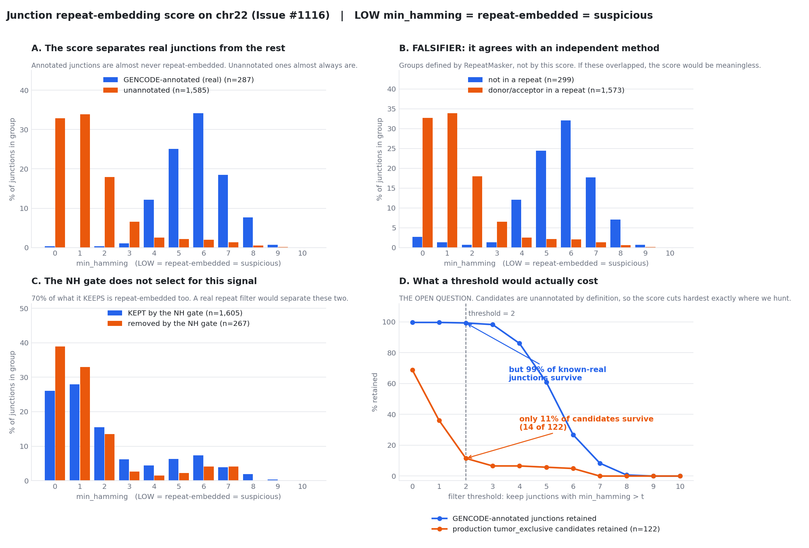

# Junction repeat-embedding score (Issue #1116)

The Portcullis anchor-vs-intron Hamming test, implemented as a pure function and evaluated on the chr22 fixture.

**One-line result: the score works, it is validated against an independent repeat annotation, it separates real from spurious junctions far better than the NH gate did - and it must not be turned into a gate, because it would remove 85% of exactly the population we are hunting.**

## What it computes

For each junction, compare each exonic **anchor** against the intronic sequence adjacent to the *opposite* splice site:

```
5' side:   ...exonL[-k:] | INTRON ....................... intron[-k:] | exonR...
           \___________/                                 \__________/
            left anchor            compared against        intron 3' end
```

If they match, the aligner had **no sequence basis** to place that anchor outside the intron rather than inside it: the junction may be an artifact of a repeat. **Low Hamming distance = suspicious.**

`min_hamming` (not mean) summarizes the two sides: an artifact needs only **one** ambiguous anchor to be placeable elsewhere.

## Why this and not `NH`

`NH` is **index-relative** - on a single-chromosome index, genome-wide multimappers look unique. That is what made the [#919](https://github.com/Jin-HoMLee/splice-neoepitope-pipeline/issues/919) chr22 A/B degenerate and unfixable without a whole-genome run we cannot afford.

This score reads **only the reference sequence and the junction coordinates**. No index, no BAM, no `NH` tag. It means the same thing on chr22 as it would genome-wide - which is why it is the one validation lever available under the current $0 posture.

It is also the *shape* of signal [#1122](https://github.com/Jin-HoMLee/splice-neoepitope-pipeline/issues/1122) permits: a **junction-level score** that can be carried into the tumor/normal comparison, rather than a per-read gate applied to each arm independently (the property that got the NH filter disqualified).

## The figure



Four panels, four questions: **A** the result, **B** the falsifier, **C** why the NH gate is not a substitute, **D** the decision that is still open.

**Panel D is the one to look at**, and it is drawn on the **real production candidate set** (the `tumor_exclusive` junctions from `novel_junctions.tsv`), not a proxy - because "85% of unannotated junctions" is abstract and "you would delete 108 of your 122 actual candidates" is not.

It shows the dilemma in one crossing pair of lines. A `min_hamming > 2` filter would look **superb** on the known-real junctions - **99.3% survive**. And it would delete **88.5% of the candidate pool** (122 -> 14). Those two facts are the same fact, because our candidates are unannotated *by definition*, and unannotated is precisely where this score fires.

| threshold | production candidates kept | known-real junctions kept |
|---|---|---|
| `> 0` | 68.9% | 99.7% |
| `> 1` | 36.1% | 99.7% |
| **`> 2`** | **11.5%** (14 of 122) | **99.3%** |
| `> 3` | 6.6% | 98.3% |
| `> 4` | 6.6% | 86.1% |

A filter that keeps 99% of everything you can verify while deleting 89% of everything you are looking for is either the best filter in the pipeline or the worst. **The data cannot tell you which**, because the ground truth for a *novel* junction does not exist in GENCODE by construction. That is the whole reason this ships as a score.

## Results (chr22, tumor; `--anchor 10`)

Coordinates are checked before anything is scored: **400/400** sampled introns read `GT..AG` / `CT..AC`, so the 1-based-inclusive offset convention is confirmed and the script does not proceed on a bad one.

**What that check does and does not prove** (sharpened after review on [PR #1171](https://github.com/Jin-HoMLee/splice-neoepitope-pipeline/pull/1171)): it catches an **off-by-one**, which is the failure that would make every number below confident garbage - a shifted read lands on the wrong dinucleotides and fails the test. It is **not** evidence that the junction set is canonical: it already is, by construction, because the upstream extractors gate on motif (regtools takes strand from HISAT2's motif-derived `XS` tag; the STAR script drops non-canonical codes). A 100% canonical result is therefore partly guaranteed rather than earned, and should not be read as a property of the data.

### Q1 - it separates real from spurious junctions, enormously

| junction set | n | median `min_hamming` | fraction flagged (`<= 2`) |
|---|---|---|---|
| GENCODE-annotated | 287 | **6.0** | **0.007** |
| unannotated | 1,585 | **1.0** | **0.847** |

**A 120x difference in the flagged fraction.** Annotated (i.e. real) junctions are almost never repeat-embedded; unannotated ones almost always are.

### Q3 - the falsifier: is it measuring repeats at all?

The check that could have killed this Issue. The #919 run independently annotated every junction with **RepeatMasker** overlap - a completely different method. If the two disagreed, the Hamming score would not be a repeat detector and #1116's premise would be dead.

| RepeatMasker | n | median `min_hamming` | fraction flagged |
|---|---|---|---|
| donor/acceptor **in** a repeat | 1,573 | 1.0 | 0.846 |
| **not** in a repeat | 299 | 6.0 | 0.047 |

**median(non-repeat) - median(repeat) = +5.0**, an 18x difference in flagged fraction, in the predicted direction. Two independent methods agree. **The score is measuring what it claims to measure**, and the whole pattern **replicates in the normal sample** (0.004 vs 0.848; +5.0).

### Q2 - it does NOT agree with the NH gate, and that is a finding

| junction set | n | **mean** `min_hamming` | fraction flagged |
|---|---|---|---|
| removed by the NH gate | 267 | 1.39 | 0.854 |
| **kept** by the NH gate | 1,605 | 2.17 | **0.695** |

*(Note the axis switch: Q1 and Q3 report **medians**, this table reports **means**. The medians here are **identical at 1.0**, so the mean is the only statistic that surfaces the small gap at all - which is itself the point. The raw runs in `outputs/` carry both.)*

The gate removes junctions that are mostly repeat-embedded (85%) - but it **keeps 1,605 junctions of which 70% are also repeat-embedded**. It is not selective for this signal at all; both medians are 1.0.

**This is independent evidence for [#1122](https://github.com/Jin-HoMLee/splice-neoepitope-pipeline/issues/1122).** If the NH gate were a proxy for "remove repeat-driven artifacts", it would enrich sharply for low-Hamming junctions. It does not. It removes a subset that is barely distinguishable, on this axis, from the subset it keeps - while costing 28.5% of candidates and manufacturing a false `tumor_exclusive`. The gate was not doing the job it was assumed to be doing.

## The caveat that matters most, and why this ships as a score

**Do not turn this into a filter without a Scientist decision.**

Our candidates are **unannotated by definition** - a `tumor_exclusive` junction is one that is *not* in GENCODE. And 85% of unannotated junctions are flagged by this score. So a naive `min_hamming <= 2` gate would remove **~85% of the candidate pool**.

That is either:

- **correct** - most of that pool is repeat-driven alignment noise, exactly as this score and RepeatMasker both say; or
- **catastrophic** - a genuine novel splice junction in a repeat-rich region (and IG/HLA/TCR loci *are* repeat- and paralog-rich, which is the whole reason this pipeline cares) would be indistinguishable from an artifact by this test.

**This score cannot tell those apart, and neither can I.** It is a *feature*, not a verdict. Shipping it as a score - available to the junction-filtering decision, carried into the tumor/normal comparison - is what [#1122](https://github.com/Jin-HoMLee/splice-neoepitope-pipeline/issues/1122) asked for. Shipping it as a gate would repeat the exact mistake #1122 just disqualified: an engineering choice silently making a scientific call.

## Layout

| file | what |
|---|---|
| `repeat_score.py` | the pure scoring function (no index, no I/O) |
| `evaluate_chr22.py` | the evaluation: coordinate check, Q1, Q2, Q3-falsifier |
| `tests/test_repeat_score.py` | unit tests, incl. the low-is-suspicious direction and the refuse-rather-than-truncate edges |
| `outputs/evaluation.{tumor,normal}.txt` | the runs behind the tables above |

Reproduce:

```bash
research/.venv/bin/python research/experiments/issue_1116_junction_repeat_score/evaluate_chr22.py --sample tumor
```

Needs `resources/test/chr22.fa`, `resources/test/chr22.gtf.gz`, and the #919 outputs. No index, no BAM, no cloud.
