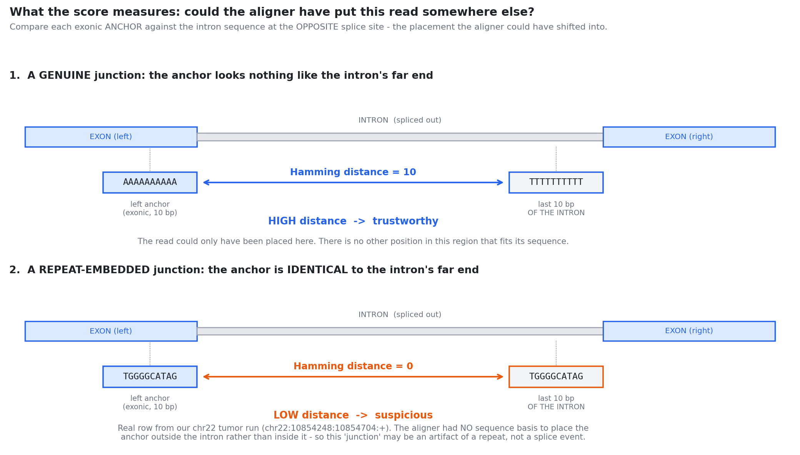

## Where this comes from

**This morning we disqualified the `NH` uniqueness filter.** It gated the tumor and normal arms *independently*, so it could destroy support in the normal while leaving the tumor untouched - promoting a junction present in **both** into a false `tumor_exclusive` candidate.

> A filter that only removes reads should never be able to **add** a candidate. That it can is the defect.

**But the question it was trying to answer did not go away:** some of our junctions are alignment artifacts, and we would like to know which.

The Scientist's constraint on any replacement (Issue #1122):

::: {.callout-note appearance="simple"}
A uniqueness signal must be a **junction-level score carried into the comparison** - or a decision made **after** pooling tumor and normal evidence. **Never a per-read gate applied to each arm independently.**
:::

This deck is the first attempt at such a score.

---

## Why we could not just measure `NH` better

`NH` = the number of places a read aligns. The obvious repair is "count them properly."

**It cannot work on the data we have, and the reason is structural:**

::: {.callout-important appearance="simple"}
**`NH` is *index-relative*.** On a **single-chromosome** index, a read that maps to 40 places genome-wide maps to exactly **one** place on chr22 - and is reported as `NH=1`, *uniquely mapped*.
:::

So on our chr22 fixture, `NH` is not merely noisy - it is **systematically wrong**, and wrong in the direction that makes the filter look harmless. Every genome-wide multimapper is disguised as a unique read.

That is why the #919 A/B was unfixable without a whole-genome run, and we cannot afford one ($0 posture).

**We need a signal that means the same thing on chr22 as it does genome-wide.**

---

## What the score measures {.smaller}

**Reads only the reference sequence** - no index, no BAM, no `NH` tag - so it says the same thing on one chromosome as on twenty-three. [@mapleson2018portcullis]

{width=93%}

---

## Read it again, because the direction is backwards

The intuition most people bring is *"big number = bad."* Here it is the opposite.

::: {.callout-warning appearance="simple"}
**LOW Hamming distance = SUSPICIOUS.**
:::

**Why:** we are asking *"could the aligner have placed this read somewhere else?"*

- If the exonic anchor is **identical** to the intron's far end, then shifting the read by the length of the intron produces an **equally good alignment**. The aligner's choice was arbitrary. The junction may be an artifact of a repeat.
- If the anchor looks **nothing like** the intron's far end, no such shift exists. The junction is anchored by sequence.

We summarize the two sides with `min`, not the mean: **an artifact needs only ONE ambiguous end** to be placeable elsewhere.

---

## Does it work? {.smaller}

**Panel A:** GENCODE-annotated (i.e. real) junctions are flagged (`min_hamming ≤ 2`) at **0.7%**; unannotated ones at **84.7%**. A **120x** difference. The other three panels are the next three slides.

{width=82%}

---

## The falsifier - the only reason to believe panel A

A result that can only ever confirm you is not evidence. So: **is this score measuring repeats at all, or just producing numbers?**

The #919 run had already annotated every junction with **RepeatMasker** overlap - a completely **independent** method, built from a different principle. If low-Hamming junctions were *not* enriched for RepeatMasker overlap, this score is not a repeat detector and the whole idea is dead.

| RepeatMasker says | n | median `min_hamming` | flagged (≤2) |
|---|---|---|---|
| donor/acceptor **in** a repeat | 1,573 | 1.0 | **0.846** |
| **not** in a repeat | 299 | 6.0 | **0.047** |

**+5.0 median separation. 18x in flagged fraction. Predicted direction. Replicates in the normal sample.**

Two unrelated methods agree. *That* is what makes panel A believable rather than circular.

---

## And the `NH` gate never did this job anyway

If the `NH` gate were a proxy for *"remove repeat-driven artifacts"*, it should enrich sharply for low-Hamming junctions.

| | n | mean `min_hamming` | flagged (≤2) |
|---|---|---|---|
| removed by the `NH` gate | 267 | 1.39 | 0.854 |
| **kept** by the `NH` gate | 1,605 | 2.17 | **0.695** |

**It keeps 1,605 junctions of which 70% are repeat-embedded.** Both medians are 1.0. It is removing a subset that is, on this axis, nearly **indistinguishable** from the subset it keeps - while costing 28.5% of candidates and manufacturing a false target.

::: {.callout-note appearance="simple"}
Third independent strike against the gate: **structural** (#1122), **null enrichment** (#919), and now **not even selective**.
:::

---

## The trap {.smaller}

Panel D says a `min_hamming > 2` filter would:

::: {.columns}
::: {.column width="50%"}
**keep 99.3%**
of GENCODE-annotated junctions

*(looks superb)*
:::
::: {.column width="50%"}
**delete 88.5%**
of production `tumor_exclusive` candidates (122 → 14)

*(looks catastrophic)*
:::
:::

**These are the same fact, not a tradeoff to tune.**

Our candidates are **unannotated by definition** - a `tumor_exclusive` junction is one that is *not* in GENCODE. And unannotated is precisely where the score fires.

::: {.callout-important appearance="simple"}
The filter's excellent performance on the annotated set is **not evidence that it is safe** on the candidate set. The annotated set is, structurally, the one population it was never going to hurt.
:::

**Is that 88.5% repeat-driven noise, or real neojunctions in repeat-rich IG/HLA/TCR loci - exactly the loci we hunt?** *The data cannot say.* Ground truth for a **novel** junction does not exist in GENCODE, by construction.

---

## So it ships as a score, wired into nothing

**Every instinct said: use it. Look at the separation.**

That instinct is exactly what produced the defect we fixed this morning - an engineering choice silently making a scientific call, and the call was wrong.

**What would actually settle it** (Scientist's call, not the Developer's):

1. **Use it as a ranking feature, gate nothing.** Carry `min_hamming` into the candidate table; delete no rows. Cheapest, zero recall risk, no decision needed.
2. **Manufacture the missing ground truth.** A simulated set with **known-true junctions injected into repeat regions** (#1036/#1037/#1038) is the one population GENCODE cannot give us - and the only route that *earns* a threshold.
3. **Decide the biological prior.** Is a real neojunction *a priori* unlikely to sit in a repeat? If so, a threshold is defensible today. IG/HLA/TCR being repeat-rich is why nobody has been willing to assert it.

---

## Caveats to read before citing this {.smaller}

- **chr22 only.** The score is index-independent, so it *transfers* - but the junction population it was measured on does not. chr22 carries the lambda orphons, not HLA (chr6) or TCR (chr7/14).
- **"Repeat-embedded" is not "false".** The score measures *placement ambiguity*, not truth. A real junction in a repeat is ambiguous **and real**. Nothing here distinguishes those.
- **The annotated set is not a fair test set.** It is the population the filter cannot hurt (panel A is partly a restatement of that). It bounds the *false-positive* cost of a threshold and says nothing about the *false-negative* cost, which is the one we care about.
- **The coordinate check proves the offset, not the junctions.** The input is already motif-gated upstream, so "400/400 canonical" is partly true by construction. It catches an off-by-one; it is not evidence about the data.
- **`NH` values in the #919 comparison are themselves chr22-relative** - see slide 2. Panel C compares against a gate whose own inputs are distorted.

---

## References

::: {#refs}
:::
