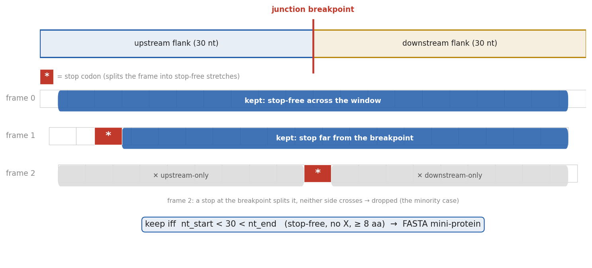
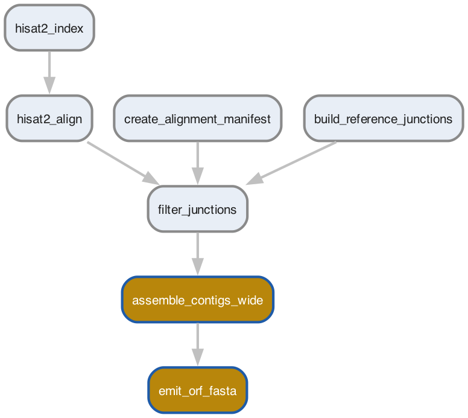
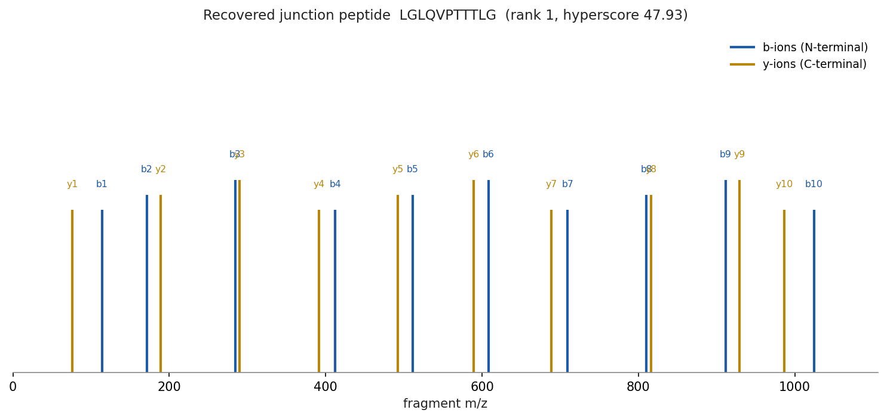

## The gap {.smaller}

Our pipeline **predicts** which splice-junction peptides should bind HLA (MHCflurry presentation score [@odonnell2020mhcflurry]).

::: {.fragment}
A prediction is a hypothesis, not evidence.
:::

::: {.fragment}
**The question this sets up:** do tumor-specific splice-junction peptides *actually* get presented on real tumor cells?
:::

::: {.fragment}
::: {.callout-note appearance="simple"}
This deck is the **method + instrument + validation** chapter. The wet/compute re-search that answers the question is Issue #1176 AC-6.
:::
:::

---

## The idea {.smaller}

Search **public tumor HLA-I immunopeptidome spectra** (peptides physically eluted off tumor MHC) against a **junction-derived protein database**.

::: {.incremental}
- The FASTA we build is the search **database** (candidate answers), not a sample.
- The **canonical proteome enters as a *competing target***, not a pre-exclusion filter: a junction peptide is only called when it out-scores every canonical explanation of the same spectrum.
- Keep the DB **RNA-seq-bounded** to the cohort - an unbounded catalog manufactures false candidates and inflates FDR [@nesvizhskii2016achilles].
:::

---

## The instrument {.smaller}

Junction contig → 3-frame translate → split at stop codons → keep the single **breakpoint-crossing** stretch → FASTA mini-protein.

{width=88%}

---

## Where it plugs in {.smaller}

A **decoupled** 30-nt path (gold) adds two rules - a widened-flank `assemble_contigs` instance (reusing the existing script) plus the new `emit_orf_fasta` emitter. The production MHCflurry k-mer path (27-nt flanks, `peptide_lengths [8,9,10]`) is untouched.

{width=42%}

---

## The deeper insight {.smaller}

The ORF-stretch FASTA is the **superset representation**. You can derive any k-mer set by substringing a stretch; never a stretch from k-mers.

```{mermaid}
flowchart LR
  J[junction contig] --> O["ORF stretch (FASTA)<br/>canonical intermediate"]
  O --> A["class-I windower<br/>8-11 → MHCflurry-I"]
  O --> B["class-II<br/>13-25 → NetMHCIIpan"]
  O --> C["pass-through<br/>→ MS search"]
```

Two of the three future consumers (MHC-II, MS) take protein FASTA **directly**. Promotion to the canonical intermediate is trigger-gated on MHC-II: Issue #1255.

---

## Validation - it recovers a real junction peptide {.smaller}

On the chr22 test cohort the emitter produced **335** junction ORF stretches (frames balanced 110/113/112; 0 stop/X). Sage [@lazear2023sage] loaded and nonspecifically digested the combined DB to **49,432** peptides + decoys, and recovered the junction peptide below.

{width=74%}

::: {.callout-note appearance="simple" style="font-size:0.8em"}
Recovery is the check (a bogus peptide fails it); statistical significance against real spectra is Issue #1176 AC-6, not this smoke.
:::

---

## What's next {.smaller}

- **Issue #1176 AC-6 - the real re-search:** the Courcelles CRC cohort (MS `PXD071022` CC0 + matched RNA-seq `GSE312236`), competing-target DB, subset FDR on the junction partition, entrapment + RNA-seq corroboration [@chong2020newance].
- **Issue #1255 - architecture:** promote the ORF-stretch FASTA to the canonical peptide-generation intermediate when MHC-II lands.
- **Honest claim throughout:** RNA-seq witnesses that the source *sequence exists*, not that the peptide is a presented ligand - the MS step still needs ordinary FDR discipline.

---

## References {.smaller}

::: {#refs}
:::
