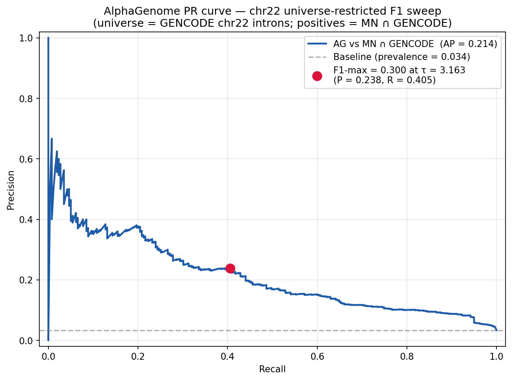
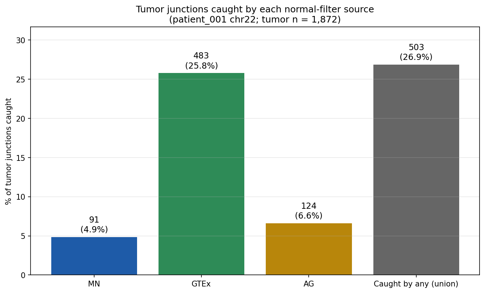
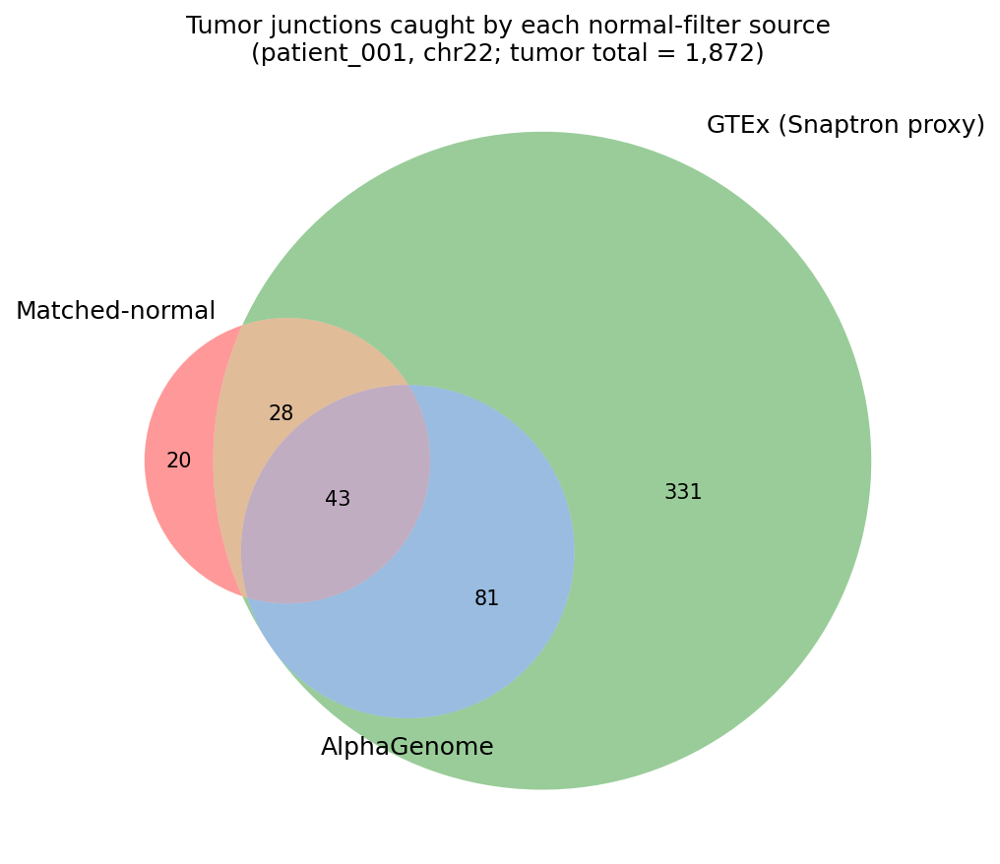

## The question

::: {.r-fit-text}
Is AlphaGenome worth
:::

::: {.r-fit-text}
adding as a third
:::

::: {.r-fit-text}
normal-junction filter?
:::

. . .

::: {.callout-note appearance="simple"}
**Why now:** parent [Issue #203](https://github.com/Jin-HoMLee/splice-neoepitope-pipeline/issues/203) — rethink normal-junction filtering with population panel + AlphaGenome as candidate fallback. This deck is the Experiment 3 outcome ([Issue #225](https://github.com/Jin-HoMLee/splice-neoepitope-pipeline/issues/225)), feeding back into the #203 decision rule.
:::

---

## Why this matters {.smaller}

**Current pipeline:** matched-normal RNA-seq filters tumor junctions → only tumor-exclusive junctions reach neoepitope prediction.

**Problem:** matched-normal samples are not always available (cost, logistics, retrospective cohorts).

**Three candidate replacements:**

::: {.incremental}
1. **Matched-normal (MN)** — current pipeline source. Patient-specific, but availability-limited.
2. **GTEx pan-tissue** — population-scale union via Snaptron [@wilks2018snaptron; @gtex2020v8] (production panel tracked in [Issue #211](https://github.com/Jin-HoMLee/splice-neoepitope-pipeline/issues/211))
3. **AlphaGenome predicted-normal** [@avsec2026alphagenome] — reference-only, tissue-conditioned ML
:::

. . .

**Today's question:** when you already have GTEx, does AG add value on top? Or is it subsumed?

---

## Method — block diagram {.smaller}

```{mermaid}
%%| fig-width: 11
flowchart LR
    T["Tumor RNA-seq<br/>(SRR9143066)"] -->|"HISAT2 + regtools"| TJ["Tumor junctions<br/>n = 1,872"]
    MN["Matched-normal<br/>RNA-seq (SRR9143065)"] -->|"HISAT2 + regtools"| MS["MN junctions<br/>n = 1,714"]
    GT["Snaptron GTEx v2<br/>(hg38)"] -->|"≥1 sample,<br/>chr22"| GS["GTEx panel<br/>n = 880,769"]
    AG["AlphaGenome<br/>chr22 predictions"] -->|"τ = F1-max<br/>vs MN ∩ GENCODE"| AS["AG predicted-normal<br/>n = 448"]
    TJ --> R{{"Set intersections<br/>tumor ∩ each filter"}}
    MS --> R
    GS --> R
    AS --> R
    R --> V[["Venn + decision rule"]]

    style R fill:#ffe6a3,stroke:#b8860b,stroke-width:2px
    style V fill:#a3d8ff,stroke:#1e5ba8,stroke-width:2px
```

**Tooling:** `HISAT2` [@kim2019hisat2] + `regtools` [@cotto2023regtools] (alignment + junction extraction); GENCODE v47 [@mudge2025gencode] for the F1-sweep universe.

---

## Data scope {.smaller}

| Field | Value |
|---|---|
| Patient | patient_001 |
| Samples | Tumor `SRR9143066` + matched normal `SRR9143065` (gastric cancer, adjacent stomach) |
| Read depth | 500K reads / sample (test dataset) |
| Chromosome | **chr22 only** (test-config harness) |
| Reference | GRCh38 (UCSC hg38) |
| Tumor set | 1,872 junctions |
| MN set | 1,714 junctions |
| GTEx panel | 880,769 junctions (Snaptron chr22 pan-tissue, ≥1 sample) |
| AG predicted-normal | 448 junctions @ τ = F1-max |

::: {.callout-warning appearance="simple"}
**Snaptron proxy ≠ production GTEx.** The chr22 union from Snaptron stands in for the production GTEx panel (tracked in [Issue #211](https://github.com/Jin-HoMLee/splice-neoepitope-pipeline/issues/211)). Pan-tissue not tissue-matched — matches the vaccine-safety reasoning from [Issue #203](https://github.com/Jin-HoMLee/splice-neoepitope-pipeline/issues/203).
:::

---

## AG threshold via F1 sweep {.smaller}

**Universe:** GENCODE chr22 introns (n = 7,731). **Positives:** matched-normal ∩ GENCODE (n = 259) — the confirmed tissue-expressed set. **Negatives:** 7,472. **AG-scored:** 5,728 / 74.1% of universe.

::: {.callout-note appearance="simple"}
Universe-restricted F1 (not full tumor set) — matches [Issue #224](https://github.com/Jin-HoMLee/splice-neoepitope-pipeline/issues/224) §5 semantics so this F1 is directly comparable to #224's reported value.
:::

{width=72%}

**Result:** F1 = **0.300** at τ = **3.16** (P = 0.238, R = 0.405). Threshold-binarised AG predicted-normal set: **448 junctions**.

Compute via `sklearn.metrics.precision_recall_curve` [@pedregosa2011scikit] over the dense score grid (5,729 unique scores).

---

## Caught counts {.smaller}

For each filter F, `caught_by_F = tumor ∩ F` — i.e. tumor junctions the filter would remove as non-tumor-specific.

{width=70%}

::: {.incremental}
- **MN catches 4.9%** — sparse because this is a 500K-read patient sample.
- **GTEx catches 25.8%** — population scale advantage shows immediately.
- **AG catches 6.6%** — looks marginal on its own.
- **Stacked union catches 26.9%** — only +1.1pp over GTEx alone. Hint at the killer slide.
:::

---

## The killer slide {.smaller}

{width=68%}

::: {.fragment}
**Two over-determining findings:**

- **Only AG = 0.** Not a single AG-caught tumor junction is unique to AG.
- **GTEx ∩ AG = AG (124 = 124).** AG is a *strict subset* of GTEx at the F1-max threshold.
:::

. . .

**Implication:** stacking AG on top of GTEx adds zero new filtering signal. Even Exp 2 (germline-aware AG, deferred to [Sub-Issue #381](https://github.com/Jin-HoMLee/splice-neoepitope-pipeline/issues/381) pending WGS) cannot rescue this — the AG set itself is contained in GTEx.

---

## Decision rule {.smaller}

| Scenario | Threshold | Decision |
|---|---|---|
| F1 ≥ 0.8 **AND** patient-specific delta > 10% | both required | Adopt as 3rd always-on source |
| F1 ≥ 0.7 **AND** ≥ 5% unique vs GTEx | both required | Adopt as fallback only |
| **F1 < 0.5 OR delta < 1%** | **either triggers** | **No-go — treat as tissue prior** |

::: {.incremental}
- F1 = **0.300** → trips the `F1 < 0.5` NO-GO clause directly.
- **0.0%** AG-unique-vs-GTEx → fails the fallback tier's `≥ 5%` test.
- Exp 2 delta deferred — **not load-bearing**. Exp 1's F1 alone is conclusive.
:::

. . .

::: {.callout-important}
The verdict is **over-determined** — F1 and unique-vs-GTEx independently land in NO-GO.
:::

---

## Decision

::: {.r-fit-text}
🔴 NO-GO
:::

::: {.r-fit-text}
treat as tissue prior
:::

::: {.fragment}
- AlphaGenome predicted-normal does **not** add filtering value over GTEx on chr22 patient_001.
- Filter stack stays at **MN + GTEx** (with AG dropped as a candidate third source).
:::

---

## Caveats — read before citing the headline {.smaller}

::: {.incremental}
1. **chr22 PoC scope.** Generalisation to full genome must be re-validated.
2. **Snaptron proxy ≠ production GTEx.** Production panel via [Issue #211](https://github.com/Jin-HoMLee/splice-neoepitope-pipeline/issues/211); when it lands, re-run the GTEx-set construction cell. Conclusion is unlikely to flip — AG is subsumed by Snaptron's pan-tissue union; the production panel will be at least as inclusive.
3. **Exp 2 deferred.** [Sub-Issue #381](https://github.com/Jin-HoMLee/splice-neoepitope-pipeline/issues/381) handles AG with germline variants once WGS lands. Not load-bearing for this NO-GO.
4. **Pan-tissue not tissue-matched.** Matches [Issue #203](https://github.com/Jin-HoMLee/splice-neoepitope-pipeline/issues/203) vaccine-safety framing.
5. **AG threshold = F1-max from #224 §2(b)** — recomputed inline because #224 didn't persist `best_threshold`.
:::

---

## Next steps {.smaller}

::: {.incremental}
- **Close [Issue #225](https://github.com/Jin-HoMLee/splice-neoepitope-pipeline/issues/225)** after PR #452 merges; carry the NO-GO row into parent [Issue #203](https://github.com/Jin-HoMLee/splice-neoepitope-pipeline/issues/203) Exp 3 (immediate post-merge).
- **[Issue #211](https://github.com/Jin-HoMLee/splice-neoepitope-pipeline/issues/211) (production GTEx)** — when it lands, re-run §2(c) cell against the production panel; sanity-check the NO-GO holds.
- **[Sub-Issue #381](https://github.com/Jin-HoMLee/splice-neoepitope-pipeline/issues/381) (Exp 2: germline-aware AG)** — patient_001 with WGS; nice-to-have follow-up, but the Exp 1 NO-GO already binds.
- **[Issue #455](https://github.com/Jin-HoMLee/splice-neoepitope-pipeline/issues/455) (notebooks/slides migration)** — moves `issue_224_*` + `issue_393_*` into the `research/experiments/` convention established by this work.
:::

---

## References

::: {#refs}
:::

<!-- bibliography renders here, auto-populated by Pandoc from refs.bib via [@cite-keys] in the text above -->
