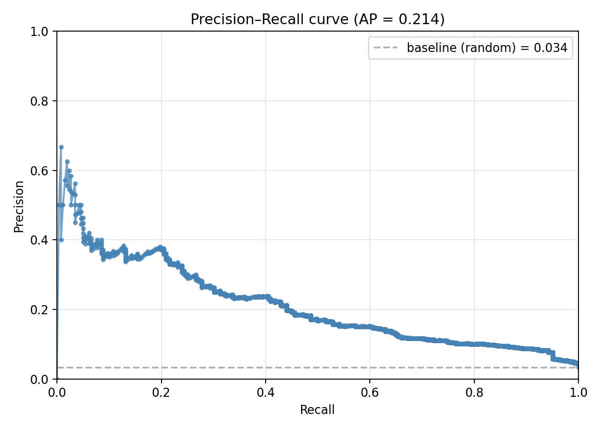
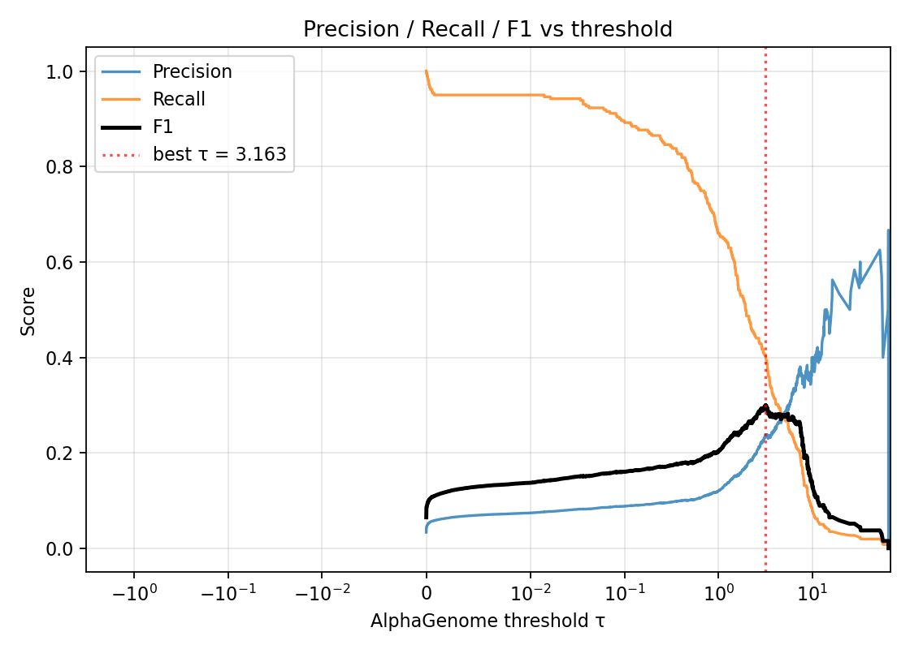
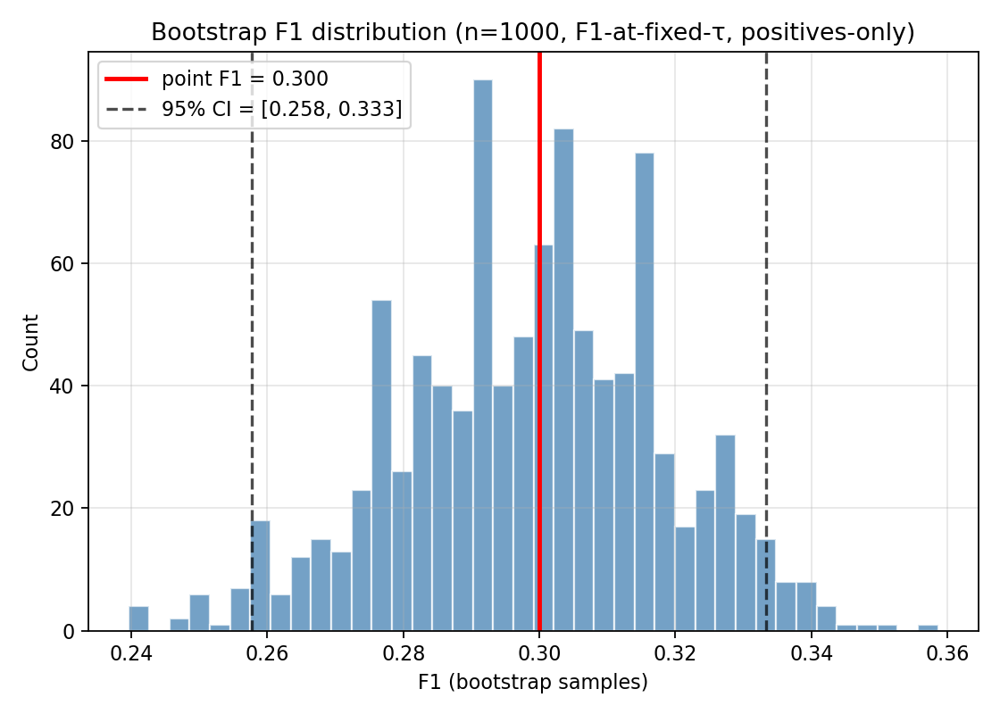

## The question

::: {.r-fit-text}
Can AlphaGenome predict
:::

::: {.r-fit-text}
tissue-expressed splicing
:::

::: {.r-fit-text}
from reference alone?
:::

. . .

::: {.callout-note appearance="simple"}
**Why now:** parent [Issue #203](https://github.com/Jin-HoMLee/splice-neoepitope-pipeline/issues/203) — rethink normal-junction filtering with population panel + AlphaGenome as candidate fallback when no matched-normal sample exists.
:::

---

## Why this matters {.smaller}

**Current pipeline:** matched-normal RNA-seq filters out tissue-expressed splicing → only tumor-exclusive junctions reach neoepitope prediction.

**Problem:** matched-normal samples aren't always available (resource cost, sample logistics, retrospective cohorts).

**Three candidate replacements:**

::: {.incremental}
1. **GTEx pan-tissue filter** — population-scale, but tissue mismatch risk ([Issue #212](https://github.com/Jin-HoMLee/splice-neoepitope-pipeline/issues/212))
2. **AlphaGenome predicted normal** — *reference-only, tissue-conditioned ML*  ← this experiment
3. **Hybrid (stacked evidence)** — best-of-both
:::

. . .

**Today's question:** does (2) work on its own? Decision-rule outcome feeds [Issue #203](https://github.com/Jin-HoMLee/splice-neoepitope-pipeline/issues/203).

---

## Method — block diagram {.smaller}

```{mermaid}
%%| fig-width: 11
flowchart LR
    A["Matched-normal<br/>RNA-seq<br/>(500K reads)"] -->|"HISAT2 +<br/>regtools"| B["Observed junctions<br/>n = 1,714"]
    C["GENCODE v47<br/>chr22 GTF"] -->|"parse exons<br/>→ introns"| D["Annotated introns<br/>n = 7,731<br/>← UNIVERSE"]
    E["GRCh38 chr22<br/>reference<br/>(no variants)"] -->|"AlphaGenome<br/>predict_interval<br/>(stomach GTEx)"| F["AG scores<br/>per junction"]
    B --> G((("Positives<br/>n = 259")))
    D --> G
    G --> M["P / R / F1<br/>vs threshold τ"]
    D --> M
    F --> M

    style G fill:#ffe6a3,stroke:#b8860b,stroke-width:2px
    style M fill:#a3d8ff,stroke:#1e5ba8,stroke-width:2px
```

**Flow (left to right):**

::: {.incremental}
1. **3 inputs** — matched-normal RNA-seq, GENCODE annotation, GRCh38 reference.
2. **3 derived sets** — observed junctions (regtools), annotated introns (universe), AG scores.
3. **Universe = Positives (259) + Negatives (7,472)** *(negatives depth-confounded → slide 11)*
4. **Evaluate** — sweep τ, compute P/R/F1. *Recall = 105/259 is the unconfounded view.*
:::

::: {.callout-tip appearance="simple"}
`regtools` [@cotto2023regtools] · `HISAT2` [@kim2019hisat2] · `AlphaGenome` [@avsec2026alphagenome]
:::

---

## Data scope {.smaller}

| Field | Value |
|---|---|
| Patient | patient_001 |
| Samples | Tumor SRR9143066 + matched normal SRR9143065 (gastric cancer, adjacent stomach) |
| Read depth | 500K reads per sample (test dataset) |
| Chromosome | **chr22 only** (PoC scope) |
| Reference | GRCh38 (UCSC hg38) |

::: {.callout-warning appearance="simple"}
**AG sweep:** stomach GTEx track is the *only* available stomach track in AlphaGenome's inventory (1 of 1; polyA RNA-seq). 39 × 1,048,576-bp tiles · ~7.4 min wall. Coverage asymmetry vs liver (4 tracks) is a caveat we return to.
:::

---

## Universe construction — Framing 1 {.smaller}

We chose **annotated-chr22-introns as the evaluable universe** [@mudge2025gencode]:

- **Universe:** 7,731 GENCODE-annotated chr22 introns
- **Positives:** 259 (matched-normal ∩ annotated) — *the confirmed tissue-expressed set*
- **Negatives:** 7,472 (annotated, not in matched-normal at this depth)

. . .

**Three framings were on the table — what would count as a "false positive"?**

| Framing | Universe | A "false positive" is… | Verdict |
|---|---|---|---|
| **1 (chosen)** | 7,731 annotated chr22 introns | An annotated intron AG predicts that isn't in matched-normal | Mirrors production filter |
| 2 | All AG predictions genome-wide | **Any** AG call not in our 259-set — including AG calls that are correct but missed by our shallow 500K-read sample | Pessimistic; conflates *"should predict"* with *"predicts at all"* |
| 3 | Same as #1 but with deeper matched-normal first | Deferred (depends on the rerun) | Better as Exp 3 follow-up |

. . .

**Why Framing 1:** mirrors the production filter use case — *"given a candidate junction, is it likely normal-expressed?"* Universe = the candidate set; AG = the classifier.

---

## Metric convention — AUC-PR {.smaller}

**sklearn's Average Precision** [@pedregosa2011scikit]:

$$\mathrm{AP} = \sum_n (R_n - R_{n-1}) \cdot P_n$$

. . .

::: {.callout-important}
sklearn explicitly warns that the *trapezoidal* AUC (`auc(recall, precision)`) is **"too optimistic"** — linear interpolation between threshold points is unsupported by the data.
:::

. . .

**Validated:** our `average_precision_numpy` matches `sklearn.metrics.average_precision_score` exactly (delta = 0.000000).

**Threshold sweep:** all 5,729 distinct AG scores in the universe — not a coarse quantile grid (the latter missed the true F1 optimum by ~6% pre-correction).

---

## Headline result {.smaller}

| Metric | Value | Note |
|---|---|---|
| **AP / AUC-PR** | **0.214** | baseline (random) = 0.034 → **6.3× chance** |
| **Best F1** | **0.300** at τ = 3.163 | TP=105, FP=336, FN=154, TN=7,136 |
| **Precision** @ best F1 | 0.238 | depth-confounded (see honest-headline slide) |
| **Recall** @ best F1 | **0.405** | the honest headline number |
| **F1 95% bootstrap CI** | [0.258, 0.333] | F1-at-fixed-τ, positives-only (n=1000) |
| AG-predicted introns | 5,728 / 7,731 (74.1%) | non-zero score in stomach track |

---

## How does the classifier trade off? {.smaller}

{width=68%}

::: {.fragment}
Each point = one threshold's (recall, precision) pair. Curve summarizes *all* thresholds at once → AP.
:::

---

## Where should we set τ in production? {.smaller}

{width=68%}

::: {.fragment}
Same data as the P-R curve, **different question:** for the production filter, we need a *specific τ* — this view picks it.
:::

---

## Bootstrap F1 — what the CI measures {.smaller}

{width=58%}

::: {.fragment}
**CI semantics — read carefully:** this measures *F1-at-fixed-τ*, **not** CI of *max-F1 over τ*. τ is held constant across iterations. Re-tuning τ per bootstrap would absorb the optimistic-by-tuning effect and typically widen the interval.
:::

---

## The honest headline {.smaller}

**Precision (0.238) is depth-confounded.**

Many of the 336 "false positives" are plausibly tissue-expressed introns the 500K-read matched-normal sample missed at this depth. Precision is a **lower bound**, not the truth.

. . .

**Recall (0.405) is the honest read.**

It measures AG's hit rate on the **confirmed** tissue-expressed set. The matched-normal depth doesn't bias *which* known positives AG recovers.

. . .

::: {.callout-tip}
**Report recall, not precision, as the headline.** AG identifies ~40% of confirmed tissue-expressed introns at the F1 optimum.
:::

---

## Decision

::: {.r-fit-text}
🟡 AMBER — real signal, not standalone
:::

::: {.fragment}
**Not** standalone-filter strength on chr22 (recall ~40% means missing ~60% of true positives at the F1 optimum).

**But** real signal: 6.3× over chance baseline, and a viable secondary evidence stream stacked with GTEx [@mudge2025gencode] + matched-normal-where-available.
:::

. . .

**Next:** Exp 3 head-to-head — three filters compared on patient_001 ([Issue #225](https://github.com/Jin-HoMLee/splice-neoepitope-pipeline/issues/225)).

---

## Caveats — do not omit when citing the headline {.smaller}

::: {.incremental}
1. **chr22 PoC scope.** Generalisation to full genome must be validated.
2. **500K-read matched-normal depth.** Negatives include hidden false-negatives → precision is a lower bound.
3. **Single stomach track.** AG inventory has only 1 stomach GTEx track (polyA). Tissue coverage asymmetry.
4. **Annotated-only ground truth.** Excludes novel splicing; not a measure of AG's novel-event prediction.
5. **n = 259 positives.** Bootstrap CI is wide. Denser matched-normal would tighten substantially.
6. **Positives-only, fixed-τ bootstrap.** CI reports positive-bag variance at the published τ, not max-F1 sampling variance.
:::

---

## Next steps {.smaller}

::: {.incremental}
- **Exp 3** ([Issue #225](https://github.com/Jin-HoMLee/splice-neoepitope-pipeline/issues/225)) — comparative filter strength: matched-normal vs GTEx vs AlphaGenome on patient_001. Natural follow-up from this PoC.
- **GTEx integration** ([Issue #212](https://github.com/Jin-HoMLee/splice-neoepitope-pipeline/issues/212)) — pairs with AG as the multi-stream filter design feeding MHCflurry [@odonnell2020mhcflurry] presentation scoring.
- **Scale-up refactor.** chr22 produced ~2.6M AG-prediction dicts. Full-genome ~67M ≈ **10-15 GB RAM** with current accumulator pattern. Switch to per-tile parquet append + groupby-max merge before Exp 3 runs full-genome.
- **Exp 2** ([Sub-Issue #381](https://github.com/Jin-HoMLee/splice-neoepitope-pipeline/issues/381)) — patient_001 with germline; blocked on WGS acquisition.
:::

---

## References

::: {#refs}
:::

<!-- bibliography renders here, auto-populated from refs.bib via [@cite-keys] above -->
