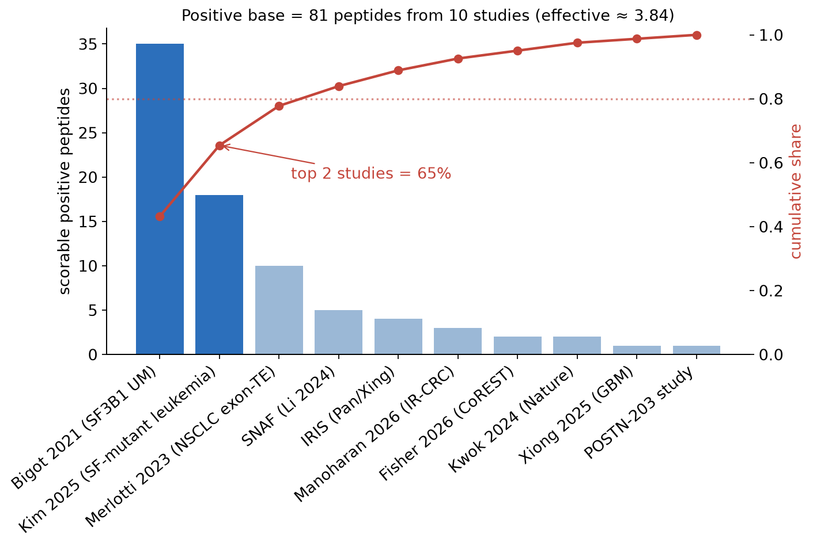
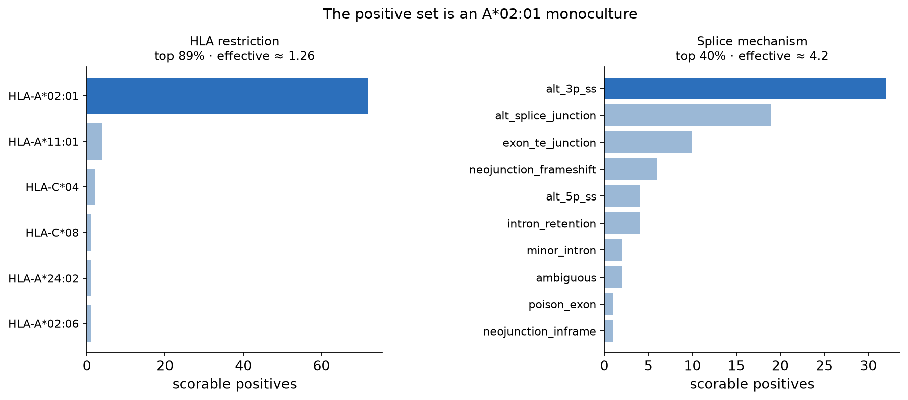
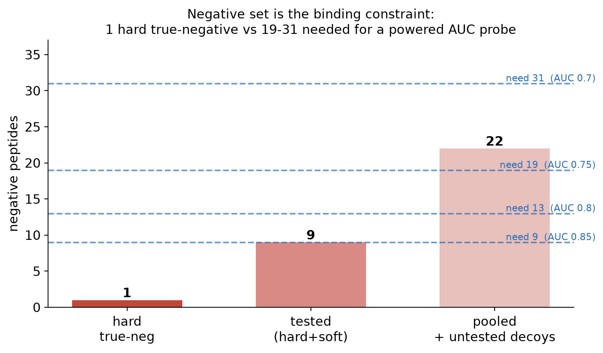

## The question

::: {.r-fit-text}
How much functionally-validated
:::

::: {.r-fit-text}
splice-neoantigen ground truth
:::

::: {.r-fit-text}
does the field actually have?
:::

. . .

::: {.callout-note}
The answer bounds every benchmark built on it - including our own [#680](https://github.com/Jin-HoMLee/splice-neoepitope-pipeline/issues/680). The scarcity is itself the publishable point.
:::

## The two gates a peptide must pass

A peptide enters the registry only if it clears **both**:

- **Gate 1 - splice origin.** Derived from an aberrant splice junction (alt 3′/5′ SS, exon skip, intron retention, exon-TE junction) - *not* an SNV/indel neoantigen.
- **Gate 2 - measured immunogenicity.** T-cell reactivity *assayed* (IFN-γ, tetramer, cytotoxicity, 4-1BB) - *not* predicted in silico.

. . .

Of **96** registry rows, **94** pass both gates; **81 are scorable** - a published sequence + an HLA restriction + a positive readout.

::: {.callout-tip}
81 peptides is the entire field-wide positive base. We then ask: how concentrated is it?
:::

## Concentration, three ways

For each axis (study / allele / mechanism) we report:

| Metric | Meaning |
|---|---|
| **Top share** | fraction from the single largest contributor |
| **HHI** (Σ pᵢ²) | 1/k if perfectly spread, 1.0 for a monopoly |
| **Effective number** (1 / HHI) | how many *equally-weighted* contributors the diversity is worth |

The effective number is the honest headline: **10 studies that are really worth ~3.8.**

## Result 1 - a few-study assembly

{width="78%"}

Top study (Bigot SF3B1-UM [@bigot2021sf3b1]) = **43%**; top two (+ Kim leukemia [@kim2025sfmutant]) = **65%**. Effective ≈ **3.8** independent studies.

## Result 2 - an HLA-A\*02:01 monoculture

{width="92%"}

**72/81 (89%) are A\*02:01** - effective ≈ **1.26 alleles**. Mechanism spread is healthier (effective ≈ 4.2). Any allele-stratified result collapses to an A2 result.

## Result 3 - the negative set is the binding constraint

{width="74%"}

**One** hard true-negative field-wide [@fisher2026corest] - and it's A\*11:01, not even the dominant A2 allele; 8 soft (failed-to-prime [@manoharan2026ircrc]). A powered AUC probe needs **19-31** negatives [@hanley1982roc]. Specificity is, today, **unmeasurable** (n = 1).

## What it means - a probe, not a powered benchmark

::: {.incremental}
- Positives suffice to **rank-order** a predictor - but only within an A\*02:01, ~4-study, ~4-mechanism slice.
- No validated negatives ⇒ **no specificity, no calibrated-probability** claim.
- Every reported splice-immunogenicity AUC must state: small, single-allele, source-clustered denominator; ~no true-negative anchor.
- This bounds the **#680** headline metric by construction.
:::

## The two rate-limiting reagents

The scarcity analysis names *what to source next* - not "more curation," but two specific gaps:

1. **Non-A\*02:01 functionally-validated positives** - to break the monoculture (tracked: [#839](https://github.com/Jin-HoMLee/splice-neoepitope-pipeline/issues/839)).
2. **Measured true-negatives** - splice-derived, MHC-presented, assayed non-reactive - the single scarcest reagent in the field (tracked: [#911](https://github.com/Jin-HoMLee/splice-neoepitope-pipeline/issues/911)).

. . .

Adding more A2 positives to an already-saturated axis does **not** improve the benchmark.

## Caveats {.smaller}

- **Source-string hygiene.** SNAF/IRIS carry split source strings; collapsed to 10 canonical studies (collapsing *strengthens* the clustering finding).
- **81 is a floor.** Sequence-blocked gate-passers (e.g. Zhao 2025) excluded pending retrieval; folding them doesn't relieve the A2 / negative constraints.
- **Soft ≠ tested-negative.** The 8 IR-CRC soft negatives must never pool with the 1 hard negative as equal strength ([`LABELING_SCHEME.md`](../LABELING_SCHEME.md) §7).
- **Power calc is illustrative.** Hanley-McNeil sizing sets the order of magnitude of the negative requirement, not an exact stratified-design target.

All numbers: [`notebook.ipynb`](notebook.ipynb) → [`outputs/`](outputs/); prose: [`sparsity_writeup.md`](sparsity_writeup.md).

## References {.smaller}

::: {#refs}
:::
