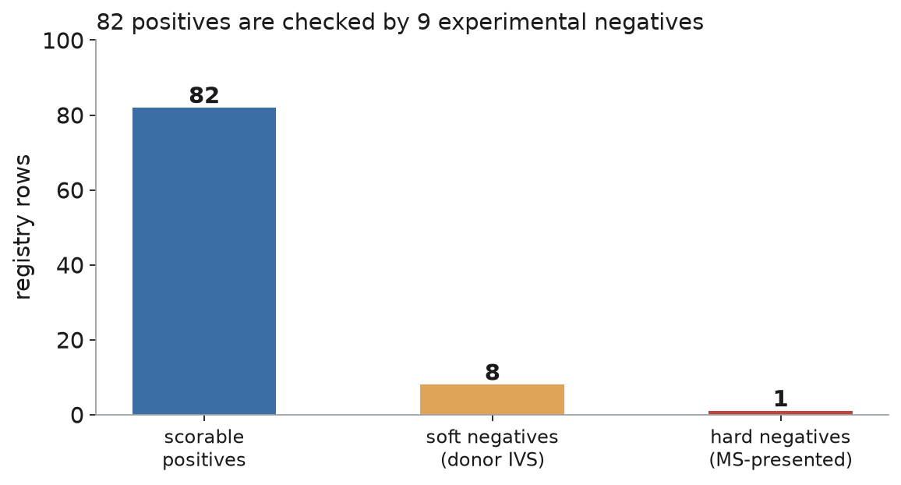
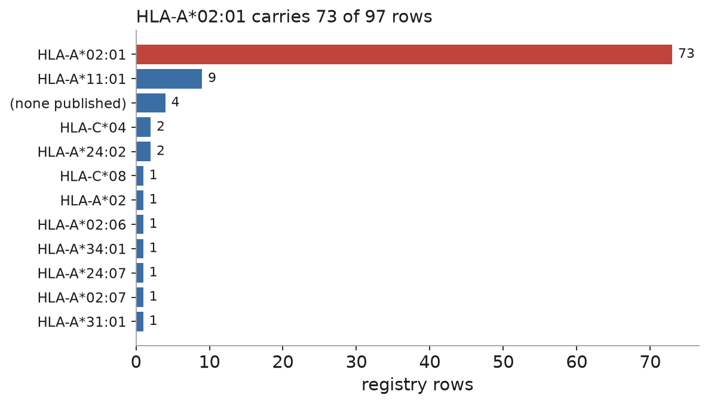
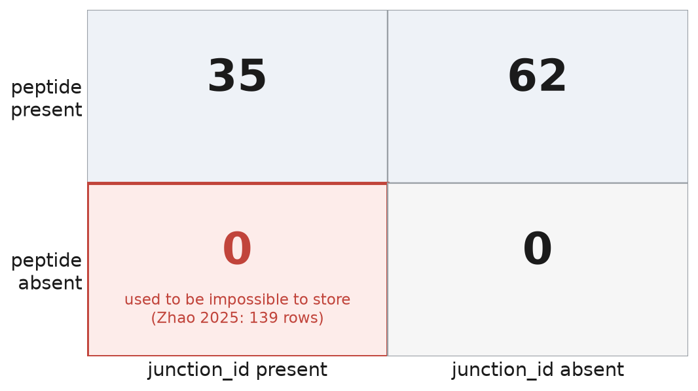

## 97 rows from 12 studies is the entire field-wide ground truth {.smaller}

Every splice-derived tumor peptide that someone has actually tested on real T cells, gathered from the published literature. This is not a sample of the field - as far as we can find, it **is** the field.

| tier | rows | what it means |
|---|---:|---|
| `functional-scorable` | 82 | splice-derived, tested on T cells, and we know its exact sequence + allele |
| `candidate-negative` | 8 | tested negative, but only in a lab-donor priming assay (a *weak* no) |
| `functional-nonscorable` | 4 | tested, but the presenting allele was never published |
| `hard-negative-true-splice` | 1 | shown on the cell surface, yet T cells did not react (a *strong* no) |
| `presentation-prevalence` | 1 | shown on the surface and common in tumors, but never tested on T cells |
| `negative-control-not-splice` | 1 | a normal control peptide (not splice-derived at all) |

This is a **probe, not a full benchmark**. Any score you compute must say which negatives it used.

## 82 positives are checked by only 9 real negatives

{fig-align="center" width="72%"}

Negatives are what's scarce, and it's worse than the count looks: 8 of the 9 are only *weak* no's - a peptide that failed to wake up T cells taken from a healthy donor in a dish [@manoharan2026ircrc], which doesn't prove it would stay quiet in a real patient. Exactly **one** row is a clean, strong negative.

## Three quarters of the registry is a single allele {.smaller}

{fig-align="center" width="70%"}

The HLA-A\*02:01 skew comes from the field, not our curation: the two biggest studies [@bigot2021sf3b1; @kim2025sfmutant] only looked at that allele. When we went hunting for other alleles to even it out (#839), we found **none** that qualify. So a scorer trained here is really a scorer for A\*02:01.

## Keying on the peptide locked out a whole class of studies

{fig-align="center" width="62%"}

Every row used to need the peptide's amino-acid sequence just to exist. But a splice study's native output is the **junction** - where the gene was cut and rejoined - not the peptide. Zhao 2025 [@zhao2025hcc] clears both of our bars, yet lists its 139 antigens (Supplementary Table S1) **by genome location with no sequences** - so it added **zero rows**.

## Letting a row key on its junction *or* its peptide lets those studies in {.smaller}

Now a row can be identified by its `junction_id`, its `peptide`, or both - it just needs at least one of the two. If both are present, the junction is the identity.

And a missing peptide isn't a bare blank; it says **why** it's missing, because the follow-up differs:

| `peptide_status` | meaning | follow-up |
|---|---|---|
| `published-recovered` | sequence in hand (all 97 rows today) | none |
| `published-pending` | sequence exists, not yet obtained (Zhao, asked authors) | keep chasing |
| `unpublished-idonly` | study only ever gave locations | ask the authors |
| `na-junction-level` | never had a peptide (a plain junction) | none |

A checker keeps these consistent: no peptide means no length, it can't sit in the scorable set, and it must carry a real junction location. **Tested end to end** - a Zhao-style row now goes in clean.

## One junction can produce several peptides, so we don't merge on the junction {.smaller}

The tempting rule - "one junction, one row" - is wrong, and the registry already has the counterexample. A single Kim 2025 event [@kim2025sfmutant] yields three different peptides:

```
junction ci@16:719606:720123:+  ->  FLWPGLGPS   (9 residues)
                                     FLWPGLGPSV  (10 residues, the same plus one)
                                     ILGSLTWSC
```

Whether a peptide is immunogenic depends on the exact peptide + allele pair - you can't boil it down to the junction. So a row counts as a duplicate only if its junction, peptide, **and** allele all match. When we *do* want a junction-level view, a separate helper rolls the peptides up under their junction.

## We can't yet compare coordinates across studies - the genome version isn't recorded {.smaller}

The plan was one tidy coordinate format for every junction. **Two facts kill it.**

**Nobody wrote down which genome version the coordinates use** - it's absent from every file we hold. You can't line up coordinates when you don't know the reference they're on.

**And the 17 with real coordinates come in four shapes, two of which bundle more than one junction:**

| study | example | shape |
|---|---|---|
| SNAF [@li2024snaf] | <code>chr5:33954504-33963931(-)</code> | one junction |
| IRIS [@pan2023iris] | <code>chr15:-:75655550:75655631:&hellip;</code> | a six-number event |
| Kim 2025 [@kim2025sfmutant] | <code>se@8:22480210:22481428:-&#124;&hellip;</code> | two junctions |

Picking "the" junction out of a two-junction event means guessing which one made the peptide - the kind of guessing we've banned. So we keep each study's coordinate **exactly as it was published**, cross-study comparison waits, and the cleanup is its own task (#1100).

## What needs your judgment {.smaller}

The bot review and the tests cover the code. These are the **judgment calls I made** that you should push back on:

1. **Putting off the tidy coordinate format (#1100) instead of inventing one now.** I decided nothing waiting on us needs it yet. If you think the junction-level detection benchmark (#679) is closer than I assumed, that was the wrong call.
2. **A row can be marked "the study only named the gene" and still carry a real junction location we found elsewhere.** That mark (`junction_mapping_grade`) records what the *original study* published; the location (`junction_id`) records what we now hold. They can disagree on purpose - so "which rows have a location?" must be answered from the location column, not the mark.
3. **Not blocking the nonsense combo "no peptide, yet labeled positive".** It's currently allowed. I sent the guard to #911 so it gets written against real data, not a guess.
4. **Calling the allele-rebalance a real dead end** rather than a search I didn't push hard enough. It depends on our inclusion rules; loosen them and rows might appear.

## References {.smaller}

::: {#refs}
:::

**Where this lives:** `registry.tsv` (97 rows) · `LABELING_SCHEME.md` §7 · `validate_registry.py` + `registry_dedup.py` · 34 tests. Every figure is redrawn from `registry.tsv` by `figures/_regenerate_figures.py`, so the table is the single source and no *registry-derived* number here was typed by hand. (The lone exception is Zhao's 139, which can't come from the table - it contributes zero rows - and is cited to its Supplementary Table S1.)
