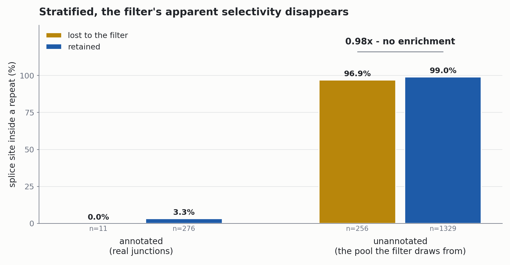
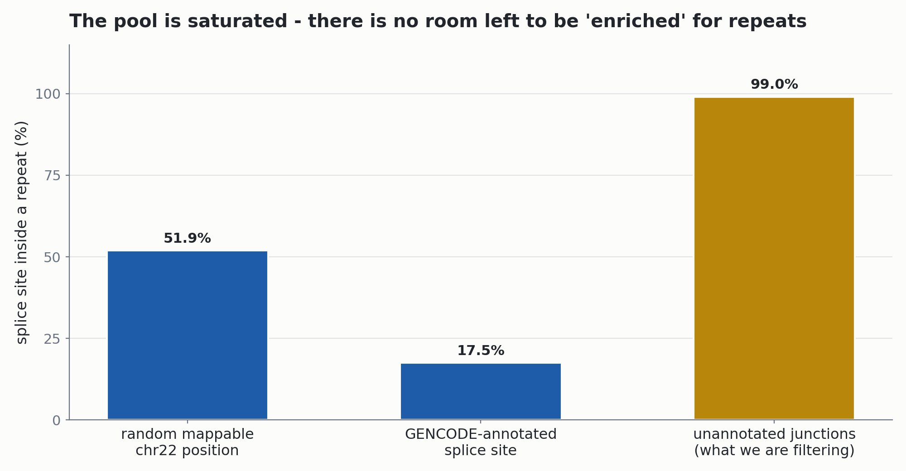
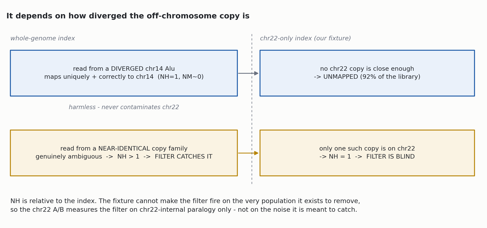

## The claim, and why it is falsifiable

HISAT2 [@kim2019hisat2] reports **one arbitrary copy** of a multimapped read. Spliced reads over repeats therefore produce junction calls at arbitrary repeat copies - and those become spurious neoepitope candidates.

**The proposed lever:** drop multimapped alignments before junction extraction, using a samtools filter expression [@danecek2021samtools].

```bash
samtools view -e '[NH]==1'   # feeds regtools junctions extract
```

::: {.callout-note}
## The claim is testable, not just plausible
If the junctions the filter removes are **not** enriched for repeat overlap relative to the ones it keeps, then it is removing *something else* - and the mechanism story is wrong even when the counts look reasonable.
:::

Everything that follows is an attempt to falsify it.

## Method: an A/B on chr22, categorized by RepeatMasker

**Design.** Same tumor sample, same index, filter off vs on. HISAT2 is deterministic per read, so any differential junction is attributable to the filter, not to run-to-run jitter.

**The probe.** A junction counts as *repeat-overlapping* when a **splice site** falls inside a UCSC `rmsk` interval.

::: {.callout-tip}
## Why the splice sites, not the whole intron
Introns are repeat-dense - an intron merely *spanning* a repeat is unremarkable. A splice site **inside** a repeat copy is the signature of the misplaced-read failure mode.
:::

| | |
|---|---|
| tumor junctions, filter off | 1,872 |
| tumor junctions, filter on | 1,605 |
| removed | **267** |
| gained | **0** (the filter can only remove) |

## The naive answer looks like a win

Unstratified, repeat overlap among the junctions the filter removed vs those it kept:

| set | junctions | splice site in a repeat |
|---|---|---|
| lost to the filter | 267 | **92.9%** |
| retained | 1,605 | 82.6% |

. . .

**1.13x enrichment.** Ship it?

::: {.callout-important}
## No - this number is an artifact
The lost set is **annotation-poor**, and annotated junctions are **repeat-poor**. The ratio moves on composition alone.
:::

## Stratified, the enrichment disappears



Inside the unannotated pool - the pool the filter actually draws from - **0.98x**. The matched normal independently gives **1.00x**.

## Read depth says the same thing

If the filter were really just removing low-coverage calls, the lost set would be depleted of well-supported junctions. It is not:

| set | single-read junctions |
|---|---|
| lost to the filter | 85.8% |
| retained | 87.8% |

**By both probes available, what the filter removes is indistinguishable from what it keeps.**

## Why: the pool is saturated



No headroom left - essentially everything in the pool already is a repeat.

## The mechanism: `NH` is relative to the index



## The mismatch data pins down *which* reads

Mismatch count (`NM`) of spliced alignments, chr22 tumor BAM:

| spliced alignments | n | NM=0 | NM=1 | NM≥2 |
|---|---|---|---|---|
| `NH=1`, annotated junction | 435 | 91.7% | 8.0% | 0.2% |
| `NH=1`, unannotated | 1,504 | 49.9% | 48.7% | 1.4% |
| `NH>1`, unannotated | 338 | 52.7% | 46.7% | 0.6% |

::: {.callout-warning}
## What this rules OUT
Force-mapping a **diverged** copy (5-15% divergence) would leave **5-15 mismatches**. `NM≥2` is ~1%. **It does not happen** - diverged reads simply fail the score threshold and go unmapped (hence 92% unmapped).
:::

`NM` of 0-1 is the signature of **near-identical** copies - which is exactly the population the filter is *for*, and exactly the one chr22 renders `NH=1`.

## So chr22 cannot test this filter - in principle

::: {.callout-important}
## Not a weak test. Not a test.
The fixture cannot make the filter fire on the population it exists to remove. The chr22 A/B measures it on **chr22-internal paralogy only** (which is why the `IGLV2` losses are what it found).
:::

**Also note:** `NH>1` unannotated is statistically **indistinguishable** from `NH=1` unannotated (52.7/46.7 vs 49.9/48.7). The multimappers the filter removes are **not** a dirtier population than the unique reads it keeps - consistent with the 0.98x null.

**Consequence:** the whole-genome run ([#1095](https://github.com/Jin-HoMLee/splice-neoepitope-pipeline/issues/1095)) is promoted from a completeness check to **the only run that can decide this**.

## And the filter is not free: paralog loss

Four **GENCODE-annotated** junctions lost, all single-read, all in one paralogous family:

| junction | gene | annotated |
|---|---|---|
| `chr22:22734666-22734781+` | *IGLV2-18* | yes |
| `chr22:22758787-22758903+` | *IGLV2-14* | yes |
| `chr22:22792579-22792695+` | *IGLV2-11* | yes |
| `chr22:22822867-22822981+` | *IGLV2-8* | yes |

One read maps equally well to four near-identical V-gene introns; the read is real, the *attribution* is not recoverable.

**Mitigating:** annotated junctions are discarded before prediction anyway - so **0 candidates** are lost. chr22 carries only the lambda orphons; **HLA is chr6, TCR is chr7/chr14 - unmeasured.**

## Field practice: we are the outlier, but our lever is the crudest

| tool | multimappers at junction level |
|---|---|
| **LeafCutter** [@li2018leafcutter] | "our most restrictive filter is the requirement that reads considered be uniquely mapped" - and it calls `regtools` [@cotto2023regtools] with **essentially our command** |
| **STAR** [@dobin2013star] | separates unique (col 7) from multi-mapping (col 8); ships `--outSJfilterReads Unique` |
| **our STAR path** | already unique-only |
| **our HISAT2 path** | counts **all** reads |

. . .

**But nobody hard-gates.** FineSplice [@gatto2014finesplice] drops multireads *temporarily*, then **rescues** those with "a unique location after filtering". Portcullis [@mapleson2018portcullis] uses the uniquely-mapped ratio as a **classifier feature**, not a gate.

## Decision: keep opt-in, default off

::: {.callout-note}
## Shipped default-off in PR #1113
The mechanism is **unconfirmed, not confirmed**. Turning it on would remove **16.2%** of the `tumor_exclusive` candidate set on an unvalidated mechanism, with a demonstrated cost at immune loci.
:::

**What would actually decide it:**

1. **[#1095](https://github.com/Jin-HoMLee/splice-neoepitope-pipeline/issues/1095) - whole-genome index.** The only run where `NH` means what we think it means.
2. **[#1116](https://github.com/Jin-HoMLee/splice-neoepitope-pipeline/issues/1116) - score, don't gate.** A Portcullis-style anchor-vs-intron Hamming test is a **pure sequence test**: it never consults the index, so it *would* work on the fixture we already have.

Flipping the default is a call on ground truth - not a boolean flip.

## Caveats before citing this

- **The null is chr22-specific.** The 51.9% random-position baseline excludes chr22's 10.5 Mb acrocentric N-gap; including it dilutes the null to 41% and the saturation argument gets *stronger*, not weaker.
- **`[NH]==1` assumes the tag is present.** HISAT2 always emits it (verified: all 41,634 mapped records). An aligner that omits it would have every read silently dropped.
- **The `-q 2` MAPQ alternative is set-identical here** (collateral loss: **0**), so `NH` is right by construction, not by measured advantage - contrary to what the Issue originally predicted.
- **Single sample pair, one chromosome, 500K reads.** Nothing here generalizes to HLA or TCR loci.

## References

::: {#refs}
:::
