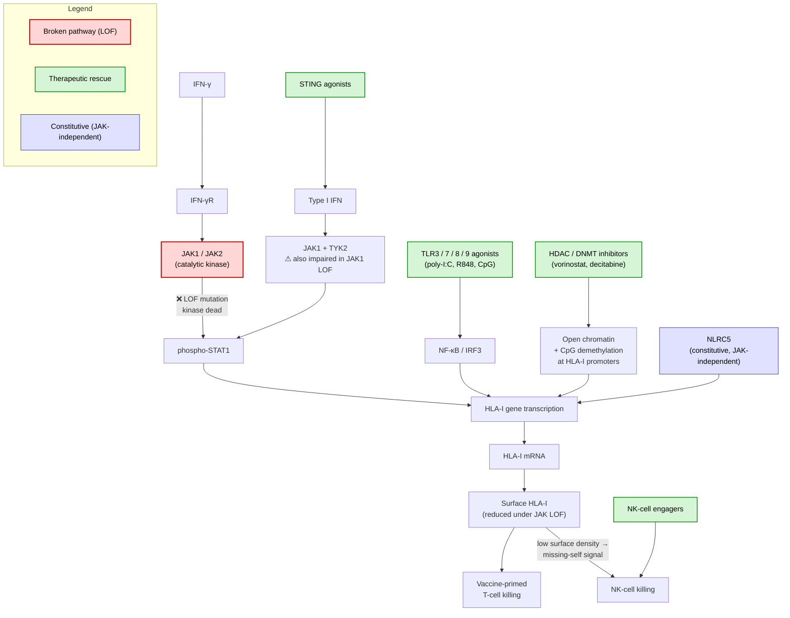

# Discussion

*Living document — intended to be refined into a publication discussion section.*

---

## Junction-spanning filter: chimeric codons and the complete-codon rule

The junction-spanning filter (see `METHODS.md` §5) requires each retained 9-mer to
contain at least one **complete codon** from each side of the splice junction. This is
a conservative approximation that warrants discussion.

### Why chimeric codons are not checked individually

A chimeric codon — one whose three nucleotides span the junction (e.g. 2 upstream nt +
1 downstream nt) — could in principle encode a novel amino acid not present in the
normal protein. A more precise implementation would translate each chimeric codon and
compare it against the reference proteome, keeping the 9-mer only when the amino acid
genuinely differs.

In practice this check is omitted for two reasons:

1. **Codon degeneracy makes chimeric codons unreliable.** The downstream exon may
   contribute a nucleotide that, combined with the upstream nucleotides, still encodes
   the same amino acid. This was observed directly in the first gastric cancer
   production run: the chimeric last codon of `YLADLYHFV` still encoded valine (V),
   making the entire 9-mer identical to SH3BP1 residues 209–217. There is no guarantee
   that a chimeric codon is novel without explicitly checking.

2. **Peripheral amino acid changes have limited biological impact.** MHC class I
   binding affinity is governed primarily by **anchor positions** — typically positions
   2 and 9 for HLA-A\*02:01 (P2 and PΩ anchor motif). A single amino acid change at
   a peripheral position (1 or 8) arising from a chimeric codon is unlikely to
   meaningfully alter binding affinity or T-cell receptor (TCR) recognition. Such
   peptides are therefore weak neoepitope candidates even if the amino acid does differ.

### Conservative bias and its justification

The complete-codon rule discards some true positives near the junction boundary.
Peptides retained by the rule contain multiple novel downstream amino acids and are more
likely to be genuinely foreign to the immune system. This conservative bias is
preferable in a discovery context: the cost of a missed weak candidate is lower than the
cost of pursuing a false positive through expensive downstream validation.

### Future refinement

A hybrid approach could be considered: apply the complete-codon rule as the primary
filter, then optionally recover chimeric-codon 9-mers where the altered amino acid falls
at an anchor position (P2 or P9). These would represent a small, high-confidence set of
junction-boundary candidates worth investigating further.

---

## Contig upstream length: 26 nt vs. 24 nt

The current contig design uses 26 nt upstream + 24 nt downstream. With `upstream_nt=26`,
the spanning condition is `2 ≤ start ≤ 23`, which means the first valid 27 nt window
across all three reading frames starts at `start=2` (frame 2). The nucleotides at
positions 0 and 1 are never the start of any valid junction-spanning window — they
contribute only as interior nucleotides of later windows.

Reducing `upstream_nt` to 24 would make `min_start=0`, so frame 0 windows starting at
`start=0` would be valid and no upstream nucleotides are wasted. This is a cleaner
design. However, `upstream_nt=26` is deliberately retained for the following reason:

**Chimeric codon data preservation.** The 2 extra upstream nucleotides (nt 0 and 1) are
excluded from valid window starts under the current complete-codon rule, but they remain
in the contig sequence. This preserves the raw data needed to handle chimeric codons —
codons that straddle the splice junction with 1 or 2 nucleotides on one side — if the
pipeline is extended to translate them in a future release.

A more principled future change would be to extend the downstream flank symmetrically
from 24 to 26 nt (giving 26 + 26 = 52 nt contigs), providing chimeric codon coverage on
**both** sides of the junction. This would also simplify the config to a single
`flank_nt` value instead of separate `upstream_nt` / `downstream_nt`.

---

## Reading frame annotation: why translation is not restricted to the canonical frame

The pipeline annotates each tumor-exclusive junction with its canonical reading frame
(derived from the GENCODE CDS, see Methods §5), but translates junction contigs in all
three frames rather than restricting to the annotated one.

### The case for restriction

For a junction whose splice donor matches an annotated CDS exon end in a gene not
otherwise perturbed by somatic mutations, the CDS-derived frame is the most likely frame
being translated. Restricting translation to that frame would reduce the peptide candidate
set by up to two-thirds for those junctions, lowering the false-positive burden on
downstream MHC binding prediction.

### Why restriction is not implemented

Restricting to the canonical frame introduces **false negatives** — true neoepitopes
permanently removed from the candidate set — in scenarios that are common in the tumors
where junction-derived neoepitopes are most clinically relevant:

- **Upstream frameshift indels.** A somatic insertion or deletion in an upstream exon of
  the same gene shifts the reading frame for everything downstream. These events are
  frequent in hypermutated tumors (MSI-high, POLE-mutant) and cannot be identified from
  RNA-seq junction data alone; WGS or WES would be needed to account for them.
- **Structural variants.** A gene fusion or large rearrangement can place exons in a
  reading frame context that has no GENCODE counterpart.
- **Upstream novel junctions.** A second tumor-exclusive junction upstream in the same
  gene may shift the reading frame before reaching the junction of interest. Although the
  pipeline detects co-occurring novel junctions in the same patient, short-read RNA-seq
  cannot phase two junctions to the same transcript, making the propagated frame
  unknowable without transcript assembly.
- **Alternative reading frames.** Some loci encode multiple proteins in different frames
  (e.g. CDKN2A p16/p14ARF). The CDS annotation captures only the canonical frame per
  donor; ARF-frame peptides would be silently dropped by a hard restriction.

In all of these cases, the biologically active frame in the tumor differs from the
GENCODE-derived canonical frame. Crucially, the risk is highest in hypermutated tumors —
precisely those expected to harbour the most actionable neoepitopes overall.

### On six-frame (sense + antisense) translation

Translating both strands of each contig was considered. For strand-specific libraries
(e.g. dUTP second-strand marking, as confirmed for patient_001's gastric cancer samples:
KAPA RNA HyperPrep with RiboErase), only the first-strand cDNA is amplified. Both aligners
assign strand to canonical junctions from splice-site sequence — STAR from the intron-motif
field of `SJ.out.tab` (rescuing the strand from the motif where its own call is undefined),
and HISAT2 from the XS auxiliary tag (derived from the splice-site dinucleotide). Genuine
antisense transcription then appears as junctions on the opposite strand and is already
translated in the correct orientation. Antisense translation of a strand-corrected contig would correspond to the
non-transcribed DNA strand and has no established biological basis for MHC-I presentation.

For non-stranded RNA-seq libraries, strand assignment relies entirely on splice-site
sequence inference and may be incorrect for non-canonical splice sites. In that context,
six-frame translation would be more appropriate. The strandedness of patient_002's
osteosarcoma samples has not been verified; if those samples turn out to be non-stranded,
the strand annotation of their junctions should be treated with caution.

### Current approach

Translation proceeds in all three sense-strand frames. The `reading_frame` annotation in
`novel_junctions.tsv` is retained as metadata: it records the canonical CDS-derived frame
for biological interpretation and downstream stratification of candidates, but does not
gatekeep any peptide from analysis.

---

## Normal sample filtering: junction level vs. peptide level

Tumor-specific junctions are currently defined by absence in the matched normal sample
at the **junction level** (see `METHODS.md` §3). An alternative approach would be to
run MHC binding prediction on both tumor and normal samples and subtract normal
predictions from tumor predictions at the **peptide level**.

The junction-level approach was chosen because:

- It is computationally cheaper (normal predictions never need to be run).
- A junction present in normal tissue is not tumor-specific by definition, regardless
  of the peptide it produces.

The peptide-level approach would additionally catch cases where a tumor-specific junction
produces a peptide that happens to match a normal protein at a completely different
genomic locus. The junction-spanning filter addresses the most common version of this
(same-locus exonic sequence), but a cross-proteome BLAST check would be more thorough.
This remains an open improvement.

### GTEx pan-tissue filter: extending normal filtering for vaccination applications

The matched normal RNA-seq provides a patient-specific junction filter, but is not always
available. Patient_002 (osteosarcoma) has no matched RNA-seq normal; the WES proxy
contributed only 3 overlapping junctions — effectively no filtering. A population-level
reference is needed as a substitute or supplement.

GTEx (V10) provides RNA-seq from approximately 54 distinct tissue types across ~900
donors, with junction-level read counts available as pre-computed files. Rather than
filtering against a single tissue matched to the tumor of origin, we argue that a
**pan-tissue filter** — removing any junction present in any GTEx tissue — is the
scientifically correct choice for a vaccination application.

The reasoning follows directly from the clinical context. A personalized cancer vaccine
induces a systemic cytotoxic T cell response: once primed, vaccine-specific T cells
circulate and patrol all tissues, not only the tumor. A junction present in any normal
tissue — regardless of organ — means the derived peptide is part of that tissue's
normal transcriptome and could be presented on its cell surface. Vaccine-trained T cells
targeting that peptide could therefore cause off-tumor autoimmune toxicity in any
tissue expressing the junction. Restricting the normal filter to matched or
mesenchymally-related tissues would leave these off-tumor risks unaddressed.

The pan-tissue filter therefore serves two complementary purposes:

- **Safety.** Junctions present in any GTEx tissue are excluded, reducing the
  autoimmune risk to normal tissues from vaccine-induced T cells.
- **Candidate quality.** A junction absent from all ~54 GTEx tissue types across the
  population is a far stronger tumor-exclusivity claim than one filtered only against
  a single matched normal or not filtered at all. Given the limited number of peptide
  slots in a personalized vaccine formulation (10–20 candidates; Sahin et al.,
  *Nature* 2017; Ott et al., *Nature* 2017), precision outweighs recall: the cost of
  a wasted slot or an autoimmune adverse event exceeds the cost of a missed candidate.

This conservative bias mirrors the logic applied to GPS-based candidate ranking: the
clinical question — vaccination, not natural immunity prediction — determines both how
candidates are ranked (GPS as the primary signal for HLA genotype coverage) and how
they are filtered (pan-tissue normal reference for systemic safety).

Note that junction-level filtering is a necessary but not sufficient safety check: it
catches cases where the source splice event itself occurs in normal tissue, but does not
address cross-reactivity between a tumor-exclusive peptide and a structurally similar
normal peptide. The proteome-level BLAST check (see above) addresses that orthogonal
concern.

### AlphaGenome as a predicted-normal filter: foundation-model evaluation (NO-GO)

Beyond the matched-normal and GTEx pan-tissue axes, a third candidate filter was
evaluated: sequence-based prediction of normal splicing from the GRCh38 reference using
AlphaGenome (Avsec et al., *Nature* 2026), a deep-learning foundation model with a
dedicated splice-junction output. The motivating hypothesis was that AlphaGenome could
approximate a per-patient normal junction call directly from sequence, providing a
safety axis independent of RNA-seq availability or population coverage gaps in GTEx. A
three-experiment design quantified its filtering value on the patient_001 chr22
test-config harness: (i) predictive validity against the matched-normal junction set
restricted to GENCODE-annotated introns (Exp 1); (ii) patient-specific delta from a
germline-aware AlphaGenome call ([Sub-Issue #381](https://github.com/Jin-HoMLee/splice-neoepitope-pipeline/issues/381),
Exp 2, deferred pending WGS acquisition); and (iii) comparative filter strength against
matched-normal and a Snaptron-derived chr22 GTEx pan-tissue proxy (Exp 3). The headline
numbers were Exp 1 F1 = 0.300 at τ = 3.16 (P = 0.238, R = 0.405); Exp 3 tumor-junction
catch (n = 1,872) of matched-normal 91 (4.9%), GTEx 483 (25.8%), and AlphaGenome 124
(6.6%), with the three-way union recovering 503 (26.9%); and AlphaGenome-unique-vs-GTEx
of 0.0%. The pre-registered decision rule yields **NO-GO**: F1 < 0.5 fires the no-go
clause directly, and the 0% unique-vs-GTEx rate over-determines the verdict by failing
the fallback tier's ≥ 5% requirement independently. Exp 2 is not load-bearing — Exp 1's
signal alone is conclusive.

The empirical pattern explains the verdict. AlphaGenome's chr22 tumor catch is a strict
subset of the GTEx pan-tissue catch — every AlphaGenome-flagged junction is also flagged
by GTEx, so the model adds no junction information beyond what population-scale tissue
panels already capture from observed splicing. This is consistent with the prior
expectation that a foundation model trained on healthy reference transcriptomes,
without per-individual conditioning information, will behave as a **tissue prior** —
a smoothed expectation of which junctions are constitutively used across normal cell
states — rather than as a patient-specific normal predictor. The deferred Exp 2 was
designed to test the alternative hypothesis (that conditioning on patient germline
variants would shift predictions in a patient-private direction), but the Exp 1/Exp 3
signal makes that test moot for the filter-design question: even before germline
conditioning, the model's output is not orthogonal to GTEx. The generalizable
interpretation, applicable beyond this pipeline, is that genomic foundation models
should be benchmarked task-specifically against the resource they are proposed to
replace; redundancy with an existing population reference is a plausible failure mode
whenever the model is trained on reference-tissue data without per-individual signal
in the input.

AlphaGenome is therefore dropped from the production filter stack. The filter axes
reduce to two — patient-specific matched-normal RNA-seq when available, and
population-level GTEx pan-tissue otherwise — already specified in the per-patient run
profiles. There is no third axis to add: the two existing axes span the patient-specific
and population-reference dimensions, and a sequence-only predictor trained on reference
tissue does not occupy a third independent dimension.

The NO-GO is scoped to AlphaGenome as an *additional safety filter* — its proposed
role here. Three niche-use angles remain open in principle, though none are on the
current roadmap:

- **As a confidence proxy for GTEx hits.** Since AlphaGenome ⊂ GTEx on this benchmark,
  AlphaGenome-membership flags a GTEx-filtered junction as also sequence-predicted from
  the reference — a doubly-endorsed normal call. Useful if GTEx hits prove noisier than
  desired (e.g. low-sample Snaptron artifacts), but the mechanism is intersection-based
  scoring rather than additive filtering and would not change which candidates are
  excluded.
- **As a sensitivity-tuned filter alternative.** Substituting AlphaGenome for GTEx would
  yield a less restrictive operating point (124 vs. 483 chr22 junctions filtered on this
  benchmark). Matched-normal is already smaller (91) and patient-specific, so this niche
  reduces to unmatched-normal scenarios without a germline-aware advantage — narrow
  enough that GTEx remains the appropriate default.
- **Full-genome scale-up as a robustness check.** AlphaGenome-unique junctions are
  unlikely to emerge at full-genome scale, but the chr22 result does not formally rule
  them out; a one-time re-evaluation against the production GTEx panel
  ([Issue #211](https://github.com/Jin-HoMLee/splice-neoepitope-pipeline/issues/211))
  would close the loop.

The finding is convergent with the design choice made by splice2neo (Lang et al.,
*Bioinform Adv* 2024), an upstream junction-calling tool that pairs sequence-based
splice prediction (SpliceAI, MMSplice) with built-in GENCODE / GTEx exclusion-list
filtering rather than treating the sequence prediction as standalone tumor-exclusivity
evidence — independent tool, same conclusion: sequence-based output requires anchoring
against observed healthy tissue, not the reverse.

---

## Aligner choice: STAR for production, HISAT2 for local development

The production pipeline aligns with STAR, which published benchmarks consistently show to be
more sensitive for novel/unannotated junction detection — the critical step for a
junction-driven neoepitope pipeline. STAR's full GRCh38 index requires ~32 GB RAM, so HISAT2
(~8 GB) is retained as a low-memory alternative for local development and testing (macOS M1,
8 GB RAM), selected through a single configuration switch.

The patient_001 and patient_002 results reported here were generated with the STAR production
path (2026-06-23 cohort run), replacing an earlier HISAT2-path draft. The switch coincided with
the [#370](https://github.com/Jin-HoMLee/splice-neoepitope-pipeline/issues/370) anchor-outer
coordinate correction, so patient_001's junction count collapsed from a spurious 27,348 (pre-#370
HISAT2 draft) to 8 (corrected STAR run) - the coordinate fix, not the aligner, accounts for most
of that change.

---

## Impact of the matched normal: patient_002

Patient_002 (osteosarcoma) has **no tissue-matched normal**. The sample sheet's only normal is a
CD3+ T-cell PBMC scRNA-seq sample (Hudson Lab, Jan 2025; issue #277), which replaced an earlier
WES blood normal that could not contribute junctions at all (WES/DNA alignments yield no spliced
reads). The CD3+ T-cell normal *does* provide RNA junctions, so junction-level subtraction runs
(2026-06-23 STAR run: 442 unannotated junctions, of which 154 normal_shared, 246
gtex_pantissue_shared, and 42 tumor_exclusive) - but it is a blood/immune-lineage transcriptome,
not tissue-matched to a bone tumor.

This matters more than a raw count. A CD3+ T-cell transcriptome expresses a narrow,
lineage-specific splicing repertoire, so junctions that are normal for bone or mesenchymal tissue
but simply absent from T cells are never subtracted and survive as spurious `tumor_exclusive`
calls. The GTEx pan-tissue population filter partially compensates - it removes 246 junctions for
patient_002 versus 39 for patient_001, i.e. it does far more of the work here - but bulk
pan-tissue coverage does not fully capture bone- or osteosarcoma-microenvironment splicing. We
therefore treat patient_002's tumor-exclusive set as a methodological boundary condition rather
than a validated candidate list, and report it as such in the Results.

Two further issues surfaced. First, the pipeline currently subtracts against *any* sample whose
type contains "normal" (including a Blood Derived Normal), which conflicts with the documented
intent that a Blood Derived Normal is used for HLA typing only; this let the T-cell normal drive
subtraction silently, tracked in
[#940](https://github.com/Jin-HoMLee/splice-neoepitope-pipeline/issues/940). Second, a defensible
patient_002 candidate set requires either a tissue-appropriate normal or an explicit
population-only mode (matched normal excluded, GTEx retained). If a tissue-matched RNA-seq normal
becomes available, the pipeline can be re-run to apply a genuine matched-normal filter.

---

## MHC binding prediction: composite presentation score over affinity-only

Early versions of the pipeline used `Class1AffinityPredictor` and classified peptides
solely by IC50 (strong ≤ 50 nM, weak ≤ 500 nM). This is the most widely reported
metric but has a well-documented limitation: MHC binding affinity is necessary but
not sufficient for surface presentation. A peptide must also survive proteasomal
cleavage and TAP transport to reach the ER, and a high-affinity peptide that is
degraded in the cytosol will never be displayed to T cells.

MHCflurry 2.0 introduced `Class1PresentationPredictor`, which combines the affinity
model with an antigen processing model trained on mass spectrometry-identified
MHC ligands (O'Donnell et al., 2020, *Cell Systems*). The composite `presentation_score`
and its per-allele `presentation_percentile` have been shown to reduce false positives
from well-bound but poorly processed peptides.

### Why we use the composite predictor exclusively

Rather than offering an affinity/presentation mode switch, the pipeline always uses
`Class1PresentationPredictor`. This gives four scores per peptide:

- `ic50_nM` — binding affinity (informational)
- `processing_score` — antigen processing efficiency (informational)
- `presentation_score` and `presentation_percentile` — composite metric, primary

A single classification label `presentation_class` is derived from `presentation_percentile`
(lower = better): strong (≤ 0.5%), weak (≤ 2%), non (> 2%). The predictor's genotype API
returns one prediction per peptide — the best-allele score across the patient's HLA-A/B/C
alleles.

The 0.5% strong and 2% weak cutoffs are MHCflurry's documented defaults (O'Donnell
et al. 2020, *Cell Systems*), inheriting the IEDB/NetMHCPan binder-percentile convention.

Epitopes are ranked by `presentation_percentile` (ascending), prioritizing strong
presenters — candidates that combine high MHC affinity with efficient antigen
processing — as the subset most likely to be immunogenic.

Note: `affinity_percentile` is not included in the output because
`Class1PresentationPredictor.predict()` (MHCflurry 2.2.x) does not expose it directly.
Obtaining it would require a second sequential call to `Class1AffinityPredictor`,
doubling inference time with no gain — `presentation_percentile` already captures the
affinity signal as part of the composite model.

---

## Allele breadth and immunodominance: two complementary ranking signals

### MHCflurry as a molecular predictor: the need for a downstream genotype model

MHCflurry operates at the molecular level: given one peptide and one MHC allele, it
predicts the probability that this specific peptide–MHC pair results in surface
presentation, integrating binding affinity with antigen processing efficiency
(proteasomal cleavage, TAP transport) into a single `presentation_score`. This is a
pairwise, molecule-level quantity. It does not model the patient's HLA genotype as a
whole.

The genotype-level convenience API (`Class1PresentationPredictor.predict()` with all
alleles provided at once) runs this pairwise molecular prediction for each allele
independently and returns a single best-allele attribution per peptide — the allele with
the highest individual `presentation_score`. This is useful for identifying which allele
is the primary presenter, but it is not a genotype-level biological model: it discards
the real presentation events occurring simultaneously on the cell surface via all
non-best alleles.

The genotype presentation model addresses exactly this gap. It operates at the genotype level,
taking the per-allele molecular predictions from MHCflurry as inputs and combining them
into a single estimate of the probability that at least one allele in the patient's full
HLA genotype presents the peptide:

```
genotype_presentation_score = 1 − ∏ᵢ (1 − wᵢ × presentation_scoreᵢ)
```

This two-level architecture separates concerns cleanly: MHCflurry solves the molecular
pairwise prediction problem; the genotype presentation model solves the genotype-level
combination problem. Crucially, the HLA-C locus weight (`wᵢ ≈ 0.5`) enters at the genotype level
rather than the molecular level — HLA-C surface density is a property of how many
molecules of each type are available on the cell, not a property of the individual
peptide–MHC interaction that MHCflurry models.

### Immunodominance as a structural limitation of breadth-only scoring

The genotype presentation score (GPS) correctly captures the joint presentation probability
across independent alleles. Different HLA alleles are entirely independent proteins with non-competing
peptide-binding grooves, so each allele's contribution is additive and the complementary
probability framework is exact. The score rises as additional alleles contribute and falls
steeply when all alleles present the peptide poorly.

A biologically relevant scenario reveals a structural limitation of this model. Consider
a peptide with one exceptional allele (`presentation_score` p₁ = 0.9) and five weak
alleles (p₂...₆ = 0.02). The GPS is approximately 0.91. A second peptide with six moderate alleles (p = 0.5 each)
scores approximately 0.98. The genotype presentation model ranks the second peptide higher — yet in vivo the first may be far more immunologically potent.

The mechanism is **immunodominance** (Yewdell & Bennink, *Annu Rev Immunol* 1999): the
T cell response to a complex antigen is not flat across all possible epitopes but forms a
strict hierarchy. Two independent mechanisms drive this:

1. **Intramolecular competition.** Within a single allele, many peptides compete for the
   limited pool of empty MHC class I grooves at the cell surface. A very high-affinity
   peptide saturates the groove of its allele, generating a high density of stable,
   long-lived pMHC complexes. T cell activation scales with pMHC surface density
   (Valitutti et al., *Nature* 1995) and requires sustained TCR engagement above a
   kinetic threshold (McKeithan, *PNAS* 1995). An allele with p₁ = 0.9 is therefore far
   more likely to cross this activation threshold reliably than any individual weak allele.

2. **Immunodomination.** Once a dominant T cell clone is activated and begins lysing
   antigen-presenting cells (APCs), it can prevent those APCs from priming T cells
   restricted to subdominant alleles (Chen & McCluskey, *Adv Cancer Res* 2006). The five
   weak alleles in the scenario above do not directly compete with the dominant allele at
   the MHC molecule level — their binding grooves are separate — but the dominant T cell
   response can systemically suppress priming of subdominant clones by eliminating the
   shared APC pool.

GPS does not model either mechanism. Conversely, reporting only the
best single-allele score (as in the original pipeline) ignores the genuine clinical
benefit of multi-allele coverage: robustness to HLA loss of heterozygosity (LOH), broader
T cell recruitment, and the ability to deliberately boost subdominant responses in a
vaccine context.

### Application to personalized cancer vaccine candidate selection

This pipeline is designed for personalized cancer vaccination, which determines the
committed role of each signal.

In natural anti-tumor immunity, immunodomination enforces a strict epitope hierarchy:
dominant T cell clones eliminate APCs before competing clones can be primed, and the
resulting response is largely fixed by the tumor's antigen presentation dynamics. The
dominance signal (`best_presentation_percentile`) is the more relevant lens in that
context.

In therapeutic vaccination, immunodomination is largely bypassed because each neoepitope
is delivered as a discrete immunogen and T cell clones against each included epitope are
primed independently. The degree of bypass depends on vaccine format: short direct-binding
peptides, which compete with the endogenous peptidome for empty MHC grooves on APCs,
achieve a more complete bypass of MHC-loading competition; mRNA vaccines re-enter
intracellular antigen processing and are closer to the natural presentation pathway,
partially restoring peptide competition for MHC grooves. In both formats, however, the
APC-level suppression of subdominant T cell clones through cytotoxic killing is alleviated
relative to natural immunity.

Two further considerations commit personalized vaccine design to allele breadth as the
primary ranking criterion:

- **HLA LOH robustness.** Tumors under immune pressure — including vaccine-induced
  pressure — frequently silence individual HLA alleles as an escape mechanism. A candidate
  presented by multiple alleles remains targetable after partial HLA LOH; a single-allele
  candidate may be rendered invisible by loss of that allele alone.
- **Vaccine slot efficiency.** Personalized neoantigen vaccines include a limited number
  of peptide candidates — typically 10–20 in current clinical trials (Sahin et al.,
  *Nature* 2017; Ott et al., *Nature* 2017). Each slot should maximise coverage of the
  patient's HLA genotype; `genotype_presentation_score` directly quantifies this.

The committed role of each signal in this pipeline is therefore:

| Signal | Role | Rationale |
|--------|------|-----------|
| `genotype_presentation_score` | **Primary ranking criterion** | Multi-allele coverage; LOH robustness; vaccine slot efficiency |
| `n_strong_alleles` | **Secondary ranking criterion** | Number of alleles at clinically meaningful threshold; intuitive breadth summary |
| `best_presentation_percentile` | **Minimum quality gate** | Ensures ≥1 allele generates sufficient pMHC density for T cell recognition at the tumor |

`best_presentation_percentile` as a quality gate means a candidate is filtered out if no
allele meets the weak-presenter threshold (presentation_percentile ≤ 2%), regardless of its
genotype_presentation_score — not used to rank candidates against one another.

### Calibration note: presentation_score vs. presentation_percentile

The `genotype_presentation_score` formula uses `presentation_score` (an absolute composite probability,
0–1) as `pᵢ`, while the quality gate is defined via `presentation_percentile` (the rank
of `presentation_score` among a large allele-specific random peptide set). These two
metrics are calibrated on different scales and can disagree: for a promiscuous allele
where many random peptides score well, a `presentation_score` of 0.4 may correspond to a
`presentation_percentile` of 3–5%. In such a case, six alleles
each with `presentation_score = 0.4` would yield `genotype_presentation_score ≈ 0.95`
while all alleles remain below the weak-presenter percentile threshold. A peptide could
therefore pass the `genotype_presentation_score` ranking stage but be eliminated by the
quality gate — which is the
intended behavior, since the gate is designed to catch exactly this scenario. Future work
could explore replacing `presentation_score` in the breadth formula with a calibrated
transformation of `presentation_percentile` to achieve fully consistent allele-relative
scoring throughout.

---

## Clinical translation: durability of personalized neoantigen vaccines in low-mutation tumors

The personalized neoantigen vaccine paradigm has consolidated into a
recognisable trajectory: a recent field synthesis from the Bhardwaj lab (Onkar
et al., *Cell Rep Med* 2026) identifies neoantigen-based vaccines in combination
with immune checkpoint inhibitors as the convergent direction of cancer
vaccinology, and highlights "off-the-shelf" shared-neoantigen vaccines as the
emerging strategy to bypass the manufacturing time and cost of fully
personalized formulations. Manufacturing turnaround and biomarker discovery for
response prediction remain field-wide unsolved problems.

Among multiple active personalized neoantigen vaccine trials spanning
head-and-neck (TG4050), melanoma (mRNA-4157/V940), pancreatic (autogene
cevumeran), and other indications (Iamukova & Alferova, *Asia-Pacific Journal
of Clinical Oncology* 2026), the autogene cevumeran trial in pancreatic ductal
adenocarcinoma (PDAC) has produced the most mature long-term follow-up and
provides strong clinical validation for the personalized neoantigen vaccine
paradigm (Sethna et al., *Nature* 2025; original trial: Rojas et al., *Nature*
2023). At a 3.2-year median follow-up, vaccine responders had not reached
median recurrence-free survival compared to 13.4 months in non-responders
(P = 0.007), with vaccine-induced CD8+ T cell clones exhibiting an estimated
mean lifespan of 7.7 years (range 1.5–~100 years) and ~20% of clones
persisting on multi-decade timescales. Notably, these long-lived clones are
primed *de novo* against passenger somatic mutations rather than amplifying
pre-existing T cell pools, demonstrating that effective neoantigen targets do
not require pre-existing endogenous immunity to elicit a durable functional
response. Convergent evidence from a separate trial in triple-negative breast
cancer (TNBC) using the same BioNTech personalized mRNA platform extends this
durability finding across tumor types: 11 of 14 post-surgical patients
remained relapse-free at up to 6 years post-vaccination, with vaccine-induced
T-cell responses functional for several years (Sahin et al., *Nature* 2026).

Two clinical observations are particularly relevant to splice-junction
neoepitope prediction. First, PDAC is paradigmatic of *low-mutation tumors* —
gastrointestinal cancers and other immunologically cold tumors with few somatic
mutations are explicitly identified as ideal initial disease indications for
this paradigm, yet the somatic mutation pool in such tumors is correspondingly
limited. Splice-junction-derived neoepitopes are an orthogonal source of
tumor-specific antigens that scales with the splicing dysregulation
characteristic of these tumors rather than with point-mutation burden, and can
substantially expand the predictable target pool in exactly the indications
where personalized vaccines are most urgently needed. Second, recurrent tumors
in vaccine non-responders evolved under vaccine-induced selective pressure and
were *pruned of vaccine-targeted clones* — direct evidence that immune editing
on a finite vaccine target set permits clonal escape. The authors note this
clonal pruning may make subclinical clones (microscopic residual disease cells
below clinical detection at vaccination time) a vaccine-resistance mechanism,
and propose two non-exclusive future directions: polyvalent vaccines covering
heterogeneous clones, or alternatively, high-potency vaccines against clonal
neoantigens.

Our pipeline's primary contribution to this clinical context is expanding the
predictable target pool through splice-junction neoepitope prediction —
particularly valuable in low-mutation tumors where the somatic mutation
candidate pool is scarce. Whether splice-junction antigens are also more
clonally shared across tumor sub-populations than mutation-derived antigens —
and thus directly address the heterogeneity-driven escape mechanism the
authors highlight — remains an open empirical question worth pursuing.

---

## Immune-pathway gene neoepitopes: the presentation paradox

A subset of the candidates this pipeline produces deserves special clinical attention: splice-junction neoepitopes derived from immune-pathway genes whose loss-of-function drives immune evasion. Genes including *JAK1*, *JAK2*, *STAT1*, *B2M*, *NLRC5*, and *TAP1/2* are recurrently mutated in tumors that have escaped checkpoint blockade (Zaretsky et al., *NEJM* 2016; Sade-Feldman et al., *Cancer Discovery* 2017). Recent base-editing screens have systematically mapped the specific single-amino-acid variants that disrupt IFN-γ signaling and antigen presentation, identifying which residues in JAK1, JAK2, and other pathway components are most vulnerable to point mutation (Coelho et al., *Cancer Cell* 2023). Many of these mutations also generate splice variants — in-frame exon skips, alternative donor/acceptor usage, intron retention — whose junction-spanning peptides are immunogenic in principle.

These targets sit at a clinically interesting intersection: the very mutations that make a tumor clone HLA-low also tag it with a candidate neoepitope. Two clinical implications follow.

**Preventive vaccination.** Driver mutations in immune-pathway genes recur across patients, making them candidates for **public neoantigen vaccines** (Kwok et al., *Nature* 2025). A vaccine primed against these neoepitopes — administered early, before resistance clones have fixed in the tumor — could establish T-cell memory that recognizes the mutant clone the moment it arises. Even with partial JAK1/2 loss-of-function, constitutive HLA-I expression (NLRC5-driven, JAK/STAT-independent) maintains baseline antigen presentation; vaccine-trained T cells can engage these residual pMHC complexes, supplemented by NK-cell killing of HLA-low cells via the missing-self mechanism.

**Combination therapy for established tumors.** For tumors that already carry IFN-γ pathway lesions, vaccination must be paired with **downstream HLA-I rescue** — and the rescue must land at or below the broken signaling node. Although the molecular cause of JAK loss-of-function is a protein-level defect (catalytically dead kinase), the clinical bottleneck is transcriptional: phosphorylated STAT1 fails to drive HLA-I gene transcription, and surface HLA-I stays low because the mRNA is never produced. Upstream interventions — intratumoral recombinant IFN-γ or receptor delivery — cannot bypass this defect; the signal still terminates at the dead kinase. Effective combinations must engage HLA-I transcription via an alternative regulatory layer (Figure 1):

- **TLR3/7/8/9 agonists** (poly-I:C, R848, CpG) drive HLA-I via NF-κB and IRF3, independent of JAK/STAT.
- **STING agonists** induce type I IFN-driven HLA-I; effective for JAK2-only loss-of-function but impaired in JAK1-loss-of-function (which also disables type I IFN signaling, JAK1 + TYK2).
- **HDAC and DNMT inhibitors** (vorinostat, decitabine) derepress HLA-I epigenetically, opening chromatin and demethylating CpG islands at HLA-A/B/C promoters — restoring transcription independent of any signal-driven activator. Decitabine has entered clinical trials in combination with checkpoint inhibitors specifically for HLA-low tumors (Chiappinelli et al., *Cell* 2015).
- **NK-cell engagers** complement the strategy by exploiting (rather than rescuing) the HLA-low state.

HDAC and DNMT inhibitors are particularly noteworthy because they directly address the transcriptional bottleneck: although the upstream cause is a broken kinase, the downstream consequence is a failure of HLA-I mRNA production, and chromatin-level rescue restores that production through a parallel pathway.



**Figure 1. Rescue strategies for HLA-I presentation under JAK1/2 loss-of-function.** The canonical IFN-γ → JAK1/JAK2 → STAT1 axis drives HLA-I gene transcription; in JAK-LOF tumors the kinase is catalytically dead and the signal terminates at JAK. Three bypass routes restore HLA-I transcription independently of the JAK1/2 break: TLR agonists via NF-κB / IRF3, STING agonists via type I IFN (impaired in JAK1-LOF because JAK1+TYK2 is shared with type II IFN signaling), and HDAC / DNMT inhibitors via epigenetic derepression of HLA-A/B/C promoters. NLRC5 maintains a constitutive baseline that is JAK-independent. Surface HLA-I — reduced but not absent — supports vaccine-primed T-cell killing, while the residual HLA-low cells are targeted by NK cells via missing-self recognition (potentiated by NK-cell engagers).

The pipeline's GPS prioritization surfaces splice neoepitopes from immune-pathway genes whenever they meet the presentation thresholds; these candidates merit triage to first-in-line clinical translation despite — and partly because of — the presentation paradox.

---

## Comparison to related neoantigen-prediction tools

Two recently published tools span the same problem space from complementary angles —
pan-cancer splice-neoantigen burden estimation (SpliceMutr) and tumor-only neoantigen
calling without matched normal (ENEO). Comparing this pipeline to each clarifies the
design choices made here and the gaps each leaves uncovered.

### SpliceMutr: causal mutation–splice linkage as cohort-scale tumor-exclusivity proof

SpliceMutr (Palmer et al., *Cancer Research Communications* 2024) quantifies
splicing-derived neoantigen burden across TCGA tumor types. Each candidate splice
event is anchored to a somatic mutation predicted to cause it — splice-site mutations
at the canonical donor/acceptor dinucleotides or splice-regulatory-element mutations
that disrupt spliceosome recognition. The somatic mutation, called from tumor-vs-normal
DNA pairs, supplies the tumor-exclusivity proof at the DNA level; the splice consequence
inherits that proof without an additional RNA-level normal-vs-tumor comparison. This
mutation-anchored framing serves two cohort-scale needs: causal interpretability (each
event has a mechanistic explanation) and false-positive control across thousands of
samples that cannot be manually validated.

This pipeline takes the broader scope: any unannotated junction absent from a matched
(or pan-tissue GTEx) normal is a candidate, irrespective of an identified somatic
driver. This captures non-mutation-driven aberrant splicing — splicing-factor mutations
(e.g. SF3B1, U2AF1) acting in *trans* across many genes, epigenetic dysregulation, and
stochastic spliceosomal noise in transformed cells — that mutation-anchored approaches
miss by construction. The cost is reduced mechanistic interpretability per candidate:
the somatic origin of a junction may be unknown, and tumor-exclusivity must be
established at the RNA level rather than inherited from DNA.

The two scopes are complementary. SpliceMutr is the appropriate framing for cohort-level
burden estimation, where causal anchoring controls false positives at scale; this
pipeline is the appropriate framing for patient-level vaccine candidate prioritization,
where the objective is to maximize the candidate pool subject to safety filters and the
mutation-driven subset alone is too narrow.

### ENEO: population-reference substitution for matched normal at the variant level

ENEO (Tatoni et al., *NAR Genomics and Bioinformatics* 2025) addresses the
unmatched-normal problem with a Bayesian classifier that separates somatic from
germline and sequencing-error variants from tumor RNA-seq alone. The classifier's
priors are drawn from population genomic resources — germline allele frequencies from
population databases (gnomAD-class), calibrated sequencing error models, and somatic
prior distributions — eliminating the matched-normal requirement entirely. The
Bayesian framing is conceptually parallel to this pipeline's GTEx pan-tissue filter
(see *GTEx pan-tissue filter* above): both substitute *population-level reference
knowledge* for an individual matched normal — ENEO at the variant level (somatic
SNVs/indels), this pipeline at the junction level (splice events).

Two boundary conditions distinguish the approaches:

- **Antigen source.** ENEO is SNV-driven: candidates are MHC-presented peptides
  produced by tumor-specific point mutations or short indels in coding sequence. The
  Bayesian classifier solves the variant identifiability problem under tumor-only
  conditions but does not address the splice-derived antigen axis, where the
  tumor-exclusivity signal is at the junction level rather than the variant level.
  The corresponding tumor-only problem for splice junctions — distinguishing
  tumor-specific junctions from the patient's unobserved normal splicing repertoire —
  requires population-level junction reference filtering (GTEx pan-tissue), not
  variant-level Bayesian classification.
- **Probabilistic vs. binary thresholding.** ENEO's posterior outputs a continuous
  probability of somatic origin per variant, allowing rank-ordered candidate lists and
  context-dependent thresholds. The current GTEx pan-tissue filter is binary: a junction
  is excluded if observed in any GTEx tissue. The binary filter is robust at scale and
  trivial to communicate, but loses information at noisy edges — single-read presence
  in one of ~900 donors triggers exclusion equivalently to consistent presence across
  all donors, and low-coverage tumor candidates are kept with the same confidence as
  high-coverage ones.

ENEO's Bayesian framing is conceptually transferable to this pipeline. A
population-frequency prior over GTEx junction read counts could replace the binary
inclusion/exclusion criterion with a posterior probability of tumor-specificity per
junction, which would (i) recover candidates excluded only by single-read GTEx
artifacts, (ii) downweight low-coverage tumor junctions whose evidence does not warrant
high confidence, and (iii) yield a continuous tumor-exclusivity score that ranks
candidates rather than only filtering them. This remains an open avenue for future
work, particularly for the patient_002-class scenario where matched-normal RNA is
absent and the binary filter's loss of edge information matters most.

### Kwok et al.: public neoepitopes from recurrent splicing — the off-the-shelf end of the axis

Kwok et al. (*Nature* 2025) identified two public neoepitope candidates —
NeoA<sub>GNAS</sub> and NeoA<sub>RPL22</sub> — derived from recurrent aberrant splicing
in *GNAS* and *RPL22* across glioma, mesothelioma, prostate adenocarcinoma, and
hepatocellular carcinoma. The *GNAS* neojunction exhibited consistent intratumoral
detection across multi-region biopsy samples, indicating spatial conservation that is
uncommon for mutation-derived neoantigens. Validation extended beyond bioinformatic
prediction: TCRs reactive to the two pMHC complexes were isolated from healthy-donor
CD8+ T cells, transduced into reporter and primary T-cell populations, and shown to
kill endogenously expressing tumor cell lines in an HLA-dependent, peptide-dose-dependent
manner.

The pipeline framed here and the Kwok et al. framework target the same molecular
substrate — aberrant splice junctions presented as MHC-I peptides — at opposite ends of
a public-vs-personalized axis. Kwok et al. select for *cross-patient recurrence*
(`PSR_TCGA ≥ 10%`) and obtain off-the-shelf shared TCR targets that may be deployed via
TCR-engineered T-cell therapy across patients sharing the relevant HLA allele. This
pipeline selects per-patient *absence from a matched (or pan-tissue) normal* without a
recurrence requirement, retaining patient-private junctions that cannot be reused across
patients but cover the residual population whose tumors generate no public NJ at
sufficient TCGA prevalence. The two strategies serve complementary patient populations:
Kwok-class targets favor the subset whose tumor expresses a known recurrent junction;
this pipeline addresses the residual majority by personalizing candidate selection at
the cost of cohort-scale TCR reuse.

A note on mechanism scope: both frameworks take the molecular event to be alternative
splicing on (mostly) wild-type DNA, since Kwok's public criterion — recurrence across
patients with diverse mutational backgrounds — only holds when the cryptic acceptor
exists in the reference genome and is selected by the spliceosome rather than created
by a somatic indel at the splice site. Indel-driven splice neoantigens are typically
private and map to the personalized end of the axis above; complementary public-
recurrence mechanisms such as splicing-factor mutations (e.g., SF3B1 / SRSF2) operate
on wild-type splice sites through altered splicing-factor specificity (Kim et al.,
*Cell* 2025).<!-- TODO(#311): integrate Kim et al. discussion when SF mutation paragraph is drafted -->

The designs also differ on the GTEx normal-tissue filter at the threshold level. Kwok et
al. retain junctions with `PSR_GTEx < 1%` (up to ~91 expressing samples among 9,166 GTEx
normals); this pipeline applies `min_read_count: 1`, which is stricter than Kwok's
`PSR_GTEx = 0%` floor — Kwok's PSR counts only samples whose NJ read frequency exceeds
1% of the canonical junction, whereas this filter excludes any normal-sample read
regardless of relative frequency. The
permissive threshold is appropriate to their workflow: each public candidate is taken
through cell-line proteomic confirmation, TCR isolation, and tumor-cell killing assays,
so a transcript-level normal-tissue trace with no demonstrated MHC presentation is
treated as acceptable noise. This pipeline emits patient vaccine candidates without
per-candidate T-cell validation, and the zero-tolerance threshold is the deliberate
vaccine-safety bias that this design choice imposes (consistent with the *GTEx
pan-tissue filter* discussion above). At the population level, at least some of Kwok et
al.'s 789 characterized public NJs (the glioma-focused set taken through peptide-presentation
validation) — which by their inclusion criterion spans `0% ≤ PSR_GTEx < 1%` —
would be excluded by this pipeline's filter. Re-derivation
of `PSR_GTEx` for the two validated public NEJs against Snaptron's GTEx hg19
cohort (n=9,662; identified by signed A3 acceptor-shift signature, since the exact
junction coordinates are not published in the paper, supplementary tables, or the
SSNIP repo) detects a candidate matching NeoA<sub>RPL22</sub>'s molecular signature
in 1 of 9,662 GTEx samples (`PSR_GTEx ≈ 0%`, below Kwok's `<1%` cutoff) — within
Kwok's pipeline this junction is retained, whereas this pipeline's `min_read_count: 1`
filter would reject it. NeoA<sub>GNAS</sub> is undetectable in the same cohort and
would be retained by both filters. The threshold tradeoff is therefore concrete and
target-specific for NeoA<sub>RPL22</sub>, illustrating at the level of a validated
target what the population-level statement above only asserts in aggregate. The
single positive sample is in GTEx's standard analysis freeze (`SMAFRZE = "USE ME"`)
— likely but not formally verifiable to be in Kwok's 9,166-sample QC subset — and
falls in testis, a splicing-permissive tissue where low-frequency cryptic events
are well-documented.

### Independent validation of the splice-neoepitope axis: glioma cohorts and single-cell maps

Beyond the methodological comparisons above, three 2025 studies externally validate the
splice-junction-neoepitope axis itself. Two are glioma cohorts. Xiong et al.
(*Genes Immun* 2025) mapped tumor-enriched isoform antigens across 587 glioma patients,
building per-patient candidate repertoires from isoform expression and HLA-I haplotype —
mirroring the per-patient junction × HLA-I logic applied here — and functionally validated an
HLA-A11-restricted POSTN-203 junction epitope that elicited antigen-specific T-cell
responses. Xiong et al. (*Cell Mol Immunol* 2025) carried a single splice-junction target
the full distance to a therapeutic handle: a C/EBPβ-induced RCAN1-4 isoform, specific to
mesenchymal glioblastoma, yields an HLA-A24-restricted epitope spanning the exon4/exon5
junction (RCAN1-4<sub>22–32</sub>) against which TCR-engineered T cells showed sustained,
HLA-restricted cytotoxicity in vitro and in vivo. This is the downstream end of the
structural-validation arm framed below (*Structural validation: TCR-pMHC docking and TCR
panel design*): a splice-junction neoepitope advanced from epitope identification to a
functioning TCR-T product — the translational exemplar of what this pipeline's TCRdock
stage screens candidates toward.

A third study locates the axis in single-cell space. JAseC (Xiong et al., *Nucleic Acids
Res* 2025 — a distinct first author from the glioma work above) calls
alternative-splicing events from short-read single-cell RNA-seq, predicts MHC-I
presentation of the resulting isoform peptides (NetMHCpan, per-patient HLA), and reports
that the resulting splicing-derived antigen burden — driven in part by the splicing
regulator ESRP1 — tracks anti-PD1 response across breast cancer, melanoma, and additional
checkpoint-blockade cohorts, correlating with T-cell clonal expansion independently of
tumor mutational burden. JAseC is the single-cell counterpart to this pipeline's bulk
junction calling: it resolves splicing-antigen load per cell and links it to checkpoint
outcome, whereas the bulk approach here trades single-cell resolution for the read depth
needed to call low-abundance tumor-specific junctions confidently. Single-cell
splicing-antigen mapping is therefore complementary to, rather than within, the current
bulk RNA-seq architecture.

---

## Structural validation: TCR-pMHC docking and TCR panel design

MHC binding prediction identifies peptides with the thermodynamic potential to occupy the
MHC groove, but a candidate neoepitope vaccine requires productive TCR engagement to drive a
cytotoxic T-cell response. Two peptides with identical MHCflurry presentation scores may
differ substantially in their structural complementarity with available T-cell receptor
clonotypes. The pipeline therefore includes a structural validation step using TCRdock
(Bradley, *eLife* 2023), an AlphaFold2-based model fine-tuned on TCR-pMHC crystal
structures, which outputs a per-complex confidence score (ipTM) used as a proxy for
docking quality.

### Limitation of a single fallback TCR

In the current implementation, a single reference TCR — DMF5, an HLA-A\*02:01-restricted
clonotype originally raised against MART-1/Melan-A — is used as a structural scaffold for
all docking runs. DMF5 was adopted during the early phase of the pipeline when only
HLA-A\*02:01 was supported. Now that full six-allele HLA typing is standard, this approach
is problematic: TCR-pMHC contacts are determined jointly by the peptide sequence and the
restricting MHC allele. Modeling a peptide presented by, for example, HLA-B\*35:01 against
an A\*02:01-restricted TCR produces structurally artefactual complexes that cannot be
meaningfully interpreted.

### Patient-HLA-matched VDJdb panel

To address this, the fallback TCR will be replaced by a patient-specific panel drawn from
VDJdb (Bagaev et al., *Nature Methods* 2020), the largest curated database of TCR sequences
with known pMHC specificity. For each patient HLA allele, TCRs are selected by exact
four-digit allele match (MHC Class I only), paired α/β chain availability, and VDJdb
confidence score ≥ 2, yielding a panel of up to ten TCRs per allele. Full α/β chain
sequences are reconstructed from VDJdb V/J/CDR3 triplets using `stitchr` (Peacock et al.,
*Bioinformatics* 2023), since TCRdock requires complete variable-domain sequences rather
than CDR3 alone.

This design is intentionally conservative: exact allele matching maximises specificity at
the cost of panel depth for rare alleles. Future iterations will explore two-digit supertype
matching and CDR3-diversity-based selection to improve coverage without sacrificing
structural relevance.

### Future directions: model comparison and interface rescoring

AlphaFold3 (Abramson et al., *Nature* 2024), which models protein complexes through a
diffusion architecture, has demonstrated competitive performance with TCRdock on TCR-pMHC
prediction tasks without relying on TCR-specific fine-tuning. A prospective benchmark of
AF3 against TCRdock on a panel of experimentally validated TCR-pMHC pairs from VDJdb will
inform whether the pipeline should migrate or adopt a hybrid approach.

Independently, AlphaFold confidence scores are not calibrated as binding affinity proxies.
Complementary rescoring of the predicted complexes using Rosetta InterfaceAnalyzer or
FoldX AnalyseComplex could provide interface ΔΔG estimates as a secondary ranking signal,
consistent with established practice in structure-based drug design.

---

## TCR-pMHC scoring landscape: scoring-target taxonomy and per-scorer integration verdicts

The structural validation step described above (TCRdock + patient-HLA-matched panel)
produces an ipTM proxy for TCR-pMHC docking quality — one slice of a broader scoring
problem. Candidate TCR-pMHC pairs can be scored on three orthogonal axes (presentation
upstream of TCR engagement is handled separately by the MHCflurry composite predictor;
see *MHC binding prediction* above). Six candidate scorers were evaluated across the
i2-S1 / i3-S1 sprints to identify which to integrate alongside TCRdock and where.

### Scoring-target taxonomy

- **End-to-end structural prediction.** Co-folding models that predict the full
  TCR-pMHC complex from sequence (TCRdock, Boltz-2, AlphaFold3). Most expensive;
  replaces the upstream structural prediction step rather than augmenting it.
- **Structure-based confidence / quality cross-check.** Physics-guided or
  structural-discrimination scoring of an existing TCR-pMHC complex
  (HERMES, NetTCR-struc, t2pmhc). Requires an upstream structural prediction;
  re-weights interface contacts to derive a per-complex confidence score that is
  not directly available from the predictor's own pLDDT / ipTM.
- **Sequence-based binding / specificity prediction.** Transformer or graph models
  that bypass structure entirely and predict TCR-pMHC binding or T-cell activation
  from sequence (ImmSET, sequence-only specificity models such as TAPIR or NetTCR
  variants without the structural module). Cheap; complementary to but not a
  replacement for structural signal.

### Per-scorer evaluation outcomes

**Boltz-2** (Passaro et al., bioRxiv 2025) was evaluated as an end-to-end
co-folding replacement for TCRdock. The decision was decline. An independent
TCR-pMHC benchmark across 70 unseen Class I/II complexes (Lu et al. 2025;
10 models, both Class I and Class II MHC types) reports Boltz-2 reaches only
acceptable-quality (AQ-band) predictions — no medium- or high-quality hits —
while AF3 leads overall (median DockQ 0.636 / 0.679 Class I / II). Boltz-2's
self-reported DockQ 0.91 / 0.70 on seen / unseen complexes is consistent with
the OOD generalization gap that motivated TCRdock's TCR-specific fine-tuning
in the first place; an architectural change to a co-folding base does not
bypass the data-availability constraint.

**HERMES** (Visani et al., *PNAS* 2025) was evaluated as a structure-based
confidence cross-check. The decision was integrate as a post-TCRdock
structural confidence layer. HERMES applies physics-guided equivariant message
passing on the predicted complex to produce a per-residue likelihood that can
be aggregated into a complex-level confidence score; the authors report up to
0.72 correlation with experimental binding/activation across diverse viral
epitopes and cancer neoantigens.

**ImmSET** (Garcia Noceda et al., arXiv 2026) was evaluated as a
sequence-based specificity predictor. The decision was decline. Three hard
blockers: (i) the model is trained on Adaptive Biotechnologies' proprietary
MIRA + pairSEQ data, not redistributable; (ii) released weights are restricted
to HLA-A\*02:01, a single-allele scope that does not match this pipeline's
six-allele genotype-level prediction; (iii) the evaluation framework (IMMREP25)
is itself dominated by A\*02:01 and does not yet validate the breadth needed
for personalized vaccine candidate selection across diverse HLA backgrounds.

**t2pmhc** (Polster et al., bioRxiv 2026) and **TCRLens**
(Siriarchawatana et al., *Bioinformatics Advances* 2026) were evaluated as
structural cross-checks on the TCRdock and tFold-TCR backbones respectively.
The decision for both is decline. For t2pmhc, the structural-confidence niche
it would occupy as a TCRdock-rescoring layer overlaps with HERMES, whose
integration is already on the TCR-pMHC scorer integration milestone's
critical path; adding t2pmhc as a second confidence cross-check would
duplicate the integration surface without contributing an independent signal
axis. For TCRLens, an independent benchmark of TCR-pMHC complex predictors
(Shi, Parks, Smith, *J Chem Inf Model* 65:7156–7173, 2025; 6 tools on 27
complexes) finds that TCR-specific AlphaFold2-derived tools — the category to
which TCRLens's tFold-TCR backbone belongs — show lower accuracy in the
framework region than general-purpose structure predictors. A rescoring layer
on top of the predicted complex cannot recover backbone errors propagated
from the framework region, so TCRLens's structure-aware EGNN inherits a
backbone constraint that limits its discrimination ceiling for the intended
integration role.

**NetTCR-struc** (Deleuran et al., *Front Immunol* 2025) was evaluated
as a hybrid structural-QC predictor combining sequence and structural
features. The
decision was integrate as a post-prediction structural-QC filter.
NetTCR-struc occupies the same structural-QC niche as HERMES but operates on
the GNN side of the architectural axis; the two integrations are
complementary rather than redundant — HERMES contributes physics-guided
per-residue confidence, NetTCR-struc contributes a graph-learned
docking-quality discriminator trained on the experimental TCR-pMHC complex
set. Both will be evaluated as orthogonal post-TCRdock filters.

**AlphaFold3** (Abramson et al., *Nature* 2024) was evaluated as a
TCRdock-backend successor and parked for the shipped pipeline on
integrability rather than accuracy grounds. Lu et al. 2025 ranks AF3 as
the best-overall TCR-pMHC predictor on their 70-complex benchmark (median DockQ
0.636 / 0.679 for Class I / II), but its weights are released under
non-redistributable, non-commercial terms incompatible with a pipeline whose
TCRdock backend ships CC-BY AlphaFold2 parameters in-container; the
license-clean co-folding alternatives surveyed alongside it (Chai-1 and
ESMFold2) are blocked instead by the bf16/FP8 tensor-core and memory
requirements that the production GPU lacks. The companion CDR3-region pLDDT
quality flag was likewise not adopted — Lu et al. show that its reranking
benefit is specific to AF3 and does not transfer to the AlphaFold2 confidence
head that TCRdock uses. Both decisions are deferred for re-evaluation at the
next GPU refresh rather than declined permanently.

### Synthesis

Two patterns emerge from the seven-scorer evaluation. First, **co-folding
replacements for TCRdock** were not adopted, but for two distinct reasons.
Boltz-2 (declined) faces the data-availability constraint that motivated
TCRdock's TCR-specific fine-tuning — architectural novelty does not substitute
for in-distribution training data, and the OOD generalization gap remains the
operative constraint. AlphaFold3 (parked), by contrast, leads the benchmark on
accuracy and is blocked on integrability: its weights are non-redistributable /
non-commercial, while the license-clean alternatives (Chai-1, ESMFold2) are
hardware-blocked on the current GPU.
Second, **structure-based cross-checks** (HERMES and
NetTCR-struc both integrated; t2pmhc redundant; TCRLens backbone-limited)
are the highest-value integration angle: they slot into the existing pipeline
as post-TCRdock quality filters without replacing the prediction step, and a
small number of orthogonal cross-checks (physics-guided + GNN-learned)
provides redundancy on the calibration axis that any single confidence score
lacks. Sequence-based specificity predictors (ImmSET declined) were
systematically deprioritized given the structural-QC niche's higher immediate
value for vaccine candidate ranking; a future pass on protein language
model (PLM)-based or sequence-similarity scorers may revisit this class
as the structural-QC layer matures.

### Per-scorer integration summary

| Scorer | Scoring axis | Verdict | Carrier |
|--------|--------------|---------|---------|
| Boltz-2 | End-to-end structural prediction | Decline — OOD generalization gap | Issue #188 close comment |
| HERMES | Structure-based confidence | Integrate — post-TCRdock structural QC (physics-guided) | Sub-Issue #492 (milestone 29) |
| ImmSET | Sequence-based specificity | Decline — proprietary data + single-allele scope | Issue #201 close comment |
| t2pmhc | Structure-based confidence | Decline — redundant with HERMES | Issue #236 re-decision comment |
| TCRLens | Structure-based confidence | Decline — tFold-TCR backbone framework-accuracy limit | Issue #236 re-decision comment |
| NetTCR-struc | Structure-based confidence (GNN) | Integrate — post-TCRdock structural QC (GNN-learned) | Sub-Issue #433 (milestone 29) |
| AlphaFold3 | End-to-end structural prediction | Park — integrability (license + current GPU), not accuracy | Issue #316 close comment / Issue #601 |

The two integrations under the TCR-pMHC scorer integration milestone
(HERMES, NetTCR-struc) span the physics-guided and GNN-learned axes of
structural quality scoring respectively, providing the redundancy on the
calibration axis described above; integration outcomes will inform whether
further cross-checks from the sequence-based or end-to-end classes are
warranted in subsequent iterations.

---

## Neoantigen-generator and immunogenicity-scorer landscape: self-contrast dependence and per-tool verdicts

The MHCflurry composite predictor ranks tumor-exclusive junction candidates by
presentation likelihood (see *MHC binding prediction* above), and the TCR-pMHC
scoring landscape above surveys the scorers that act once a candidate TCR
engages the presented peptide. Between those two layers sits the immunogenicity
question: among presented peptides, which are likely to be recognized as foreign
by a T cell? Four tools spanning two layers — end-to-end neoantigen generators /
rankers and immunogenicity-beyond-presentation scorers — were evaluated across
the i3-S1 tool-landscape sprint to determine which, if any, transfer to
splice-junction-derived neoepitopes. The organizing finding is that the
immunogenicity layer's dominant design — contrasting a mutant peptide against
its wild-type self — has no counterpart for novel junction sequences, which
arise from exon-exon joins and retained introns rather than point substitutions
and so carry no aligned germline self.

### Scoring-layer taxonomy

- **End-to-end generators and rankers.** Tools that reconstruct neoepitope
  candidates from sequencing data and rank them (ASNEO, NeoGuider).
  Architectural peers to this pipeline; evaluated for whole-pipeline replacement
  or component reuse, not as add-on scorers.
- **Immunogenicity-beyond-presentation scorers.** Models that score the
  likelihood that a presented peptide is recognized by a T cell, layered above
  MHC presentation (NeoPrecis, Łuksza foreignness). This is the layer where the
  wild-type-self-contrast assumption lives.

### Per-tool evaluation outcomes

**ASNEO** (Zhang et al., *Aging* 2020) was evaluated as an end-to-end splice
neoantigen generator — our closest published peer (RNA-seq → splice junctions →
neoepitopes). The decision was component reuse. Its population-level GTEx
normal-junction filter is direct prior art for our planned pan-tissue filter and
is adopted as a design reference; full replacement was declined — ASNEO is
unmaintained since 2019, hg19-only against our GRCh38, uses one-frame translation
against our three-frame junction-spanning approach, and wraps a license-gated
NetMHCpan / NetCTLpan backend rather than a presentation predictor. A head-to-head
cross-check on our own candidates is parked as a possible manuscript-validation
experiment.

**NeoGuider** (Zhao et al., *Genome Med* 2025) was evaluated as an end-to-end
ranker whose novel contribution is feature calibration rather than architecture.
The decision was component reuse. Its kernel-density-estimate plus
centered-isotonic-regression rank calibration — which maps raw per-feature scores
to immunogenicity log-odds — is adoptable as a calibration module downstream of
MHCflurry presentation scoring, while its variant-calling and splice branches are
redundant with ours (its splice branch in fact delegates to ASNEO). One caveat
carries forward: the calibration was learned on single-nucleotide-variant
neoantigens, and whether it transfers to novel junction peptides is itself an
open question.

**NeoPrecis** (Lee et al., *Nat Commun* 2026) was evaluated as an immunogenicity
re-scorer built on a cross-reactivity-distance recognition model. The decision
was decline. The recognition score is a distance between a mutant peptide and its
equal-length, position-aligned wild-type counterpart; the implementation returns
a missing value when the two differ in length, and the authors state it is not
applicable to indels or frameshift mutations. Splice-junction-derived neoepitopes
are exactly that excluded case — novel sequences with no aligned germline self —
so the recognition score cannot be computed for our junction candidates, and
constructing a pseudo-wild-type from the canonical isoform would be arbitrary and
would violate the model's premise.

**Łuksza foreignness** (Łuksza et al., *Nature* 2017) was evaluated as the
recognition term of the neoantigen fitness model, which scores TCR-recognition
potential from sequence similarity to known immunogenic epitopes. The decision
was decline. Unlike the cross-reactivity-distance and amplitude terms,
foreignness is wild-type-free — it needs no germline counterpart and so
structurally runs on junction peptides, the lone exception in this family. It was
declined nonetheless on signal strength: independent TESLA-consortium
benchmarking (Wells et al., *Cell* 2020) found that prioritizing foreignness
without accounting for presentation does not improve — and can worsen — candidate
ranking, and this pipeline already ranks by presentation; its fitted parameters
were calibrated on 9-mer missense neoantigens against a fixed IEDB snapshot and
may not transfer to our 8–11-mer novel-frame peptides; and no ground-truth
immunogenicity labels are available to validate added signal. A conditional
revival is parked on the acquisition of such labels.

### Synthesis

One pattern dominates. The immunogenicity-beyond-presentation scorers encode
immunogenicity as a contrast between a mutant peptide and its wild-type self:
NeoPrecis's cross-reactivity distance is computed against an equal-length,
position-aligned wild-type peptide, and the Łuksza amplitude term (A =
Kd_WT/Kd_MT) requires that same paired wild-type peptide to supply its reference
MHC binding affinity. Splice-junction-derived
neoepitopes have no such counterpart by construction — they are novel reading
frames spanning exon-exon joins and retained introns, not single substitutions of
a germline residue — so the family does not transfer to this setting, and
NeoPrecis's missing-value behavior on junction peptides is the explicit form of
that failure. The two generators / rankers (ASNEO, NeoGuider) sit at a different
layer and yielded component reuse — a normal-junction filter and a calibration
module — rather than whole-tool adoption.

The lone wild-type-free signal in the family, Łuksza foreignness, escapes the
contrast trap structurally but proved too weak and uncalibratable to bank. That
leaves an open question the sequence-based family cannot answer: whether a
wild-type-free immunogenicity signal can add over presentation for junction
peptides at all. Structure-aware scorers are the natural next probe — ImmunoStruct
(Givechian et al., *Nat Mach Intell* 2026) scores immunogenicity from the
peptide-MHC structure rather than from a mutant-versus-wild-type comparison, and
so is wild-type-free by design; its evaluation for the splice setting is the
natural next target in this landscape.

### Per-tool evaluation summary

| Tool | Layer / axis | Verdict | Carrier |
|------|--------------|---------|---------|
| ASNEO | End-to-end splice generator | Component reuse — GTEx normal-junction filter (design reference) | Issue #546 close comment; GTEx filter → Issue #212; cross-check → Issue #566 |
| NeoGuider | End-to-end ranker | Component reuse — KDE + centered-isotonic calibration module | Issue #258 close comment / Issue #547 |
| NeoPrecis | Immunogenicity beyond presentation (cross-reactivity distance) | Decline — requires a wild-type counterpart (missing value on junctions) | Issue #551 close comment |
| Łuksza foreignness | Immunogenicity beyond presentation (foreignness) | Decline — wild-type-free but weak / uncalibratable | Issue #572 close comment / Issue #585 |
| ImmunoStruct | Immunogenicity beyond presentation (structure-aware) | Evaluation pending — wild-type-free escape candidate | Issue #659 |

As with the TCR-pMHC scoring landscape above, the highest-value outcomes are not
whole-tool replacements but the components that survive scrutiny — there,
orthogonal structural cross-checks; here, a normal-junction filter and a
calibration module — together with a sharpened design constraint: any
immunogenicity signal adopted downstream of presentation must be computable
without a wild-type self. That constraint is what makes the structure-aware,
wild-type-free class the next evaluation target rather than a further
sequence-based contrast model.
