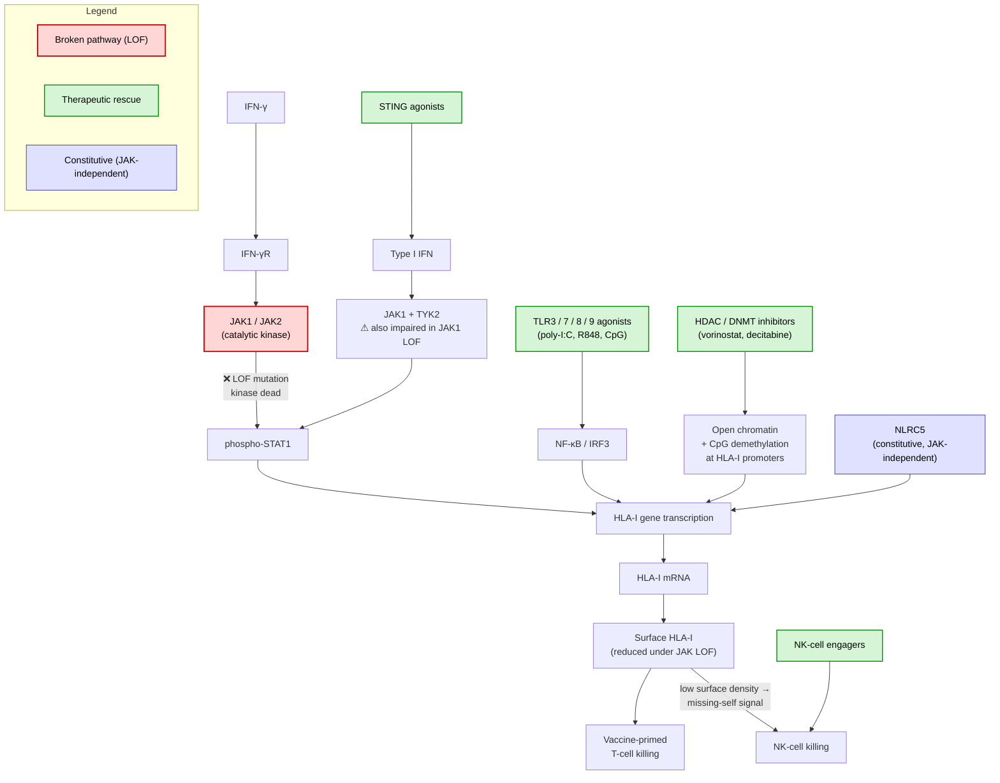

# Discussion

*Living document — intended to be refined into a publication discussion section.*

---

## Junction-spanning filter: chimeric codons and the complete-codon rule

The junction-spanning filter (see `METHODS.md` §5) requires each retained 9-mer to
contain at least one **complete codon** from each side of the splice junction. This is
a conservative approximation that warrants discussion.

### Why chimeric codons are not checked individually

A chimeric codon — one whose three nucleotides span the junction (e.g. 2 upstream nt +
1 downstream nt) — could in principle encode a novel amino acid not present in the
normal protein. A more precise implementation would translate each chimeric codon and
compare it against the reference proteome, keeping the 9-mer only when the amino acid
genuinely differs.

In practice this check is omitted for two reasons:

1. **Codon degeneracy makes chimeric codons unreliable.** The downstream exon may
   contribute a nucleotide that, combined with the upstream nucleotides, still encodes
   the same amino acid. This was observed directly in the first gastric cancer
   production run: the chimeric last codon of `YLADLYHFV` still encoded valine (V),
   making the entire 9-mer identical to SH3BP1 residues 209–217. There is no guarantee
   that a chimeric codon is novel without explicitly checking.

2. **Peripheral amino acid changes have limited biological impact.** MHC class I
   binding affinity is governed primarily by **anchor positions** — typically positions
   2 and 9 for HLA-A\*02:01 (P2 and PΩ anchor motif). A single amino acid change at
   a peripheral position (1 or 8) arising from a chimeric codon is unlikely to
   meaningfully alter binding affinity or T-cell receptor (TCR) recognition. Such
   peptides are therefore weak neoepitope candidates even if the amino acid does differ.

### Conservative bias and its justification

The complete-codon rule discards some true positives near the junction boundary.
Peptides retained by the rule contain multiple novel downstream amino acids and are more
likely to be genuinely foreign to the immune system. This conservative bias is
preferable in a discovery context: the cost of a missed weak candidate is lower than the
cost of pursuing a false positive through expensive downstream validation.

### Future refinement

A hybrid approach could be considered: apply the complete-codon rule as the primary
filter, then optionally recover chimeric-codon 9-mers where the altered amino acid falls
at an anchor position (P2 or P9). These would represent a small, high-confidence set of
junction-boundary candidates worth investigating further.

---

## Contig upstream length: 26 nt vs. 24 nt

The current contig design uses 26 nt upstream + 24 nt downstream. With `upstream_nt=26`,
the spanning condition is `2 ≤ start ≤ 23`, which means the first valid 27 nt window
across all three reading frames starts at `start=2` (frame 2). The nucleotides at
positions 0 and 1 are never the start of any valid junction-spanning window — they
contribute only as interior nucleotides of later windows.

Reducing `upstream_nt` to 24 would make `min_start=0`, so frame 0 windows starting at
`start=0` would be valid and no upstream nucleotides are wasted. This is a cleaner
design. However, `upstream_nt=26` is deliberately retained for the following reason:

**Chimeric codon data preservation.** The 2 extra upstream nucleotides (nt 0 and 1) are
excluded from valid window starts under the current complete-codon rule, but they remain
in the contig sequence. This preserves the raw data needed to handle chimeric codons —
codons that straddle the splice junction with 1 or 2 nucleotides on one side — if the
pipeline is extended to translate them in a future release.

A more principled future change would be to extend the downstream flank symmetrically
from 24 to 26 nt (giving 26 + 26 = 52 nt contigs), providing chimeric codon coverage on
**both** sides of the junction. This would also simplify the config to a single
`flank_nt` value instead of separate `upstream_nt` / `downstream_nt`.

---

## Reading frame annotation: why translation is not restricted to the canonical frame

The pipeline annotates each tumor-exclusive junction with its canonical reading frame
(derived from the GENCODE CDS, see Methods §5), but translates junction contigs in all
three frames rather than restricting to the annotated one.

### The case for restriction

For a junction whose splice donor matches an annotated CDS exon end in a gene not
otherwise perturbed by somatic mutations, the CDS-derived frame is the most likely frame
being translated. Restricting translation to that frame would reduce the peptide candidate
set by up to two-thirds for those junctions, lowering the false-positive burden on
downstream MHC binding prediction.

### Why restriction is not implemented

Restricting to the canonical frame introduces **false negatives** — true neoepitopes
permanently removed from the candidate set — in scenarios that are common in the tumors
where junction-derived neoepitopes are most clinically relevant:

- **Upstream frameshift indels.** A somatic insertion or deletion in an upstream exon of
  the same gene shifts the reading frame for everything downstream. These events are
  frequent in hypermutated tumors (MSI-high, POLE-mutant) and cannot be identified from
  RNA-seq junction data alone; WGS or WES would be needed to account for them.
- **Structural variants.** A gene fusion or large rearrangement can place exons in a
  reading frame context that has no GENCODE counterpart.
- **Upstream novel junctions.** A second tumor-exclusive junction upstream in the same
  gene may shift the reading frame before reaching the junction of interest. Although the
  pipeline detects co-occurring novel junctions in the same patient, short-read RNA-seq
  cannot phase two junctions to the same transcript, making the propagated frame
  unknowable without transcript assembly.
- **Alternative reading frames.** Some loci encode multiple proteins in different frames
  (e.g. CDKN2A p16/p14ARF). The CDS annotation captures only the canonical frame per
  donor; ARF-frame peptides would be silently dropped by a hard restriction.

In all of these cases, the biologically active frame in the tumor differs from the
GENCODE-derived canonical frame. Crucially, the risk is highest in hypermutated tumors —
precisely those expected to harbour the most actionable neoepitopes overall.

### On six-frame (sense + antisense) translation

Translating both strands of each contig was considered. For strand-specific libraries
(e.g. dUTP second-strand marking, as confirmed for patient_001's gastric cancer samples:
KAPA RNA HyperPrep with RiboErase), only the first-strand cDNA is amplified. HISAT2
assigns the correct strand to all canonical GT-AG junctions via the XS auxiliary tag
(derived from splice-site dinucleotide sequence). Genuine antisense transcription then
appears as junctions on the opposite strand and is already translated in the correct
orientation. Antisense translation of a strand-corrected contig would correspond to the
non-transcribed DNA strand and has no established biological basis for MHC-I presentation.

For non-stranded RNA-seq libraries, strand assignment relies entirely on splice-site
sequence inference and may be incorrect for non-canonical splice sites. In that context,
six-frame translation would be more appropriate. The strandedness of patient_002's
osteosarcoma samples has not been verified; if those samples turn out to be non-stranded,
the strand annotation of their junctions should be treated with caution.

### Current approach

Translation proceeds in all three sense-strand frames. The `reading_frame` annotation in
`novel_junctions.tsv` is retained as metadata: it records the canonical CDS-derived frame
for biological interpretation and downstream stratification of candidates, but does not
gatekeep any peptide from analysis.

---

## Normal sample filtering: junction level vs. peptide level

Tumor-specific junctions are currently defined by absence in the matched normal sample
at the **junction level** (see `METHODS.md` §3). An alternative approach would be to
run MHC binding prediction on both tumor and normal samples and subtract normal
predictions from tumor predictions at the **peptide level**.

The junction-level approach was chosen because:

- It is computationally cheaper (normal predictions never need to be run).
- A junction present in normal tissue is not tumor-specific by definition, regardless
  of the peptide it produces.

The peptide-level approach would additionally catch cases where a tumor-specific junction
produces a peptide that happens to match a normal protein at a completely different
genomic locus. The junction-spanning filter addresses the most common version of this
(same-locus exonic sequence), but a cross-proteome BLAST check would be more thorough.
This remains an open improvement.

### GTEx pan-tissue filter: extending normal filtering for vaccination applications

The matched normal RNA-seq provides a patient-specific junction filter, but is not always
available. Patient_002 (osteosarcoma) has no matched RNA-seq normal; the WES proxy
contributed only 3 overlapping junctions — effectively no filtering. A population-level
reference is needed as a substitute or supplement.

GTEx (V10) provides RNA-seq from approximately 54 distinct tissue types across ~900
donors, with junction-level read counts available as pre-computed files. Rather than
filtering against a single tissue matched to the tumour of origin, we argue that a
**pan-tissue filter** — removing any junction present in any GTEx tissue — is the
scientifically correct choice for a vaccination application.

The reasoning follows directly from the clinical context. A personalised cancer vaccine
induces a systemic cytotoxic T cell response: once primed, vaccine-specific T cells
circulate and patrol all tissues, not only the tumour. A junction present in any normal
tissue — regardless of organ — means the derived peptide is part of that tissue's
normal transcriptome and could be presented on its cell surface. Vaccine-trained T cells
targeting that peptide could therefore cause off-tumour autoimmune toxicity in any
tissue expressing the junction. Restricting the normal filter to matched or
mesenchymally-related tissues would leave these off-tumour risks unaddressed.

The pan-tissue filter therefore serves two complementary purposes:

- **Safety.** Junctions present in any GTEx tissue are excluded, reducing the
  autoimmune risk to normal tissues from vaccine-induced T cells.
- **Candidate quality.** A junction absent from all ~54 GTEx tissue types across the
  population is a far stronger tumour-exclusivity claim than one filtered only against
  a single matched normal or not filtered at all. Given the limited number of peptide
  slots in a personalised vaccine formulation (10–20 candidates; Sahin et al.,
  *Nature* 2017; Ott et al., *Nature* 2017), precision outweighs recall: the cost of
  a wasted slot or an autoimmune adverse event exceeds the cost of a missed candidate.

This conservative bias mirrors the logic applied to GPS-based candidate ranking: the
clinical question — vaccination, not natural immunity prediction — determines both how
candidates are ranked (GPS as the primary signal for HLA genotype coverage) and how
they are filtered (pan-tissue normal reference for systemic safety).

Note that junction-level filtering is a necessary but not sufficient safety check: it
catches cases where the source splice event itself occurs in normal tissue, but does not
address cross-reactivity between a tumour-exclusive peptide and a structurally similar
normal peptide. The proteome-level BLAST check (see above) addresses that orthogonal
concern.

---

## HISAT2 vs. STAR for novel junction detection

HISAT2 is used for local development and testing (macOS M1, 8 GB RAM). Benchmarks
consistently show STAR to be more sensitive for novel/unannotated junction detection,
which is the critical step for this pipeline. STAR requires ~32 GB RAM for the full
GRCh38 index and is therefore unsuitable for local runs but appropriate for cloud
production runs.

A planned comparison (issue #17) will run both aligners on the same gastric cancer
samples and compare the number and quality of tumor-specific junctions detected. The
HISAT2 production run provides a baseline.

---

## Impact of missing matched normal: patient_002

Patient_002 (osteosarcoma IPISRC044) has no matched RNA-seq normal sample. Blood WGS
DNA is available but cannot substitute: `regtools junctions extract` requires reads with
spliced CIGAR operations (`N`), which are absent from DNA-seq alignments. Running the
pipeline without a normal labels all unannotated junctions `tumor_exclusive`.

The patient_002 T0 run completed with 347,046 raw tumor junctions; 291,131 were
annotated (GENCODE v47) and discarded, leaving 55,915 unannotated junctions.
BG003082_N0_WES (WES, DNA) was used as the normal input. Although HISAT2 produced
106,474 junctions from the WES alignment, only 3 overlapped with the tumor set —
consistent with WES-derived spliced reads being largely alignment artifacts rather
than biological splice events. Those 3 were discarded as normal-shared, leaving
55,912 tumor-exclusive candidates.

For reference, patient_001 had an 8.9% normal-shared rate among unannotated junctions
using a matched RNA-seq normal. The WES proxy provides minimal filtering (effectively
none), so a corresponding fraction of the 55,912 candidates likely represent
patient-specific but non-tumor splicing. Given the downstream MHCflurry and TCRdock
filtering steps, the impact on the final top candidates is expected to be limited, but
results should be interpreted with this caveat.

If a matched RNA-seq sample becomes available from the osteosarcoma dataset in the
future, the pipeline can be re-run with the normal to apply the full junction-level
filter.

---

## MHC binding prediction: composite presentation score over affinity-only

Early versions of the pipeline used `Class1AffinityPredictor` and classified peptides
solely by IC50 (strong ≤ 50 nM, weak ≤ 500 nM). This is the most widely reported
metric but has a well-documented limitation: MHC binding affinity is necessary but
not sufficient for surface presentation. A peptide must also survive proteasomal
cleavage and TAP transport to reach the ER, and a high-affinity peptide that is
degraded in the cytosol will never be displayed to T cells.

MHCflurry 2.0 introduced `Class1PresentationPredictor`, which combines the affinity
model with an antigen processing model trained on mass spectrometry-identified
MHC ligands (O'Donnell et al., 2020, *Cell Systems*). The composite `presentation_score`
and its per-allele `presentation_percentile` have been shown to reduce false positives
from well-bound but poorly processed peptides.

### Why we use the composite predictor exclusively

Rather than offering an affinity/presentation mode switch, the pipeline always uses
`Class1PresentationPredictor`. This gives four scores per peptide:

- `ic50_nM` — binding affinity (informational)
- `processing_score` — antigen processing efficiency (informational)
- `presentation_score` and `presentation_percentile` — composite metric, primary

A single classification label `presentation_class` is derived from `presentation_percentile`
(lower = better): strong (≤ 0.5%), weak (≤ 2%), non (> 2%). The predictor's genotype API
returns one prediction per peptide — the best-allele score across the patient's HLA-A/B/C
alleles.

The 0.5% strong threshold is the cutoff used by Jiang et al. (2024, *Communications
Biology*) for MHCflurry-PS predictions. The 2.0% weak threshold is the conventional
affinity-percentile cutoff applied in the field.

Epitopes are ranked by `presentation_percentile` (ascending), prioritising candidates
that are both strongly bound and well processed — the subset most likely to be immunogenic.

Note: `affinity_percentile` is not included in the output because
`Class1PresentationPredictor.predict()` (MHCflurry 2.2.x) does not expose it directly.
Obtaining it would require a second sequential call to `Class1AffinityPredictor`,
doubling inference time with no gain — `presentation_percentile` already captures the
affinity signal as part of the composite model.

---

## Allele breadth and immunodominance: two complementary ranking signals

### MHCflurry as a molecular predictor: the need for a downstream genotype model

MHCflurry operates at the molecular level: given one peptide and one MHC allele, it
predicts the probability that this specific peptide–MHC pair results in surface
presentation, integrating binding affinity with antigen processing efficiency
(proteasomal cleavage, TAP transport) into a single `presentation_score`. This is a
pairwise, molecule-level quantity. It does not model the patient's HLA genotype as a
whole.

The genotype-level convenience API (`Class1PresentationPredictor.predict()` with all
alleles provided at once) runs this pairwise molecular prediction for each allele
independently and returns a single best-allele attribution per peptide — the allele with
the highest individual `presentation_score`. This is useful for identifying which allele
is the primary presenter, but it is not a genotype-level biological model: it discards
the real presentation events occurring simultaneously on the cell surface via all
non-best alleles.

The genotype presentation model addresses exactly this gap. It operates at the genotype level,
taking the per-allele molecular predictions from MHCflurry as inputs and combining them
into a single estimate of the probability that at least one allele in the patient's full
HLA genotype presents the peptide:

```
genotype_presentation_score = 1 − ∏ᵢ (1 − wᵢ × presentation_scoreᵢ)
```

This two-level architecture separates concerns cleanly: MHCflurry solves the molecular
pairwise prediction problem; the genotype presentation model solves the genotype-level
combination problem. Crucially, the HLA-C locus weight (`wᵢ ≈ 0.5`) enters at the genotype level
rather than the molecular level — HLA-C surface density is a property of how many
molecules of each type are available on the cell, not a property of the individual
peptide–MHC interaction that MHCflurry models.

### Immunodominance as a structural limitation of breadth-only scoring

The genotype presentation score (GPS) correctly captures the joint presentation probability
across independent alleles. Different HLA alleles are entirely independent proteins with non-competing
peptide-binding grooves, so each allele's contribution is additive and the complementary
probability framework is exact. The score rises as additional alleles contribute and falls
steeply when all alleles present the peptide poorly.

A biologically relevant scenario reveals a structural limitation of this model. Consider
a peptide with one exceptional allele (`presentation_score` p₁ = 0.9) and five weak
alleles (p₂...₆ = 0.02). The GPS is approximately 0.91. A second peptide with six moderate alleles (p = 0.5 each)
scores approximately 0.98. The genotype presentation model ranks the second peptide higher — yet in vivo the first may be far more immunologically potent.

The mechanism is **immunodominance** (Yewdell & Bennink, *Annu Rev Immunol* 1999): the
T cell response to a complex antigen is not flat across all possible epitopes but forms a
strict hierarchy. Two independent mechanisms drive this:

1. **Intramolecular competition.** Within a single allele, many peptides compete for the
   limited pool of empty MHC class I grooves at the cell surface. A very high-affinity
   peptide saturates the groove of its allele, generating a high density of stable,
   long-lived pMHC complexes. T cell activation scales with pMHC surface density
   (Valitutti et al., *Nature* 1995) and requires sustained TCR engagement above a
   kinetic threshold (McKeithan, *PNAS* 1995). An allele with p₁ = 0.9 is therefore far
   more likely to cross this activation threshold reliably than any individual weak allele.

2. **Immunodomination.** Once a dominant T cell clone is activated and begins lysing
   antigen-presenting cells (APCs), it can prevent those APCs from priming T cells
   restricted to subdominant alleles (Chen & McCluskey, *Adv Cancer Res* 2006). The five
   weak alleles in the scenario above do not directly compete with the dominant allele at
   the MHC molecule level — their binding grooves are separate — but the dominant T cell
   response can systemically suppress priming of subdominant clones by eliminating the
   shared APC pool.

GPS does not model either mechanism. Conversely, reporting only the
best single-allele score (as in the original pipeline) ignores the genuine clinical
benefit of multi-allele coverage: robustness to HLA loss of heterozygosity (LOH), broader
T cell recruitment, and the ability to deliberately boost subdominant responses in a
vaccine context.

### Application to personalised cancer vaccine candidate selection

This pipeline is designed for personalised cancer vaccination, which determines the
committed role of each signal.

In natural anti-tumour immunity, immunodomination enforces a strict epitope hierarchy:
dominant T cell clones eliminate APCs before competing clones can be primed, and the
resulting response is largely fixed by the tumour's antigen presentation dynamics. The
dominance signal (`best_presentation_percentile`) is the more relevant lens in that
context.

In therapeutic vaccination, immunodomination is largely bypassed because each neoepitope
is delivered as a discrete immunogen and T cell clones against each included epitope are
primed independently. The degree of bypass depends on vaccine format: short direct-binding
peptides, which compete with the endogenous peptidome for empty MHC grooves on APCs,
achieve a more complete bypass of MHC-loading competition; mRNA vaccines re-enter
intracellular antigen processing and are closer to the natural presentation pathway,
partially restoring peptide competition for MHC grooves. In both formats, however, the
APC-level suppression of subdominant T cell clones through cytotoxic killing is alleviated
relative to natural immunity.

Two further considerations commit personalised vaccine design to allele breadth as the
primary ranking criterion:

- **HLA LOH robustness.** Tumours under immune pressure — including vaccine-induced
  pressure — frequently silence individual HLA alleles as an escape mechanism. A candidate
  presented by multiple alleles remains targetable after partial HLA LOH; a single-allele
  candidate may be rendered invisible by loss of that allele alone.
- **Vaccine slot efficiency.** Personalised neoantigen vaccines include a limited number
  of peptide candidates — typically 10–20 in current clinical trials (Sahin et al.,
  *Nature* 2017; Ott et al., *Nature* 2017). Each slot should maximise coverage of the
  patient's HLA genotype; `genotype_presentation_score` directly quantifies this.

The committed role of each signal in this pipeline is therefore:

| Signal | Role | Rationale |
|--------|------|-----------|
| `genotype_presentation_score` | **Primary ranking criterion** | Multi-allele coverage; LOH robustness; vaccine slot efficiency |
| `n_strong_alleles` | **Secondary ranking criterion** | Number of alleles at clinically meaningful threshold; intuitive breadth summary |
| `best_presentation_percentile` | **Minimum quality gate** | Ensures ≥1 allele generates sufficient pMHC density for T cell recognition at the tumour |

`best_presentation_percentile` as a quality gate means a candidate is filtered out if no
allele meets the weak-binder threshold (presentation_percentile ≤ 2%), regardless of its
genotype_presentation_score — not used to rank candidates against one another.

### Calibration note: presentation_score vs. presentation_percentile

The `genotype_presentation_score` formula uses `presentation_score` (an absolute composite probability,
0–1) as `pᵢ`, while the quality gate is defined via `presentation_percentile` (the rank
of `presentation_score` among a large allele-specific random peptide set). These two
metrics are calibrated on different scales and can disagree: for a promiscuous allele
where many random peptides score well, a `presentation_score` of 0.4 may correspond to a
`presentation_percentile` of 3–5% (non-binder territory). In such a case, six alleles
each with `presentation_score = 0.4` would yield `genotype_presentation_score ≈ 0.95`
while all alleles remain below the weak-binder percentile threshold. A peptide could
therefore pass the `genotype_presentation_score` ranking stage but be eliminated by the
quality gate — which is the
intended behaviour, since the gate is designed to catch exactly this scenario. Future work
could explore replacing `presentation_score` in the breadth formula with a calibrated
transformation of `presentation_percentile` to achieve fully consistent allele-relative
scoring throughout.

---

## Immune-pathway gene neoepitopes: the presentation paradox

A subset of the candidates this pipeline produces deserves special clinical attention: splice-junction neoepitopes derived from immune-pathway genes whose loss-of-function drives immune evasion. Genes including *JAK1*, *JAK2*, *STAT1*, *B2M*, *NLRC5*, and *TAP1/2* are recurrently mutated in tumours that have escaped checkpoint blockade (Zaretsky et al., *NEJM* 2016; Sade-Feldman et al., *Cancer Discovery* 2017). Recent base-editing screens have systematically mapped the specific single-amino-acid variants that disrupt IFN-γ signalling and antigen presentation, identifying which residues in JAK1, JAK2, and other pathway components are most vulnerable to point mutation (Coelho et al., *Cancer Cell* 2023). Many of these mutations also generate splice variants — in-frame exon skips, alternative donor/acceptor usage, intron retention — whose junction-spanning peptides are immunogenic in principle.

These targets sit at a clinically interesting intersection: the very mutations that make a tumour clone HLA-low also tag it with a candidate neoepitope. Two clinical implications follow.

**Preventive vaccination.** Driver mutations in immune-pathway genes recur across patients, making them candidates for **public neoantigen vaccines** (Kwok et al., *Nature* 2024). A vaccine primed against these neoepitopes — administered early, before resistance clones have fixed in the tumour — could establish T-cell memory that recognises the mutant clone the moment it arises. Even with partial JAK1/2 loss-of-function, constitutive HLA-I expression (NLRC5-driven, JAK/STAT-independent) maintains baseline antigen presentation; vaccine-trained T cells can engage these residual pMHC complexes, supplemented by NK-cell killing of HLA-low cells via the missing-self mechanism.

**Combination therapy for established tumours.** For tumours that already carry IFN-γ pathway lesions, vaccination must be paired with **downstream HLA-I rescue** — and the rescue must land at or below the broken signalling node. Although the molecular cause of JAK loss-of-function is a protein-level defect (catalytically dead kinase), the clinical bottleneck is transcriptional: phosphorylated STAT1 fails to drive HLA-I gene transcription, and surface HLA-I stays low because the mRNA is never produced. Upstream interventions — intratumoural recombinant IFN-γ or receptor delivery — cannot bypass this defect; the signal still terminates at the dead kinase. Effective combinations must engage HLA-I transcription via an alternative regulatory layer (Figure 1):

- **TLR3/7/8/9 agonists** (poly-I:C, R848, CpG) drive HLA-I via NF-κB and IRF3, independent of JAK/STAT.
- **STING agonists** induce type I IFN-driven HLA-I; effective for JAK2-only loss-of-function but impaired in JAK1-loss-of-function (which also disables type I IFN signalling, JAK1 + TYK2).
- **HDAC and DNMT inhibitors** (vorinostat, decitabine) derepress HLA-I epigenetically, opening chromatin and demethylating CpG islands at HLA-A/B/C promoters — restoring transcription independent of any signal-driven activator. Decitabine has entered clinical trials in combination with checkpoint inhibitors specifically for HLA-low tumours (Chiappinelli et al., *Cell* 2015).
- **NK-cell engagers** complement the strategy by exploiting (rather than rescuing) the HLA-low state.

HDAC and DNMT inhibitors are particularly noteworthy because they directly address the transcriptional bottleneck: although the upstream cause is a broken kinase, the downstream consequence is a failure of HLA-I mRNA production, and chromatin-level rescue restores that production through a parallel pathway.



**Figure 1. Rescue strategies for HLA-I presentation under JAK1/2 loss-of-function.** The canonical IFN-γ → JAK1/JAK2 → STAT1 axis drives HLA-I gene transcription; in JAK-LOF tumours the kinase is catalytically dead and the signal terminates at JAK. Three bypass routes restore HLA-I transcription independently of the JAK1/2 break: TLR agonists via NF-κB / IRF3, STING agonists via type I IFN (impaired in JAK1-LOF because JAK1+TYK2 is shared with type II IFN signalling), and HDAC / DNMT inhibitors via epigenetic derepression of HLA-A/B/C promoters. NLRC5 maintains a constitutive baseline that is JAK-independent. Surface HLA-I — reduced but not absent — supports vaccine-primed T-cell killing, while the residual HLA-low cells are targeted by NK cells via missing-self recognition (potentiated by NK-cell engagers).

The pipeline's GPS prioritisation surfaces splice neoepitopes from immune-pathway genes whenever they meet the presentation thresholds; these candidates merit triage to first-in-line clinical translation despite — and partly because of — the presentation paradox.

---

## Structural validation: TCR-pMHC docking and TCR panel design

MHC binding prediction identifies peptides with the thermodynamic potential to occupy the
MHC groove, but a candidate neoepitope vaccine requires productive TCR engagement to drive a
cytotoxic T-cell response. Two peptides with identical MHCflurry presentation scores may
differ substantially in their structural complementarity with available T-cell receptor
clonotypes. The pipeline therefore includes a structural validation step using TCRdock
(Alam et al., *Science* 2023), an AlphaFold2-based model fine-tuned on TCR-pMHC crystal
structures, which outputs a per-complex confidence score (ipTM) used as a proxy for
docking quality.

### Limitation of a single fallback TCR

In the current implementation, a single reference TCR — DMF5, an HLA-A\*02:01-restricted
clonotype originally raised against MART-1/Melan-A — is used as a structural scaffold for
all docking runs. DMF5 was adopted during the early phase of the pipeline when only
HLA-A\*02:01 was supported. Now that full six-allele HLA typing is standard, this approach
is problematic: TCR-pMHC contacts are determined jointly by the peptide sequence and the
restricting MHC allele. Modelling a peptide presented by, for example, HLA-B\*35:01 against
an A\*02:01-restricted TCR produces structurally artefactual complexes that cannot be
meaningfully interpreted.

### Patient-HLA-matched VDJdb panel

To address this, the fallback TCR will be replaced by a patient-specific panel drawn from
VDJdb (Bagaev et al., *Nature Methods* 2020), the largest curated database of TCR sequences
with known pMHC specificity. For each patient HLA allele, TCRs are selected by exact
four-digit allele match (MHC Class I only), paired α/β chain availability, and VDJdb
confidence score ≥ 2, yielding a panel of up to ten TCRs per allele. Full α/β chain
sequences are reconstructed from VDJdb V/J/CDR3 triplets using `stitchr` (Peacock et al.,
*Bioinformatics* 2023), since TCRdock requires complete variable-domain sequences rather
than CDR3 alone.

This design is intentionally conservative: exact allele matching maximises specificity at
the cost of panel depth for rare alleles. Future iterations will explore two-digit supertype
matching and CDR3-diversity-based selection to improve coverage without sacrificing
structural relevance.

### Future directions: model comparison and interface rescoring

AlphaFold3 (Abramson et al., *Nature* 2024), which models protein complexes through a
diffusion architecture, has demonstrated competitive performance with TCRdock on TCR-pMHC
prediction tasks without relying on TCR-specific fine-tuning. A prospective benchmark of
AF3 against TCRdock on a panel of experimentally validated TCR-pMHC pairs from VDJdb will
inform whether the pipeline should migrate or adopt a hybrid approach.

Independently, AlphaFold confidence scores are not calibrated as binding affinity proxies.
Complementary rescoring of the predicted complexes using Rosetta InterfaceAnalyzer or
FoldX AnalyseComplex could provide interface ΔΔG estimates as a secondary ranking signal,
consistent with established practice in structure-based drug design.
